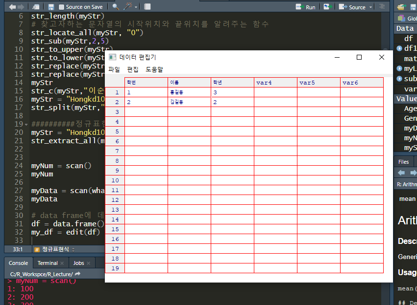
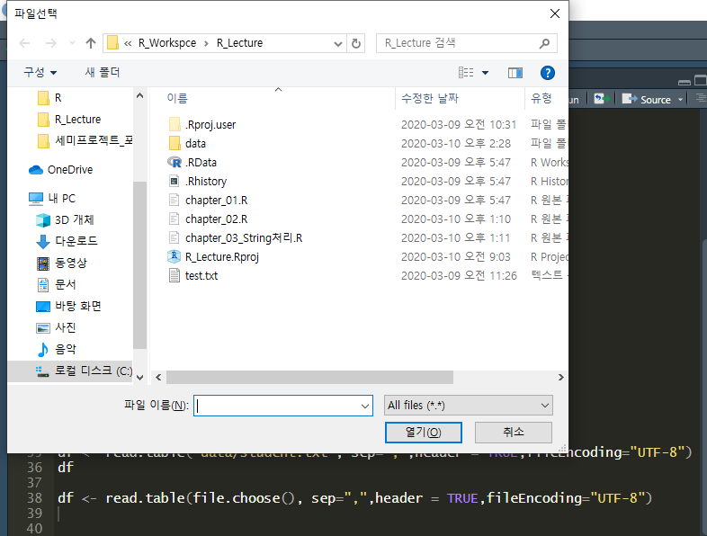
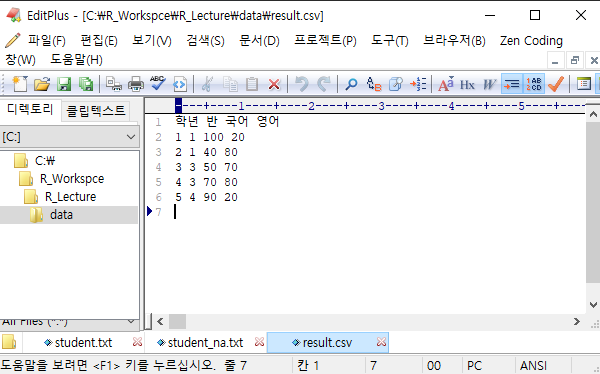

# Data IO

## 1. 키보드로 입력 받기

### 1.1 scan()

* 숫자만 받을수 있다.

```R
> myNum = scan()
1: 101
2: 
Read 1 item
> myNum
[1] 101
> myNum = scan()
1: 100
2: 200
3: 300
4: 
Read 3 items
> myNum
[1] 100 200 300
```

* 문자 입력받기

```R
> myData = scan(what = character())
1: 홍길동
2: 
Read 1 item
> myData
[1] "홍길동"
```

### 1.2 edit()

* data frame에 데이터를 직접 입력

```R
> # data frame에 데이터를 직접 입력하고 싶으면
> df = data.frame()
> my_df = edit(df)
> my_df
  학번   이름 학년
1    1 홍길동    3
2    2 김길동    2
```




## 2. 파일처리

* 파일에있는 데이터를 가져오기 위해서 여러가지 형태의 함수 이용
* C:\R_Workspce\R_Lecture 경로에 data폴더 생성

### 2.1 read.table()

* C:\R_Workspce\R_Lecture 경로에 data폴더 생성 - 파일 생성
* EditText에서 UTF-8로 셜정 변경

```R
> df <- read.table("data/student.txt", sep=",")
> df
  V1 V2  V3  V4
1  2  1  39 199
2  2  1 100  30
3  3  4  50  50
4  4  4 100  90
5  5  3  90  80
```

* studet파일에 해더가 있는경우(column)

```R
> df <- read.table("data/student.txt", sep=",",header = TRUE)
Error in make.names(col.names, unique = TRUE) : 
  '<ed><95><99>踰<88>'에서 유효하지 않은 멀티바이트 문자열이 있습니다  ## 인코딩 에러
> df
  V1 V2  V3  V4
1  2  1  39 199
2  2  1 100  30
3  3  4  50  50
4  4  4 100  90
5  5  3  90  80

######Encoding 설정#########

> df <- read.table("data/student.txt", sep=",",header = TRUE,fileEncoding="UTF-8")
> df
  학번 학년 국어 영어
1    2    1   39  199
2    2    1  100   30
3    3    4   50   50
4    4    4  100   90
5    5    3   90   80
```

```R
> df <- read.table(file.choose(), sep=",",header = TRUE,fileEncoding="UTF-8") # 경로를 직접 선택하는 방법
> df
  학번 학년 국어 영어
1    2    1   39  199
2    2    1  100   30
3    3    4   50   50
4    4    4  100   90
5    5    3   90   80
```



### 2.2 파일에 이상데이터가 있는경우

```
학번,학년,국어,영어
2,1,39,199
2,1,100,30
3,4,50,-
4,4,-,90
5,3,90,-
```

```R
> df <- read.table(file.choose(), sep=",",header = TRUE,fileEncoding="UTF-8")
> df
  학번 학년 국어 영어
1    2    1   39  199
2    2    1  100   30
3    3    4   50    -
4    4    4    -   90
5    5    3   90    -
```

* "-"를 NA로 변경

```R
> df <- read.table(file.choose(), sep=",",header = TRUE,fileEncoding="UTF-8",na.strings = "-")
> df
  학번 학년 국어 영어
1    2    1   39  199
2    2    1  100   30
3    3    4   50   NA
4    4    4   NA   90
5    5    3   90   NA
```


## 3. Data Format

* 데이터를 교환, 전달할떄 사용하는 데이터 표준 형식

###  csv

```csv
ex) 홍길동,20,서울,김길동,40,부산,신사임당,30,인천  => 데이터를 ',' 로 구
```

* comma seperated value
* csv파일을 이용해서 사용
* 사용되는 용량이 작다 =>대용량의 데이터 전달 유리
* 데이터의 구조화가 힘들다

```R
#header-TRUE, sep="," 기본값으로 되어있음(default)
> df <- read.csv(file.choose(),fileEncoding = "UTF-8")
> df
  학번 학년 국어 영어
1    2    1   39  199
2    2    1  100   30
3    3    4   50   50
4    4    4  100   90
5    5    3   90   80
```

* excel파일로 데이터 파일이 되어있을 경우 기본기능으로 안되고 외부 Package를 이요해야한다

```R
install.packages("xlsx")
require(xlsx)

> df = read.xlsx(file.choose(),sheetIndex=1,encoding="UTF-8")
> df
  학년 반. 국어 영어
1    1   1  100   20
2    2   1   40   80
3    3   3   50   70
4    4   3   70   80
5    5   4   90   20
```

* data structur

```R
> class(df)
[1] "data.frame"
```


### xml

```xml
ex) <name>홍길동</name><age>20</age><address>서울</address>
```

* extended markup language
* 파일 데이터의 크기가 크게 증가한다...

### json

```json
ex) {name:"홍길동",age:20,address:"서울"}
```

* JavaScript Object Notation
* 


## 4. file에 data frame 저장하기

### write.table()

```R
> write.table(df, file="data/result.csv")
```

```
"학년" "반" "국어" "영어"
"1" 1 1 100 20
"2" 2 1 40 80
"3" 3 3 50 70
"4" 4 3 70 80
"5" 5 4 90 20
```

```R
write.table(df, file="data/result.csv",row.names=FALSE,quote=FALSE)
```

```
row.names=FALSE => index 없이, quote=FALSE =>"" 없이

학년 반 국어 영어
1 1 100 20
2 1 40 80
3 3 50 70
4 3 70 80
5 4 90 20
```

 

