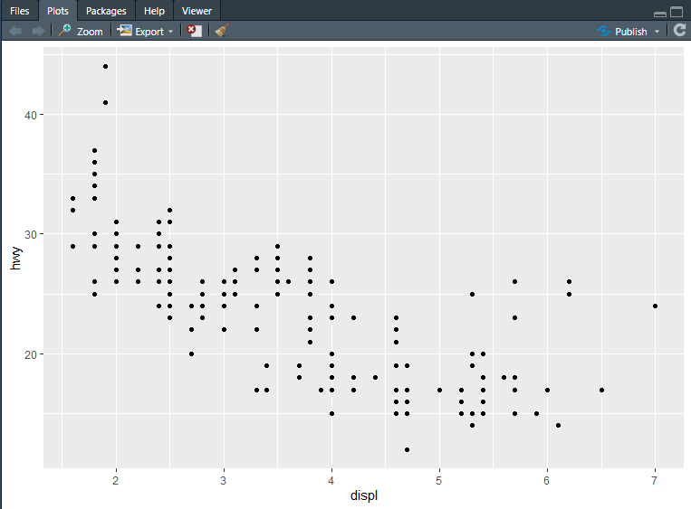
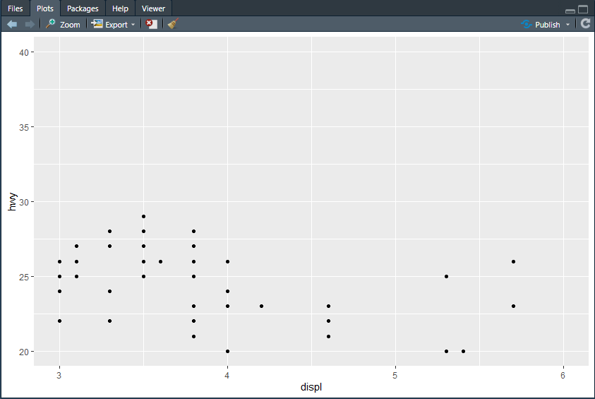
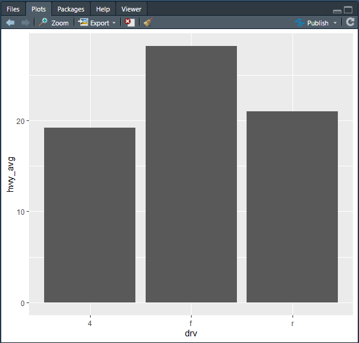
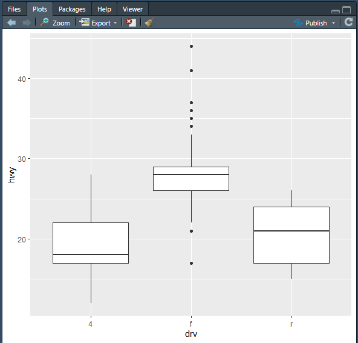
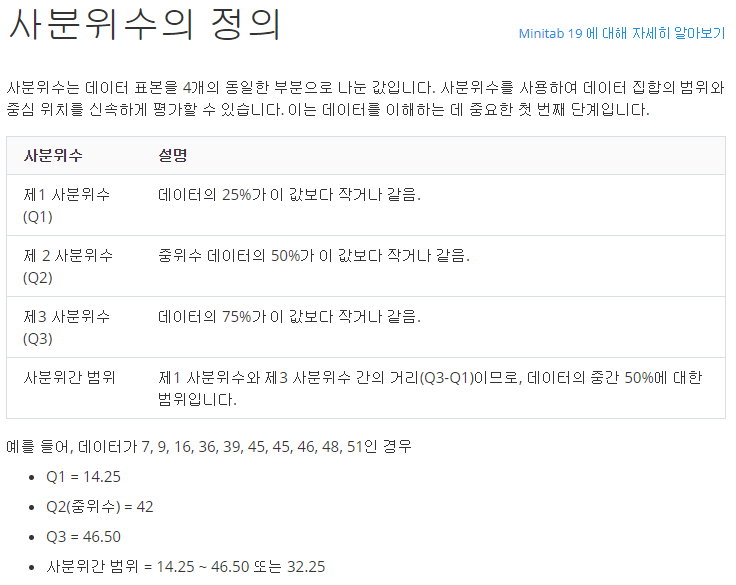
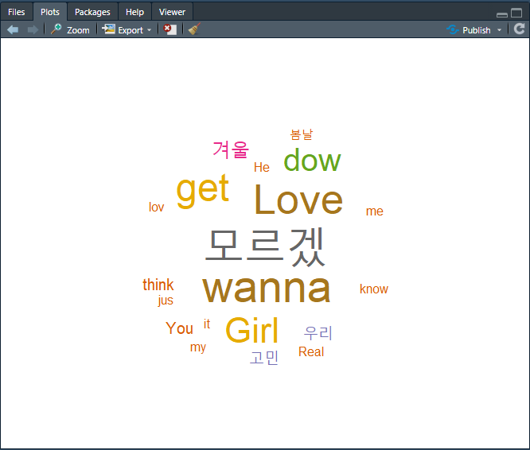

# Data 정제

* 데이터 분석전에 rawData(현장에서 수집한 데이터)를 분석이 가능한 형태로 가공

## 1. 결측치 해결

### 1.1 NA삭제

#### 1.1.1 is.na()

* 2차원 Matrix 형태료 표현

```R
> df <- data.frame(id=c(1,2,NA,3,4,NA,6), score=c(20,30,NA,40,50,NA,60))
> df
  id score
1  1    20
2  2    30
3 NA    NA
4  3    40
5  4    50
6 NA    NA
7  6    60
> is.na(df)
        id score
[1,] FALSE FALSE
[2,] FALSE FALSE
[3,]  TRUE  TRUE
[4,] FALSE FALSE
[5,] FALSE FALSE
[6,]  TRUE  TRUE
[7,] FALSE FALSE

> is.na(df$id)   ==>vector
[1] FALSE FALSE  TRUE FALSE FALSE  TRUE FALSE
> is.na(df$score)
[1] FALSE FALSE  TRUE FALSE FALSE  TRUE FALSE

> result = df %>% filter(!is.na(df$id))
> df %>% filter(!is.na(df$id))
  id score
1  1    20
2  2    30
3  3    40
4  4    50
5  6    60

dplyr 사용

> df <- data.frame(id=c(1,2,NA,3,4,NA,6), score=c(20,30,NA,40,50,23,NA))
> df %>% filter(!is.na(df$id))
  id score
1  1    20
2  2    30
3  3    40
4  4    50
5  6    NA
> df %>% filter(!is.na(df$id), !is.na(df$score))
  id score
1  1    20
2  2    30
3  3    40
4  4    50
```

* na가 들어가 있는 데이터가 전체 데이터크기에 비해 상대적으로 아주 적을떄는 삭제 하는게 좋을 수 있다.

* dplyr은 data frame를 가장 쉽고 편하게 제어할수 있는 package

#### 1.1.2 na.omit()

* NA를 다 찾아서 NA가 포함된 row를 삭제하는 함수
  * NA값을 무작정 삭제하는건 바랍직한 방법이 아니다(NA값이 상대적으로 많으면 데이터 손실이 많아짐)

```R
4  4    50
> result = na.omit(df)
> result
  id score
1  1    20
2  2    30
4  3    40
5  4    50
```

### 1.2 NA를 적절한 값으로 대체

#### 1.2.1 mean()

* NA를 무시하고 평균 계싼

```R
> mean(df$score)
[1] NA
> mean(df$score, na.rm = TRUE)  #=> na.rm = TRUE ra는 remove의 약자
[1] 32.6


```

* ifesle 삼항 연산자를 이용
  * score의 NA값 score안에 있는 NA를 제거한 모든 값의 평균으로 대체해ㅓ 새로운 data frame을 만들어 사용

```R
> df$score <- ifelse(is.na(df$score),mean(df$score, na.rm = TRUE),df$score)
> df$score
[1] 20.0 30.0 32.6 40.0 50.0 23.0 32.6
> df
  id score
1  1  20.0
2  2  30.0
3 NA  32.6
4  3  40.0
5  4  50.0
6 NA  23.0
7  6  32.6
```

## 2 이상치

*  이상한 값이 포함된것
* 사용할 수 없는 값

### 2.1 이상치를 NA로 처리

* 이상치는 일단 NA로 변환한 다음 NA를 처리하는 방식으로 진행

```R
> df <- data.frame(id=c(1,2,NA,4,NA,6), score=c(20,30,NA,50,23,NA),gender=c("^^","F","M","F","M","F"),stringAsFactors = FALSE)
> df
  id score gender stringAsFactors
1  1    20     ^^           FALSE
2  2    30      F           FALSE
3 NA    NA      M           FALSE
4  4    50      F           FALSE
5 NA    23      M           FALSE
6  6    NA      F           FALSE
> df$gender <- ifelse(df$gender %in% c("M","F"), df$gender,NA)
> df
  id score gender stringAsFactors
1  1    20     NA           FALSE
2  2    30      2           FALSE
3 NA    NA      3           FALSE
4  4    50      2           FALSE
5 NA    23      3           FALSE
6  6    NA      2           FALSE
```

### 2.1 극단치

* 극단치 값 이 퐇삼되어 있는 경우 해결
* 극단치에 대한 기준을 해결
  1. 논리적으로 이상적인 범위를 설정
  2. 통계적인 방법으로 이상적인 범위 설정

```R

```

# 데이터 분석

* web 데이터 분석이 가장 많이 사용
* 의사결정에 반영하는 방식으로 이용 =>마케팅 목적으로 이용
* 추천 시스템(cupang 고객에 대한 관심 분야 상품 추천)

# Graph

## 2차원 그래프

* ggplot2 package
* ggplo2 설정 순서
  1. 배경설정(X, Y축 설정)
  2. 실제 그래프를 추가(선, 막대,점....)
  3. 축 범위, 색,등 설정 추가

```R
table 형태로 되어있는  mpg를 data frame으로 파싱
df <-as.data.frame(mpg)
```


### 1. 산점도(scatter plot)

#### 1.1 ggplot()

1. x,y축 설정

```R
ggplot(data = df, aes(x=displ, y=hwy))
```

2. 그래프 선정 
   * geom_point() - 산점도

```R
ggplot(data = df, aes(x=displ, y=hwy))+geom_point()
```

* 배기별 고속도로 연비 비교 차트



3. 설정
   * xlim(3,6) - x축 범위 설정
   * ylim(20,40) - y축 범위 설정

```R
ggplot(data = df, aes(x=displ, y=hwy))+geom_point()+xlim(3,6)+ylim(20,40)
```




#### 1.2 geom_col()

* 막대 그래프 이용하여 구동 방식별 평균 연비 비교

```R
> result <- group_by(df, drv) %>% summarise(hwy_avg=mean(hwy))
> result
# A tibble: 3 x 2
  drv   hwy_avg
  <chr>   <dbl>
1 4        19.2
2 f        28.2
3 r        21 

ggplot(data= result, aes(x=drv, y=hwy_avg))+geom_col()
```



#### 1.3 geom_boxplot()

* 4분위를 이용하여 그린 그래프

```R
ggplot(data= df, aes(x=drv, y=hwy))+geom_boxplot()
```






### 2. 2차원 평면도

## 문자열처리


### 3. 워드 클라우드

* 워드클라우드 작성
* 한글 형태소 분석
  * 형태소 - 뜻을 가진 가장 작은 단위
* KoNLP를 설치하기 위해서는 아래 5개의 packages를 install해줘야 한다

```R
install.packages("KoNLP")
.libPaths()
library(KoNLP)
install.packages("Sejong")
install.packages("hash")
install.packages("tau")
install.packages("RSQLite")
install.packages("devtools")
library(KoNLP)
install.packages("Rtools")

Sys.setenv(JAVA_HOME = "C:/Program Files/Java/jdk1.8.0_231/bin")
```

```R
useNIADic()
tmp = "이것은 소리없는 아우성"
extractNoun(tmp)

> extractNoun(tmp)
[1] "이것" "소리" "아우" "성" 
```

```R
install.packages("wordcloud")
library(wordcloud)

txt <- readLines("data/hiphop.txt", encoding = "UTF-8")

txt
words <-extractNoun(txt)
result <- unlist(words)

wordcount <- table(result)

wordcount_df <-as.data.frame(wordcount, stringsAsFactors = F)

word_df <- wordcount_df%>%filter(nchar(result)>=2)%>%arrange(desc(Freq))%>%head(20)

install.packages("wordcloud")
library(wordcloud)

pal<-brewer.pal(8,"Dark2") #8개의 색상 사용
# wordcloud는 생성할 때 마다 다르게 생성
# 만약 같은 형태의 wordcloud를 생성하고 싶으면
# random에 대한 seed값을 설정
set.seed(1)
wordcloud(words=word_df$result, freq = word_df$Freq, min.freq = 2, max.words = 200, random.order = F, rot.per = 0.1, colors = pal) # =>사용할단어, 빈도수, 최소 빈도수, 최대빈도수, 코빈도단어 출력

```




# 실습 문제

* 네이버영화댓글 사이트에서 특정 영화에 대한 댓글을 수집하여 wordcloud를 생성

```R
movieTxt <-c()
for(i in 1:10){
url <- str_c("https://movie.naver.com/movie/point/af/list.nhn?st=mcode&sword=136873&target=&page=",i)
page_html <- read_html(url, encoding="CP949")

#사용자가 입력한 뎃글 영역만 받아오는 작업
nodes = html_nodes(page_html, "td.title")
movie_word<-html_text(nodes)
## 영화 제목 
nodes = html_nodes(page_html, "td.title > a.movie")
movie_title<-html_text(nodes)

## 영화 평점
nodes = html_nodes(page_html, "td.title > div.list_netizen_score")
movie_score<-html_text(nodes)

movie_word<-str_remove_all(movie_word, movie_title)
movie_word<-str_remove_all(movie_word, movie_score)
movie_word<-str_remove_all(movie_word, "신고")
movie_word<-str_trim(movie_word)

movieTxt <- c(movieTxt, movie_word)
}

words <-extractNoun(movieTxt) #list로 변환
result <- unlist(words) # List를 Vector로 변환

wordcount <- table(result)  # table() 빈도를 구하는 함수

wordcount_df <-as.data.frame(wordcount, stringsAsFactors = F)
mode(wordcount_df)

word_df <- wordcount_df%>%filter(nchar(result)>=2)%>%arrange(desc(Freq))%>%head(20)
mode(word_df)

pal<-brewer.pal(8,"Dark2")

set.seed(1)
wordcloud(words=word_df$result, freq = word_df$Freq, min.freq = 2, max.words = 200, random.order = F, rot.per = 0.1, colors = pal)

```

* 출력 결과


