# Json 처리

## 1. Setting

### 1.1 DB settig 

   * mySQL이용해 데이터베이스 설정(Standalone)
   * bin폴더에서 CMD 실행 - ㅡmysqld(DB서버 기동) - 도스창 하나 더실행 - mysql -u root(system 계정 접속)-user 생성 - 

```
### mysql DB 기동
C:\Users\student>cd C:\Users\student\Desktop\mysql-5.6.47-winx64\bin

C:\Users\student\Desktop\mysql-5.6.47-winx64\bin>mysqld
2020-03-11 09:08:15 0 [Warning] TIMESTAMP with implicit DEFAULT value is deprecated. Please use --explicit_defaults_for_timestamp server option (see documentation for more details).
2020-03-11 09:08:15 0 [Note] --secure-file-priv is set to NULL. Operations related to importing and exporting data are disabled
2020-03-11 09:08:15 0 [Note] mysqld (mysqld 5.6.47) starting as process 6576 ...


종료 명령어
mysqladmin -u root shutdown
```

```
C:\Users\student>cd C:\Users\student\Desktop\mysql-5.6.47-winx64\bin

C:\Users\student\Desktop\mysql-5.6.47-winx64\bin>mysql -u root
Welcome to the MySQL monitor.  Commands end with ; or \g.
Your MySQL connection id is 1
Server version: 5.6.47 MySQL Community Server (GPL)

Copyright (c) 2000, 2020, Oracle and/or its affiliates. All rights reserved.

Oracle is a registered trademark of Oracle Corporation and/or its
affiliates. Other names may be trademarks of their respective
owners.

Type 'help;' or '\h' for help. Type '\c' to clear the current input statement.
mysql>
```

* user 계정 생성

```
mysql> create user rdata identified by "rdata";
Query OK, 0 rows affected (0.00 sec)

mysql>
```

* local host 추가

```
mysql> create user rdata@localhost identified by "rdata";
Query OK, 0 rows affected (0.00 sec)
```

* DB생성

```
mysql> create database library;
Query OK, 1 row affected (0.01 sec)
```

* DB 권한 설정 (rdata, rdata$localhost계정에 권한 설정)

```
mysql> grant all privileges on library.* to rdata;
Query OK, 0 rows affected (0.00 sec)

mysql> grant all privileges on library.* to rdata@localhost;
Query OK, 0 rows affected (0.00 sec)
```

* 권한 설정 완료

```
mysql> flush privileges;
Query OK, 0 rows affected (0.00 sec)
```

* 제공된 script 이용하여 database 구촉하기

```
_BookTableDump.sql 파일 아래 경로에 붙여넣기
C:\Users\student\Desktop\mysql-5.6.47-winx64\bin
```

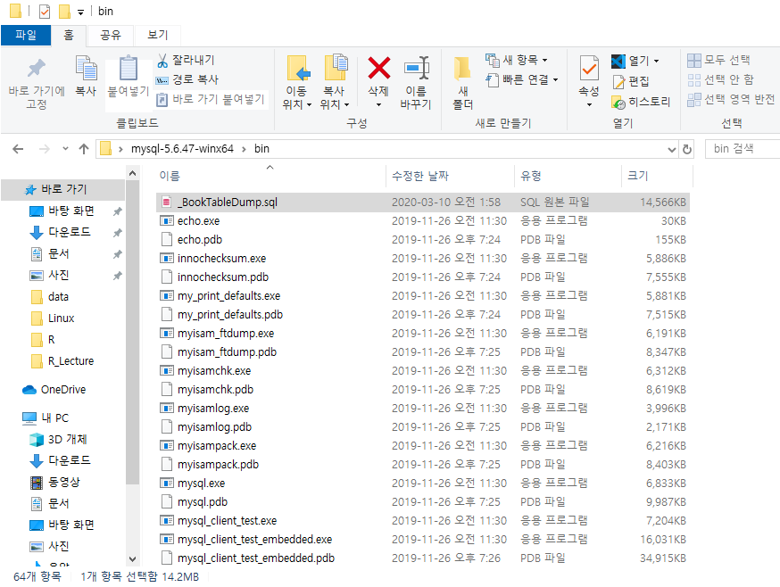

* 복사 파일 설정하기(rdata 계정)

```
C:\Users\student\Desktop\mysql-5.6.47-winx64\bin>mysql -u rdata -p library < _BookTableDump.sql
Enter password: *****

C:\Users\student\Desktop\mysql-5.6.47-winx64\bin>
```

### 1.2  Eclips 설정

#### 1.2.1 이클립스 

* utf-8설정

#### 1.2.2 톰켓설치

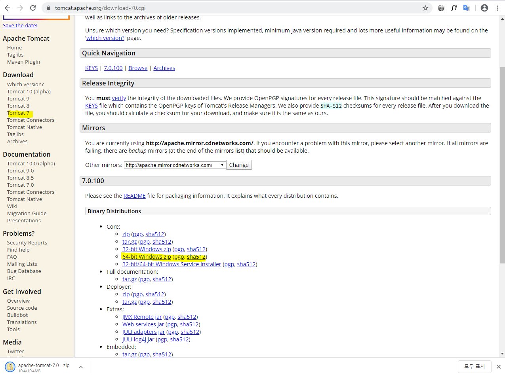

- 다운로드 - 압축풀기
- eclipse - Servies -클릭 - Apache - Tomcat7.0 Servier -next - Tomcat 다운로드 폴서 경로설정 - finish
- import - Exsting Project into workspace -achaive file 경로선택 - finish

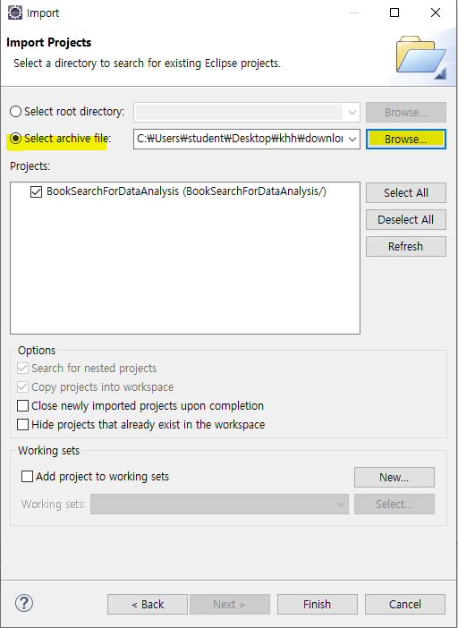

* 생성된 프로젝트 -우클릭 - property - java build Path - library - JRE System...Double Click - alternate JRE 선택 - finish

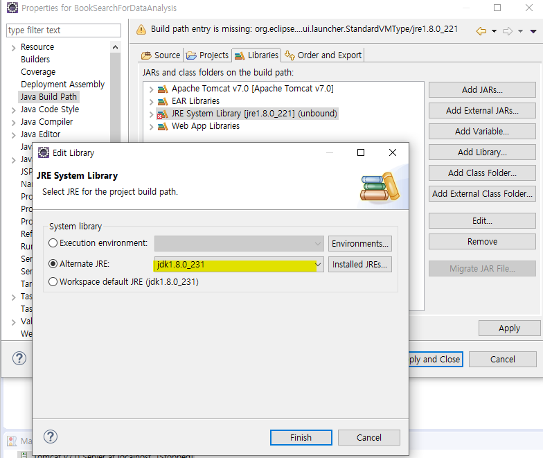

* WebContent - context.xml 파일 설정변경

```xml
<?xml version="1.0" encoding="UTF-8"?>
<Context>
    <!-- Default set of monitored resources -->
	<WatchedResource>WEB-INF/web.xml</WatchedResource>
	<Resource type="javax.sql.DataSource" 
			  name="jdbc/mySQLDB" auth="Container"
			  username="rdata" 
			  password="rdata" 
			  driverClassName="com.mysql.jdbc.Driver"
			  url="jdbc:mysql://127.0.0.1:3306/library?characterEncoding=UTF-8" />
</Context>
```

* Server - Add and Remove

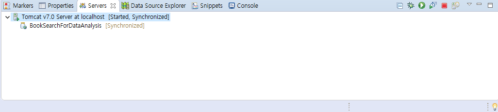

#### 1.2.3 Web program 호출

http://localhost:8080/bookSearch/search?keyword=java


* 호출 결과

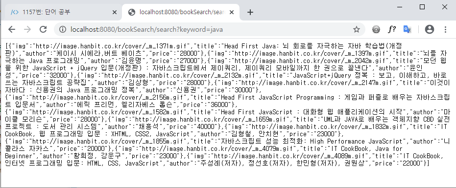

* web srore - json formatter - 설치 - 호출

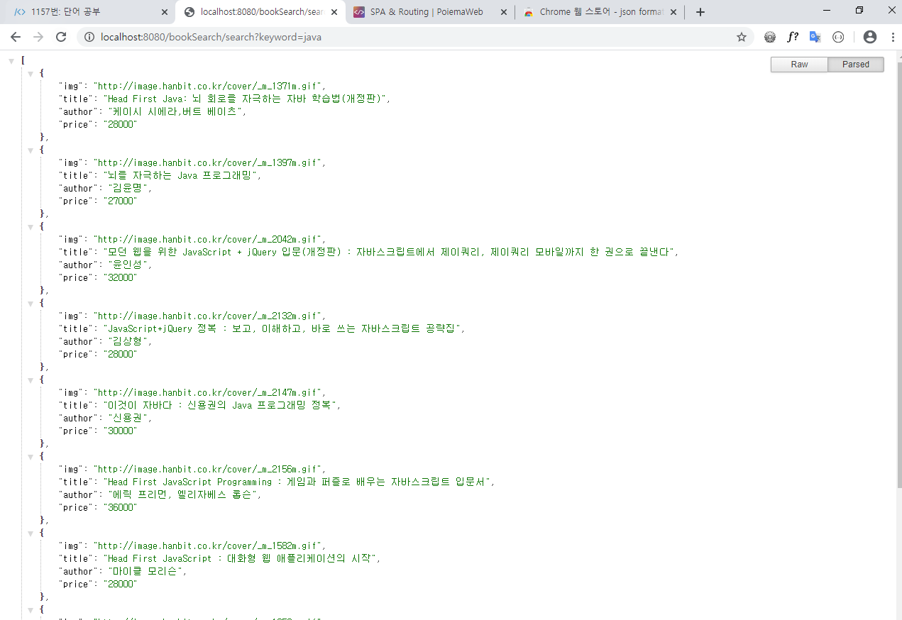

* Servers - server.xml - 수정 => url 에 한글을 입력하면 Server에서 utf-8설정이 되어있이 않아 수정해야함

```xml
65번 line 
<Connector URIEncoding="UTF-8" connectionTimeout="20000" port="8080" protocol="HTTP/1.1" redirectPort="8443"/>
```

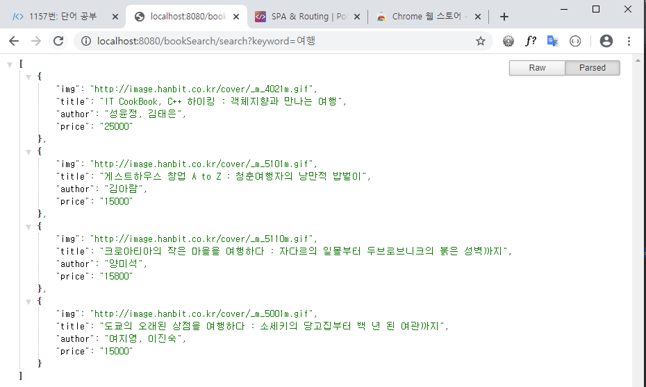


## 2. Servlet을 이용해 Json 받아오기

* R에서 외부 web Application 호출한 후 결과를 Data Frame으로 받아오기
* 결과로 받은 JSON->DataFrame으로 변환 하기
* 외부 Packge 사용

### 2.1 jsonlite package ins

```R
install.packages("jsonlite")
install.packages("curl")
require(jsonlite)
require(stringr)
require(curl)
```

```R
> url <-"http://localhost:8080/bookSearch/search?keyword="
> request_url <- str_c(url, scan(what = character()))
1: 여행
2: 
Read 1 item
> request_url
[1] "http://localhost:8080/bookSearch/search?keyword=여행"
```

* 서버 접속

```R
> url <-"http://localhost:8080/bookSearch/search?keyword="
> request_url <- str_c(url, scan(what = character()))
1: java
2: 
Read 1 item
> df = fromJSON(request_url)
> View(df)
```

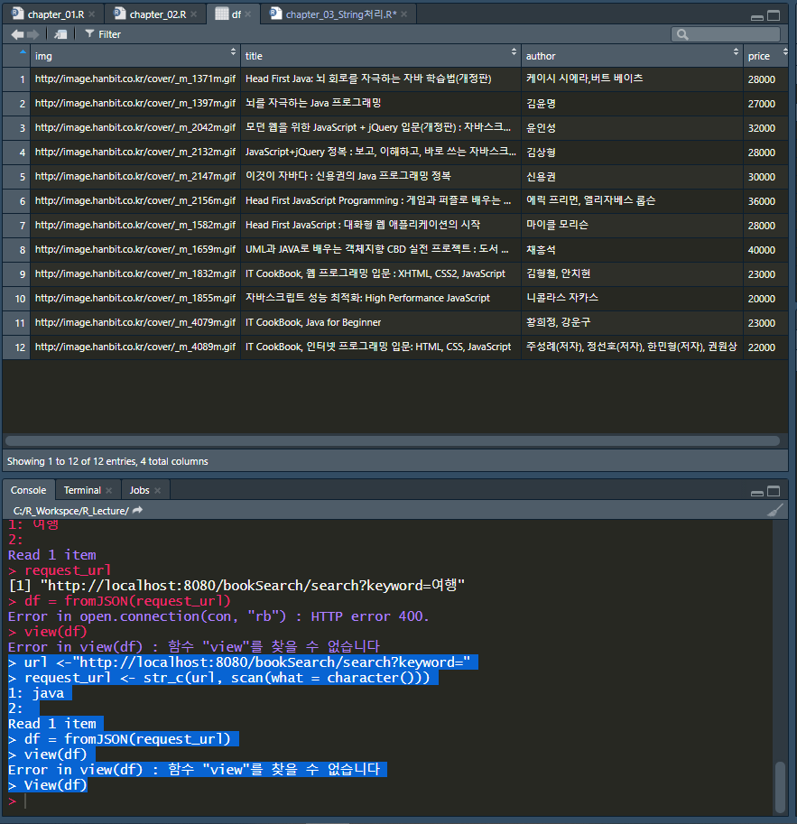

* for문을 이용한 요소 출력

```R
> nrow(df)
[1] 12
> for(i in 1:nrow(df)){
+   print(df$title[i])
+ }
[1] "Head First Java: 뇌 회로를 자극하는 자바 학습법(개정판)"
[1] "뇌를 자극하는 Java 프로그래밍"
[1] "모던 웹을 위한 JavaScript + jQuery 입문(개정판) : 자바스크립트에서 제이쿼리, 제이쿼리 모바일까지 한 권으로 끝낸다"
[1] "JavaScript+jQuery 정복 : 보고, 이해하고, 바로 쓰는 자바스크립트 공략집"
[1] "이것이 자바다 : 신용권의 Java 프로그래밍 정복"
[1] "Head First JavaScript Programming : 게임과 퍼즐로 배우는 자바스크립트 입문서"
[1] "Head First JavaScript : 대화형 웹 애플리케이션의 시작"
[1] "UML과 JAVA로 배우는 객체지향 CBD 실전 프로젝트 : 도서 관리 시스템"
[1] "IT CookBook, 웹 프로그래밍 입문 : XHTML, CSS2, JavaScript"
[1] "자바스크립트 성능 최적화: High Performance JavaScript"
[1] "IT CookBook, Java for Beginner"
[1] "IT CookBook, 인터넷 프로그래밍 입문: HTML, CSS, JavaScript"
```


## 3. OPEN API사용

* 외부 API를 이용해서 JSON데이터를 획득한후 결과를 출력

* 영화진흥 위원회(OPEN API)

### 3.1 OPEN API Key 발급

[영화진흥원](http://www.kobis.or.kr/kobisopenapi/homepg/apiservice/searchServiceInfo.do)

* 응답 에시 json

```
http://www.kobis.or.kr/kobisopenapi/webservice/rest/boxoffice/searchDailyBoxOfficeList.json?key=626c54e20d50648fdd0c00343f1f0654&targetDt=20200310
```

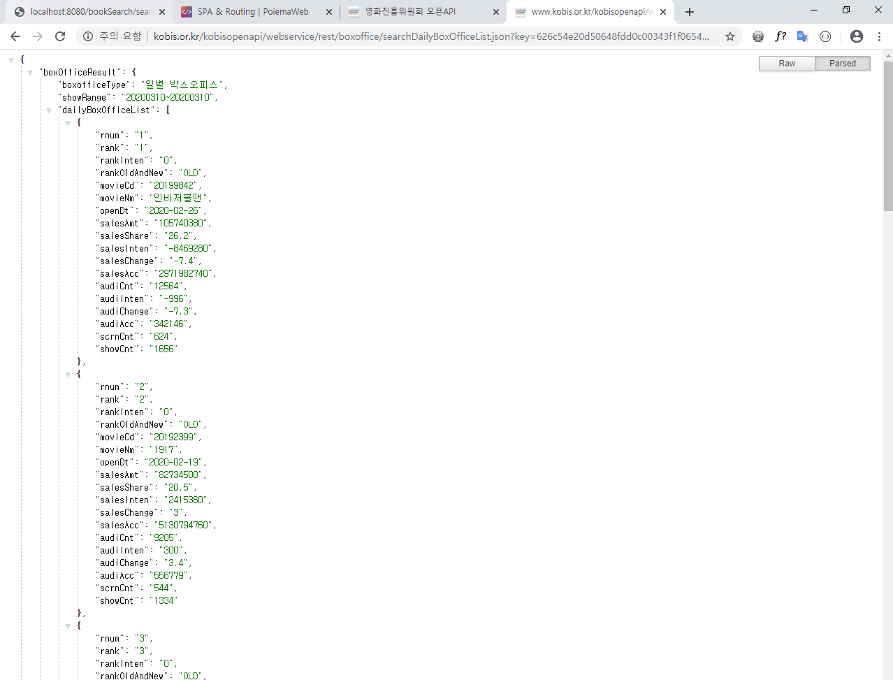

```
{
"boxOfficeResult": {
"boxofficeType": "일별 박스오피스",
"showRange": "20200310~20200310",
"dailyBoxOfficeList": [    =>대괄호는 배열을 뜻함(JSON의 배열)
            {},
            {},
            {},
            {},
            {},
            {},
            {},
            {},
            {},
            {}
		]
	}
}
```

### 3.2 R에서 데이터 활용

```R
install.packages("jsonlite")
install.packages("curl")
require(jsonlite)
require(stringr)
require(curl)
```

```R
> ## 리케스트 url##
> url <- "http://www.kobis.or.kr/kobisopenapi/webservice/rest/boxoffice/searchDailyBoxOfficeList.json?key=626c54e20d50648fdd0c00343f1f0654&targetDt=20200310"
> df = fromJSON(url)
> View(df)
> # df는 list로 되어있다 (복잡한 데이터는 dataFrame이 아닌 list로 옴)
# 아래 3line의 표기는 출력랎이 같다
df[[1]]
df[["boxOfficeResult"]]
df$boxOfficeResult

$boxofficeType
[1] "일별 박스오피스"

$showRange
[1] "20200310~20200310"

$dailyBoxOfficeList
   rnum rank rankInten rankOldAndNew  movieCd                       movieNm     openDt
1     1    1         0           OLD 20199842                    인비저블맨 2020-02-26
2     2    2         0           OLD 20192399                          1917 2020-02-19
3     3    3         0           OLD 20180962 지푸라기라도 잡고 싶은 짐승들 2020-02-19
4     4    4         0           OLD 20192240                   작은 아씨들 2020-02-12
5     5    5         0           OLD 20193321                   정직한 후보 2020-02-12
6     6    6         0           OLD 20190864                       울프 콜 2020-03-05
7     7    7         0           OLD 20135428                   어바웃 타임 2013-12-05
8     8    8         0           OLD 20040598    해리포터와 아즈카반의 죄수 2004-07-16
9     9    9         1           OLD 20205529                        그링고 2020-03-05
10   10   10         2           OLD 20193526                        젠틀맨 2020-02-26
    salesAmt salesShare salesInten salesChange    salesAcc audiCnt audiInten audiChange
1  105740380       26.2   -8469280        -7.4  2971982740   12564      -996       -7.3
2   82734500       20.5    2415360           3  5130794760    9205       300        3.4
3   39906340        9.9    2704400         7.3  5006870430    4778       366        8.3
4   27744880        6.9     733600         2.7  6906999190    3363       124        3.8
5   22338240        5.5     534200         2.5 12488069810    2733        57        2.1
6   15660640        3.9     606840           4   147639460    1985        82        4.3
7    8893000        2.2    -687500        -7.2 25155285300    1757      -140       -7.4
8   15033000        3.7    -233000        -1.5 11400248500    1731       -26       -1.5
9    6743500        1.7      15500         0.2    31765000    1293         2        0.2
10  10549780        2.6     305640           3   597784390    1257         9        0.7
   audiAcc scrnCnt showCnt
1   342146     624    1656
2   556779     544    1334
3   577461     419     988
4   819616     331     578
5  1482510     333     605
6    17802     291     499
7  3422097     127     195
8  1827354      42     157
9     5724      36      47
10   73810     230     331

##DataFrame
> df$boxOfficeResult$dailyBoxOfficeList
   rnum rank rankInten rankOldAndNew  movieCd                       movieNm     openDt
1     1    1         0           OLD 20199842                    인비저블맨 2020-02-26
2     2    2         0           OLD 20192399                          1917 2020-02-19
3     3    3         0           OLD 20180962 지푸라기라도 잡고 싶은 짐승들 2020-02-19
4     4    4         0           OLD 20192240                   작은 아씨들 2020-02-12
5     5    5         0           OLD 20193321                   정직한 후보 2020-02-12
6     6    6         0           OLD 20190864                       울프 콜 2020-03-05
7     7    7         0           OLD 20135428                   어바웃 타임 2013-12-05
8     8    8         0           OLD 20040598    해리포터와 아즈카반의 죄수 2004-07-16
9     9    9         1           OLD 20205529                        그링고 2020-03-05
10   10   10         2           OLD 20193526                        젠틀맨 2020-02-26
    salesAmt salesShare salesInten salesChange    salesAcc audiCnt audiInten audiChange
1  105740380       26.2   -8469280        -7.4  2971982740   12564      -996       -7.3
2   82734500       20.5    2415360           3  5130794760    9205       300        3.4
3   39906340        9.9    2704400         7.3  5006870430    4778       366        8.3
4   27744880        6.9     733600         2.7  6906999190    3363       124        3.8
5   22338240        5.5     534200         2.5 12488069810    2733        57        2.1
6   15660640        3.9     606840           4   147639460    1985        82        4.3
7    8893000        2.2    -687500        -7.2 25155285300    1757      -140       -7.4
8   15033000        3.7    -233000        -1.5 11400248500    1731       -26       -1.5
9    6743500        1.7      15500         0.2    31765000    1293         2        0.2
10  10549780        2.6     305640           3   597784390    1257         9        0.7
   audiAcc scrnCnt showCnt
1   342146     624    1656
2   556779     544    1334
3   577461     419     988
4   819616     331     578
5  1482510     333     605
6    17802     291     499
7  3422097     127     195
8  1827354      42     157
9     5724      36      47
10   73810     230     331

## vector
> df$boxOfficeResult$dailyBoxOfficeList$movieNm
 [1] "인비저블맨"                    "1917"                         
 [3] "지푸라기라도 잡고 싶은 짐승들" "작은 아씨들"                  
 [5] "정직한 후보"                   "울프 콜"                      
 [7] "어바웃 타임"                   "해리포터와 아즈카반의 죄수"   
 [9] "그링고"                        "젠틀맨" 

> for(i in 1:nrow(df$boxOfficeResult$dailyBoxOfficeList)){
+   print(df$boxOfficeResult$dailyBoxOfficeList$movieNm[i])
+ }
[1] "인비저블맨"
[1] "1917"
[1] "지푸라기라도 잡고 싶은 짐승들"
[1] "작은 아씨들"
[1] "정직한 후보"
[1] "울프 콜"
[1] "어바웃 타임"
[1] "해리포터와 아즈카반의 죄수"
[1] "그링고"
[1] "젠틀맨"
```


스크랩핑

* 크롤링에 의해 열어진 브라우져에서 데이터를 추출하는것

크롤링

* 반복적으로 브라우징행위

## 4. 데이터 수집

### 4.1 web scraping

* 웹사이트 상에서 내가 원하는 위치에 대한 정보를 자동으로 추출해서 수집하는 기능
* web 구조에따라selector또는 Xpath 를 이용

#### 4.1.1 Selector

* [webstorrm](https://www.jetbrains.com/ko-kr/webstorm/)을 이용
  * front end 개발에 용이
  * 홈페이지에서 30일 무료버전 다운로드
* javaScript로 select알아보기

```html
<!DOCTYPE html>
<html lang="en">
<head>
    <meta charset="UTF-8">
    <title>Title</title>
    <style>
        /*selector는 선택자이다*/
        /*1.tag selector
            tag명으로 원하는 부분을 지정할 수 있따.*/
        /*h1{*/
        /*    color: red;*/
        /*}*/
        /*li{*/
        /*    background-color: yellowgreen;*/
        /*}*/
        /*2.전체 selector
            "**를 이용해서 모든 영역을 선택/
         */
        /**{*/
        /*    color: red;*/
        /*}*/
       /* 3.ID selector
            "#*을 이용해서 원하는 영역을 선택/
        */
        /*#inchon{*/
        /*    background-color: yellowgreen;*/
        /*}*/
        /*!*4. class selector**!*/
        /*!*    "."을 이용해서 원하는 영역 선택!*/

        /*.myClass{*/
        /*    background-color: red;*/
        /*}*/
        /*5.구조selector*/
        /*    자식 => ">"*/
        ol > .myClass{
            background-color: yellowgreen;
        }
        /*div li{*/
        /*    color: yellowgreen;*/
        /*}*/
        #inchon + li.myClass{
            color: red;
        }

    </style>
</head>
<body>
    <h1>h1입니다</h1>
    <div>
        <ul>
            <li class="myClass">서울</li>
            <li id="inchon">인천</li>
            <li class="myClass">부산</li>
        </ul>
        <ol>
            <li >홍길동</li>
            <li class="myClass">김길동</li>
            <li >고길동</li>
        </ol>
    </div>
</body>
</html>
```

#### 네이버 영화 페이지 이용한 scraping

* Packages install

```R
install.packages("rvest")
library(rvest)
```

* scraping할 url

```R
url <-"https://movie.naver.com/movie/point/af/list.nhn?&page="

request_url <- str_c(url,1)
request_url

[1] "https://movie.naver.com/movie/point/af/list.nhn?&page=1"
> request_url <- str_c(url,1)
> request_url
[1] "https://movie.naver.com/movie/point/af/list.nhn?&page=1"
> page_html <- read_html(request_url, encoding="CP949")
> page_html
{html_document}
<html lang="ko">
[1] <head>\n<meta http-equiv="Content-Type" content="text/html; charset=UTF-8">\n<meta htt ...
[2] <body>\r\n\r\n\r\n\t\r\n\t\r\n\t\r\n\t\r\n\t\r\n\t\t\r\n\t\r\n\r\n<div id="wrap" class ...

#html중에 selector에 맞는 element를 가져옴
> nodes = html_nodes(page_html, "td.title > a.movie")
#element가 가지고 있는 text(Tag사이의 글자)를 가져옴
> movie_title<-html_text(nodes)

> movie_title
 [1] "신문기자"                                "호텔 뭄바이"                            
 [3] "버즈 오브 프레이(할리 퀸의 황홀한 해방)" "마루 밑 아리에티"                       
 [5] "다크 워터스"                             "조디악"                                 
 [7] "아이즈 와이드 셧"                        "더 홈즈맨"                              
 [9] "반지의 제왕: 왕의 귀환"                  "태극기 휘날리며"   
```

```R
install.packages("rvest")   #scraping 위한 package
library(rvest)
library(stringr)

url <-"https://movie.naver.com/movie/point/af/list.nhn?&page="

request_url <- str_c(url,1)
request_url

page_html <- read_html(request_url, encoding="CP949")
page_html

nodes = html_nodes(page_html, "td.title > a.movie")
movie_title<-html_text(nodes)
movie_title

nodes = html_nodes(page_html, "td.title > div.list_netizen_score > em")
movie_title<-html_text(nodes)
movie_title

> nodes = html_nodes(page_html, "td.title")
> movie_title<-html_text(nodes)
> nodes1 = html_nodes(page_html, "td.title > a.movie")
> movie_title1<-html_text(nodes1)
> nodes2 = html_nodes(page_html, "td.title > div.list_netizen_score")
> movie_title2<-html_text(nodes2)
> movie_title<-str_remove_all(movie_title, movie_title1)
> movie_title<-str_remove_all(movie_title, movie_title2)
> movie_title<-str_remove_all(movie_title, "신고")
> movie_title<-str_remove_all(movie_title, "[\t\n]")
> movie_title
 [1] "버즈 오브 프레이(할리 퀸의 황홀한 해방)그야 말로 비싼똥이다... 액션씬이라도 잘 만들지..긴박함 전혀 없고 시원한 맛도 없다...저예산 영화 수준 "
 [2] "그냥 명작입니다.... 역사 좋아하시는 분이라면 강추입니다 "                                                                                    
 [3] "주디와닉이경찰파트너가되어서를지킨점 "                                                                                                       
 [4] "영화를 달고나커피 만들면서 봤는데 넋놓고 보느라 젓는걸 잊어버렸다.. 진짜 지금까지 3번이나 봤는데도 볼때마다 경이롭고 집중해서 보게 되는 듯 " 
 [5] "예고편만봐도 재미없을거같다 스토리만 봐도 딱느낌옴 오씨엔에서 보여줘도 안봄 "                                                                
 [6] "아, 역시 킬링타임용으로는 제격이네. 재밌게 잘 봤다. 쥬만지 1편부터 지금까지 쭈우욱~!!! 재밌네 ㅋㅋ "                                         
 [7] "방구석에서 혼자 조용히 보는데도 이정도인데 영화관에서 보면 개오질듯 ㄷㄷ "                                                                   
 [8] "너무 잘생겼어요. 긴머리도 잘생겼고, 짧은 머리는 더 잘생겼어요 "                                                                              
 [9] "엄기영 앵커 보신분들은 공감 "                                                                                                                
[10] "진짜 재밌다ㅜㅜ 흐어엉ㅜㅜ 와 진짜 마음에 잔잔한 물결이 흐르는 거 같아아앙 흐어엉 "  
```

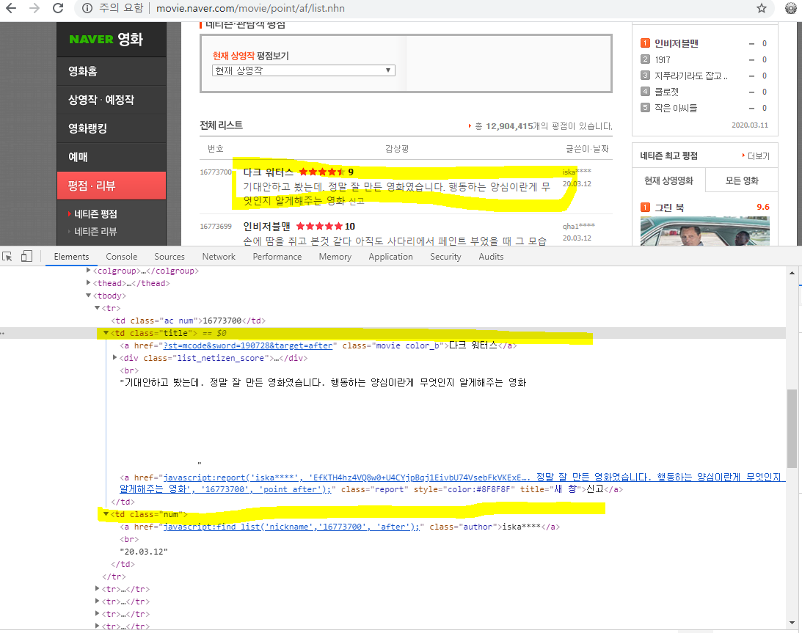

```R
#Naver 제목, 뎃글 ,평점 들고오기
url <-"https://movie.naver.com/movie/point/af/list.nhn?&page="
#문자열 합치기 = url과 page number를 합친다
request_url <- str_c(url,1)
request_url
#naver의 영화 페이지 encoding에 맞춰 적용
page_html <- read_html(request_url, encoding="CP949")
page_html

#########selector이용###########
#네이버 뎃글 가져오가 +>Scraping html_nodes는 Tag를 찾아오는 함수
nodes = html_nodes(page_html, "td.title > a.movie") # td tag 하위 a tag 추출
movie_title<-html_text(nodes)
movie_title

#평점을 가지고있는 html엘리먼트(html TAB)를 획득하는 작업
nodes = html_nodes(page_html, "td.title > div.list_netizen_score > em")
movie_title<-html_text(nodes)
movie_title


#사용자가 입력한 뎃글 영역만 받아오는 작업
nodes = html_nodes(page_html, "td.title")
movie_title<-html_text(nodes)
View(movie_title)

nodes1 = html_nodes(page_html, "td.title > a.movie")
movie_title1<-html_text(nodes1)
movie_title1

nodes2 = html_nodes(page_html, "td.title > div.list_netizen_score")
movie_title2<-html_text(nodes2)
movie_title2

nodes3 = html_nodes(page_html, "td.title > a,report")
movie_title3<-html_text(nodes3)
movie_title3

movie_title<-str_remove_all(movie_title, movie_title1)
movie_title<-str_remove_all(movie_title, movie_title2)
movie_title<-str_remove_all(movie_title, "신고")
movie_title<-str_remove_all(movie_title, "[\t\n]")
movie_title
```


#### 4.1.2 XPATH

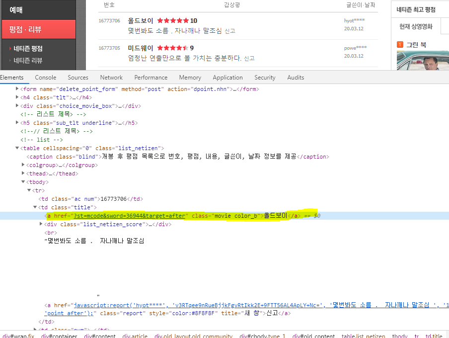

* 해당 문구 우클릭 - copy xpath - R studio 코드에 붙여넣기


* 문제

```R
###########로튼토마토 2019 TOP100 제목 user Rating 장르 ######################
url <-"https://www.rottentomatoes.com/top/bestofrt/?year=2019"
request_url <- url
request_url

page_html <- read_html(request_url, encoding="UTF-8")
page_html

# //*[@id="top_movies_main"]/div/table/tbody/tr[1]/td[3]/a
myPath=str_c('//*[@id="top_movies_main"]/div/table/tr/td/a')
nodes = html_nodes(page_html, xpath=myPath)
movie_title = nodes
movie_title = str_extract_all(movie_title, "[\\s]{2,}")
html_text(movie_title)


###############################################33
#//*[@id="top_movies_main"]/div/table/tbody/tr[1]/td[3]/a

url <-"https://www.rottentomatoes.com/top/bestofrt/?year=2019"
request_url <- url

page_html <- read_html(request_url, encoding="UTF-8")

nodes = html_nodes(page_html, xpath='//*[@id="top_movies_main"]/div/table/tr/td/a')
nodes
type(html_text(nodes))
titleLink <- html_attr(nodes,"href")
titleLink
for(i in 1:100){

enterLink = str_c("https://www.rottentomatoes.com",titleLink[i])
moviePage_html <- read_html(enterLink, encoding = "UTF-8")
titileNode <- html_nodes(moviePage_html, xpath='//*[@id="topSection"]/div[2]/div[1]/h1')
html_text(titileNode)
ratingnNode <-html_nodes(moviePage_html, xpath = '//*[@id="topSection"]/div[2]/div[1]/section/section/div[2]/h2/a/span[2]')
ratingData = html_text(ratingnNode)
ratingData = str_remove_all(ratingData, "[\n\\s]")
ratingData
df = data.frame(Title=c(html_text(titileNode)), Raiting=c(ratingData))
}

df
#genreNode <-html_nodes(moviePage_html, 
#                       xpath = '//*[@id="mainColumn"]/section[4]/div/div/ul/li[2]/div[2]/a[1]')
#html_text(genreNode)

########

```


### 4.2 Crawling

* 자동화 봇인 web crawler가 ㅇ정해진 규칙에 따라서 복수개의 웹페이지를 browsing하는 행위

## 5. 십습 문제

> [로튼토마토](https://www.rottentomatoes.com/) 2019 TOP100 제목, user Rating, 장르 데이터 Scraping하여 파일 만들기

```R
##url 페이지 url지정
url <-"https://www.rottentomatoes.com/top/bestofrt/?year=2019"
request_url <- url

page_html <- read_html(request_url, encoding="UTF-8")
## html_nodes()함수 이용하여 url경로와 xpath이용하여 불로올 데이터 경로 설정
nodes = html_nodes(page_html, xpath='//*[@id="top_movies_main"]/div/table/tr/td/a')
nodes

## 토마토 Top데이터가 1-100개로 나타나있고 user Rating, 장르 경로를 설정하려면 top100 데이터 a Tag link를 타고 들어가야 하기때문에 html_attr(nodes,"href") 를 통해 link접속
type(html_text(nodes))
titleLink <- html_attr(nodes,"href")
titleLink
# 100개의 데이터를 담기위해 데이터 담을 변수의 길이를 설정
ratingData = vector(mode="character", length = length(titleLink))
titleData = vector(mode="character", length = length(titleLink))
genreData = vector(mode="character", length = length(titleLink))

#반복문으로 각 index데이터를 저장
for(i in 1:length(titleLink)){
  # 100개 리스트 페지 경로 =>https://www.rottentomatoes.com/m/parasite_2019 로 되어있어 titleLink[i]를 통해 각 순위별 데이터값 index를 활용하여 호출
enterLink = str_c("https://www.rottentomatoes.com",titleLink[i])
moviePage_html <- read_html(enterLink, encoding = "UTF-8")
#xpath로 받아온 데이터 값을 titleData[]에 담는다
titleNode <- html_nodes(moviePage_html, xpath='//*[@id="topSection"]/div[2]/div[1]/h1')
titleData[i] <- html_text(titleNode)

ratingnNode <-html_nodes(moviePage_html, xpath = '//*[@id="topSection"]/div[2]/div[1]/section/section/div[2]/h2/a/span[2]')

ratingData[i] =ifelse(length(ratingnNode)!=0,html_text(ratingnNode) ,"0")
ratingData[i] = str_remove_all(ratingData[i], "[\n\\s]")

genreNode <-html_nodes(moviePage_html,xpath = '//*[@class="meta-value"]')[2]

genreData[i] <-html_text(genreNode)
genreData[i] <- str_trim(genreData[i])

}
View(titleData)
View(ratingData)
View(genreData)
df = data.frame(Title=c(titleData), Raiting=c(ratingData), Genre=c(genreData))
View(df)
```

