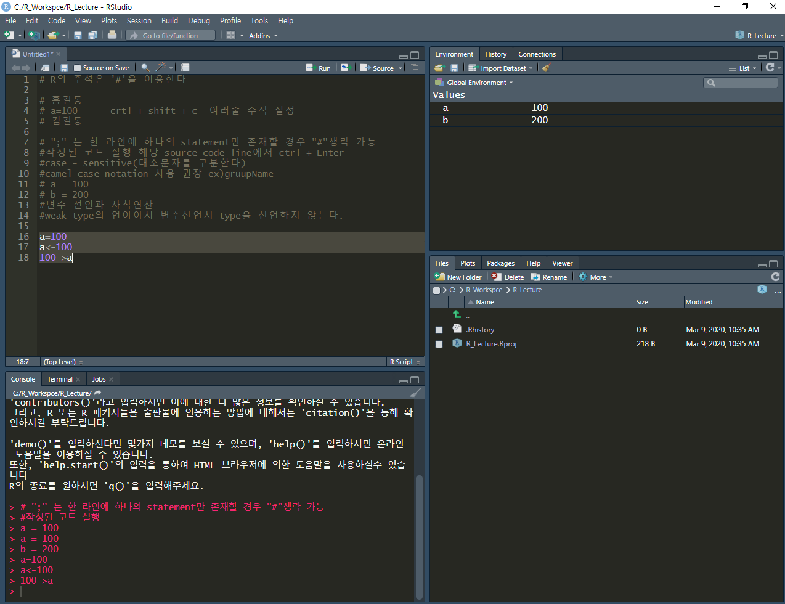
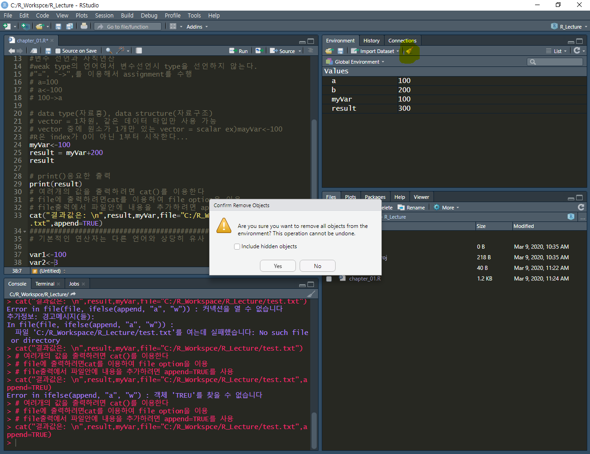
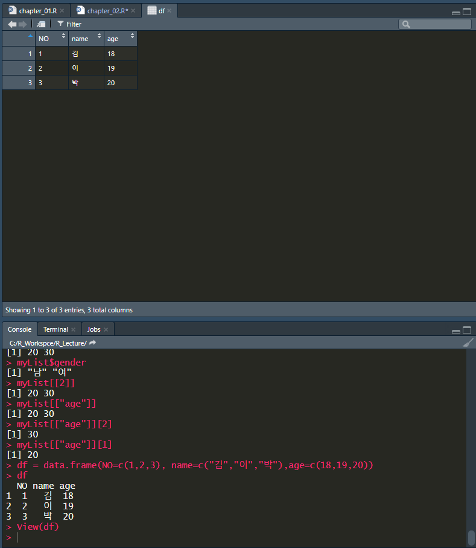
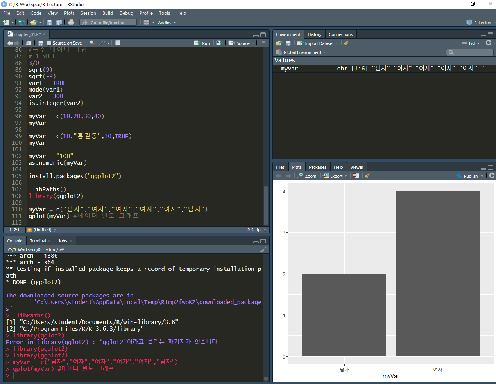

# R Data

## 주석

```R
# R의 주석은 '#'을 이용한다

# 홍길동
# a=100      crtl + shift + c  여러줄 주석 설정 
# 김길동
```

## 컴파일

```R
#작성된 코드 실행 해당 source code선택된 line에서  ctrl + Enter
a = 100
b = 200
```

## 변수 데이터 대입 법

```R
#아래 선언 방법은 동일하나 아래 방법을 추천한다.
a=100
a<-100
100->a
```



## vector

* 1차원, 같은 데이터 타입만 사용가능
* 원소가 1개만 있는 vector = scalar

```R
# data type(자료횽), data structure(자료구조)
# vector = 1차원, 같은 데이터 타입만 사용 가능
# vector 중에 원소가 1개만 있는 vector = scalar ex)mayVar<-100
#R은 index가 0이 아닌 1부터 시작한다...
myVar<-100
result = myVar+200
result

------------출력---------------
[1] 300
```

## print()

> 프린트 함수는 하나의 값만 출력 할 수 있다.

```R
myVar<-100
result = myVar+200
result

# print()응요한 출력
print(result)
```

```R
> result
[1] 300
> print(result)
```


## cat()

```R
# 여려개의 값을 출력하려면 cat()를 이용한다
cat("결과값은: \n",result,myVar)
```

```R
> cat(result,myVar)
300 100
> cat("결과값은: \n",result,myVar)
결과값은: 
 300 100
```

```R
# file에 출력하려면cat를 이용하여 file option을 이용
# file출력에서 파일안에 내용을 추가하려면 append=TRUE를 사용
cat("결과값은: \n",result,myVar,file="C:/R_Workspce/R_Lecture/test.txt",append=TRUE)
```


## 메모리 데이터 정리



## 연산자

### /

```R
var1<-100
var2<-3
result<-var1/var2

--------------------------------------

> var1<-100
> var2<-3
> result<-var1/var2
> result
[1] 33.33333
```

### options

```R
var1<-100
var2<-3
result<-var1/var2
result  #33.33333(c총 7개의 digit로 표현 - default)
options(digits = 5)
result
---------------------------------------
> options(digits = 5)
> result
[1] 33.333
```

### format

```R
> # c와 java처럼 format을 이용한 출력도 가능하다.
> sprintf("%.8f",result)
[1] "33.33333333"
```

### 나머지와 몫

```R
> result<-var1 %/% var2 #몫을 구할떄 사용
> result
[1] 33
> result = var1 %% var2 #나머지를 구할때 사용
> result
[1] 1
```

## 비교연산

### "=="

```R
> # 비교연산은 다른 언어와 동일하다
> var1 = 100
> var2 = 200
> var1 == var2
[1] FALSE
```

### "!="

```R
> var1 != var2
[1] TRUE
```

## 논리연산

### &,&& / |,||

```R
# 논리연산은 R에서 주의해서 써야한다
# &,&& 는 의미는 같다(AND)
# |,|| 는 의미는 같다(OR)
# 하나와 두개는 vector인지 scalar인지에 따라서 동작이다르다
> TRUE & TRUE
[1] TRUE
> TRUE && TRUE
[1] TRUE
> TRUE && FALSE
[1] FALSE
> TRUE & FALSE
[1] FALSE
> # combine 함수 이용해서 vector를 생성 c()
> c(TRUE, FALSE) & c(TRUE, TRUE) # &를 이용하면 백터화 연산을 수행(같은 위치끼리 연산)
[1]  TRUE FALSE
> c(TRUE, FALSE) && c(TRUE, TRUE) ## 맨 처음에 있는 요소를 가지고 연산
[1] TRUE
> c(TRUE, FALSE) && c(TRUE, TRUE, TRUE)
[1] TRUE
```

# Data Type

## DataType종류

1. numeric(수치형)
   * 정수와 실수를 구분하지 않음.
   * 숫자 뒤에 L을 붙이면 실수형 타입이 된다 (100 - 실수, 100.3 - 실수, 10L - 정수)
   
2. character(문자열)
   
   * 하나의 문자, 문자열 둘다 문자열로 사용
   
3. logical(논리형)
   * TRUE - T
   * FALSE - F
   
   1. boolean indexing(size가 같아야한다)
   
   ```R
   > x <- c(2,4,6,8)   
   > y <- c(T,F,T,F)
   > y[1]
   [1] TRUE
   > x[y]
   [1] 2 6
   ```
   
   2. fency indexting
   
   ```R
   > x[c(1,2,4)]
   [1] 2 4 8
   ```
   
   
   
4. complex(복소수형)
   
   * 4-3i

## 특수 Data Type

1. NULL

   * java의 null과 유사한 의미
   * 존재하지 않는 객체를 지정할때 사용

2. NA

   * Not Available - 유효하지 않은 값
   * 결측치를 표현할때 사용(missing value)
   * sensor에서 잘못된 값이나 사용할수 없는 값이 들어올때 사용

3. NAN

   * Not A Number - 수치 값 이지만 숫자로 표현이 안되는 값

     * sqrt(9) = 3,

     ```R
     > sqrt(9)
     [1] 3
     ```

     * sqrt(-9) = ???  => NaN

     ```R
     > sqrt(-9) 
     [1] NaN
     경고메시지(들): 
     In sqrt(-9) : NaN이 생성되었습니다
     ```

4. Inf

   * Infinite - 무한대의 양

   ```R
   > 3/0
   [1] Inf
   ```

## DataType 우선순위

* character <- complex <- numeric <- logical
* 데이터가 상위 type으로 맞춰지게 된다.

```R
> myVar = c(10,20,30,40)
> myVar
[1] 10 20 30 40
> myVar = c(10,20,30,FALSE)
> myVar
[1] 10 20 30  0
> myVar = c(10,20,30,TRUE)
> myVar
[1] 10 20 30  1
```

```R
> myVar = c(10,"홍길동",30,TRUE)
> myVar
[1] "10"     "홍길동" "30"     "TRUE"  
```

# 함수

## mode()

* 데이터 타입을 알려주는 함수

  ```R
  > var1 = 100
  > mode(var1)
  [1] "numeric"
  
  > var1 = TRUE
  > mode(var1)
  [1] "logical"
  ```

## is 계열 함수

> 여러개의 is.xxxxxx() 가 있다.
>
> Type을 확인하는 함수

* is.numeric()

  ```R
  > var2 = 300
  > is.numeric(var2)
  [1] TRUE
  ```

* is.duble()

  ```R
  > is.double(var2)
  [1] TRUE
  ```

* is.integer()

  ```R
  > is.integer(var2)
  [1] FALSE
  ```
  
* is.na()

  * 결측치 확인(Missing Value = NA)

  ```R
  > x <- c(10,20,30,NA,40,50,60,NA,NA,100)
  > is.na(x)
   [1] FALSE FALSE FALSE  TRUE FALSE FALSE FALSE  TRUE  TRUE FALSE
  > sum(is.na(x))
  [1] 3
  ```

  * 실습 예제

  ```R
  > z <-c(1,2,3,4)
  > (z+2)[(!is.na(z)) & z>2] ->z
  > z
  [1] 5 6
  ```

  


## as 계열 함수

> 케스팅 작업

* as.numeric()

  ```R
  > myVar = "100"
  > as.numeric(myVar)
  [1] 100
  ```


## 기본 함수

### abs()

* 절대값 구하는 함수

### sqrt()

* 제곱근을 구하는 함수

### factorial()

* 팩토리얼

### sum()

```R
> x <- c(2,4,6,8)   
> y <- c(T,F,T,F)
> sum(x[y])
[1] 8
```


# 자료 구조

* 자료형은 저장된 데이터의 타입을 지칭
* 자료구조는 데이터가 메모리에 어떤 방식으로 저장되어 있는가.

## homogeneous

* 같은 종류의

1. vector 

   * 1차원 선형구조
   * 순서개념이 존재
   * 같은종류의 데이터 타입을 이용
   * index를 이용하여 vector를 사용할수 있음
   * []를 이용해서 각 요소를 access할 수 있으며 요소가 1개짜리 vector => scalar

   * **vector만드는 방법**

     1. combine() 함수 이용 - 주로 사용됨

     ```R
     > myVar = c(100)
     > myVar     
     [1] 100
     > myVar2 = c(3.14,10,100)
     > myVar2
     [1]   3.14  10.00 100.00
     > myVar1 = c(10,20,30)
     > myVar1
     [1] 10 20 30
     # 요소들을 이용한 vector
     > result <- c(myVar1, myVar2)
     > result
     [1]  10.00  20.00  30.00   3.14  10.00 100.00
     ```

     2. ":" 을 이용

     ```R
     # 수치형데이터만 사용 할 수 있고 단조증가, 단조감소 형태의 vector를 생성
     > myVar = 1:10  #(start:end)
     > myVar
      [1]  1  2  3  4  5  6  7  8  9 10
     > myVar = 8.7:2
     > myVar
     [1] 8.7 7.7 6.7 5.7 4.7 3.7 2.7
     ```

     3. 2번의 일반형

     ```R
     > myVar = seq(1,10,2)
     > myVar
     [1] 1 3 5 7 9
     
     > myVar = seq(from=10,to=3,by=-3)  #위와 동일 하지면 원칙으로는 해당 line처럼 해야한다.
     > myVar
     [1] 10  7  4
     ```

     4. 반복적인 값을 이용

     ```R
     > myVar = rep(1:3, times=3) # 1:3 을 3번 반복
     > myVar
     [1] 1 2 3 1 2 3 1 2 3
     
     > myVar = rep(1:3, each=3) 
     > myVar
     [1] 1 1 1 2 2 2 3 3 3
     ```

   * vector안의 요소 개수 확인 함수

     * length()

     ```R
     > myVar = c(10,20,30)
     > length(myVar)
     [1] 3
     ```

   * **vector 요소의 사용(indexing 방식)**

   ```R
   > myVar = c(3.14, 100, "hello", TRUE, 300)
   > myVar
   [1] "3.14"  "100"   "hello" "TRUE"  "300"  
   > myVar[1]
   [1] "3.14"
   > myVar[3]
   [1] "hello"
   > myVar[6]  
   [1] NA
   > myVar[length(myVar)] # 마지막 요소를 access
   [1] "300"
   > result = myVar[2:4]  # slicing
   > result
   [1] "100"   "hello" "TRUE" 
   > result = myVar[c(2,3,5)] # fancy indexting
   > result
   [1] "100"   "hello" "300" 
   > myVar[-1] # 1번째 index 빼고 나머지
   [1] "100"   "hello" "TRUE"  "300"  
   > myVar[-(3:4)] # 3, 4번째 index를 뺀 나머지
   [1] "3.14" "100"  "300" 
   ```

   * vector데이터에 이름 붙이기_ names()

   ```R
   > myVar = c(10,20,30,40,50)
   > myVar
   [1] 10 20 30 40 50
   > names(myVar)
   NULL
   > names(myVar)=c("a","b","c",'d',"e")
   > names(myVar)
   [1] "a" "b" "c" "d" "e"
   > myVar
    a  b  c  d  e 
   10 20 30 40 50 
   > myVar[1]
    a 
   10 
   > myVar["a"]
    a 
   10 
   ```

   * vector 연산

   ```R
   > myVar1 = 1:3
   > myVar2 = 4:6
   > result = myVar1 + myVar2
   > result
   [1] 5 7 9
   > myVar3 = 1:6
   > result = myVar1+myVar3 # 사이즈가 다를경우 큰 사이즈 vector에 맞춰 연산 = recycle rule
   > result	# 1 2 3 1 2 3 + 1 2 3 4 5 6 
   [1] 2 4 6 5 7 9
   ```

   * vector 집합 연산

   ```R
   > var1 = 1:5
   > var2 = 3:7
   > union(var1, var2)  # 합집합
   [1] 1 2 3 4 5 6 7
   > intersect(var1,var2) # 교집합
   [1] 3 4 5
   > setdiff(var1,var2)
   [1] 1 2
   ```

2. matrix

   * 2차원구조(행과 열로 구성)

   * index를 사용할 수 있다.

   * 같은종류의 데이터 타입을 이용

   * matrix 생성

     1. matrix() 

     ```R
     > var1 = matrix(c(1:5))   # 5행 1열
     > var1
          [,1]
     [1,]    1
     [2,]    2
     [3,]    3
     [4,]    4
     [5,]    5
     
     > var1 = matrix(c(1:10),nrow=2)   # 2행 5열
     > var1
          [,1] [,2] [,3] [,4] [,5]
     [1,]    1    3    5    7    9
     [2,]    2    4    6    8   10
     
     > var1 <- matrix(c(1:11), nrow=2)  # recycleRule을 적용하여 빈곳에 1이 생성
     경고메시지(들): 
     In matrix(c(1:11), nrow = 2) :
       데이터의 길이[11]가 행의 개수[2]의 배수가 되지 않습니다
     > var1
          [,1] [,2] [,3] [,4] [,5] [,6]
     [1,]    1    3    5    7    9   11
     [2,]    2    4    6    8   10    1
     
     > var1 <- matrix(c(1:10), nrow=2, byrow=TRUE)  # byrow 속성을 이용한 가로열(행방향) 우선 체우기
     > var1
          [,1] [,2] [,3] [,4] [,5]
     [1,]    1    2    3    4    5
     [2,]    6    7    8    9   10
     ```

     2. cbind(), rbind() 이용하여  matrix생성

     ```R
     > var2 <- 1:4
     > var3 <- 5:8
     > matl = rbind(var2,var3)
     > matl
          [,1] [,2] [,3] [,4]
     var2    1    2    3    4
     var3    5    6    7    8
     
     > matl = cbind(var2,var3)
     > matl
          var2 var3
     [1,]    1    5
     [2,]    2    6
     [3,]    3    7
     [4,]    4    8
     ```

   * matrix사용 방법

     1. 2차원 indexing

     ```R
     > var1 <- matrix(c(1:10), nrow = 2, byrow = TRUE)
     > var1
          [,1] [,2] [,3] [,4] [,5]
     [1,]    1    2    3    4    5
     [2,]    6    7    8    9   10
     
     > var1[1,4]
     [1] 4
     
     > var1[,4]  # 모든행의 4열 출력 (결과는 vector로 return)
     [1] 4 9
     
     > var1[1,]
     [1] 1 2 3 4 5
     
     > length(var1) # 전체 요소의 개수
     [1] 10
     > nrow(var1) # 행의 갯수
     [1] 2
     > ncol(var1) # 열의 갯수
     [1] 5
     ```

     1. ㅁㄴㅇㄹ
     2. ㅁㄴㅇㄻㄴ

3. array

   * 3차원 이상의 구조
   * index를 사용할수 있다.
   * 같은종류의 데이터 타입을 이용
   * 3차원 array 생성

   ```R
   > var1<-array(c(1:24),dim = c(3,2,4))  #24개 요소를 3행 2열 4면 으로 구성
   > var1
   , , 1
   
        [,1] [,2]
   [1,]    1    4
   [2,]    2    5
   [3,]    3    6
   
   , , 2
   
        [,1] [,2]
   [1,]    7   10
   [2,]    8   11
   [3,]    9   12
   
   , , 3
   
        [,1] [,2]
   [1,]   13   16
   [2,]   14   17
   [3,]   15   18
   
   , , 4
   
        [,1] [,2]
   [1,]   19   22
   [2,]   20   23
   [3,]   21   24
   ```

4. factor

   * 범주

   * 방의 크기 (대, 중, 소) =>Level

   * 명목형과 순서형이 있따.

     * 명목형 - level에 순서개념이 없으면( ex)좌파,우파 )

     ```R
     > var1 = c("A","B","AB","O","A","AB")
     > var1
     [1] "A"  "B"  "AB" "O"  "A"  "AB"
     > var1Factor<- factor(var1)
     > var1Factor
     [1] A  B  AB O  A  AB
     Levels: A AB B O    # factor는 반드시 level이 함께 나온다.
     
     > levels(var1Factor) # factor의 Level만 확인
     [1] "A"  "AB" "B"  "O"
     
     > var1Factor <- factor(var1, levels = c("A","B","O"))
     > var1Factor
     [1] A    B    <NA> O    A    <NA>  # 범주안에 포함되지 않은 요소는 "NA" 로 표시된다
     Levels: A B O
     
     > var1Factor <- factor(var1, levels = c("A","B","O"), ordered = FALSE)
     > var1Factor
     [1] A    B    <NA> O    A    <NA>
     Levels: A B O
     > var1Factor<- factor(var1, levels = c("A","B","O"), ordered = TRUE)
     > var1Factor
     [1] A    B    <NA> O    A    <NA>
     Levels: A < B < O
     ```

     * 순서형 - level에 순서개념이 있으면( ex)대,중,소 )

## heterogeneous

* 다른 종류의

1. list 
   * 1차원 선형구조
   * 순서개념이 존재
   * json 을 활용할떄 많이 사용
   * 저장이 되는 구조는 **map구조(kew, value) **
   * 중첩자료 구조 = 모든 자료구조(vector, matrix, array)를 포함시킬 수 있다
   * list사용.
   
   ```R
   > var1_scalar = 100
   > var2_vector = c(10,20,30)
   > var3_matric = matrix(c(1:6), nrow = 3)
   > myList = list(var1_scalar, var2_vector, var3_matric)
   > myList
   [[1]]  # key 값을 명시하지 않으면 index값으로 명시된다.
   [1] 100
   
   [[2]]
   [1] 10 20 30
   
   [[3]]
        [,1] [,2]
   [1,]    1    4
   [2,]    2    5
   [3,]    3    6
   
   > myList[[1]]  # key 값으로 데이터 출력
   [1] 100
   > myList[[3]]
        [,1] [,2]
   [1,]    1    4
   [2,]    2    5
   [3,]    3    6
   
   > myList[[3]][1]
   [1] 1
   > myList[[3]][2]
   [1] 2
   > myList[[3]][4]
   [1] 4
   > myList[[3]][1,2]
   [1] 4
   ```
   
   * ;list key 값 부여
   
   ```R
   > myList <-list(name=c("홍길동","김길동"), age=c(20,30), gender=c("남","여"))
   > myList
   $name
   [1] "홍길동" "김길동"
   
   $age
   [1] 20 30
   
   $gender
   [1] "남" "여"
   
   > myList$age # key 값을 가지고 출력
   [1] 20 30
   > myList$gender
   [1] "남" "여"
   > myList[[2]] # index순번을 가지고 출력 가능
   [1] 20 30
   > myList[["age"]]
   [1] 20 30
   > myList[["age"]][2]
   [1] 30
   > myList[["age"]][1]
   [1] 20
   ```
   
   
   
2. **data frame**

   * 행과 열로 구성된 2차원 Table 구조(DB의 Table 구조)
   * matrix는 2차원 형태의 자료구조이지만 data frame 애눈 column이 존재한다
   * column단위로 서로 다른 type의 데이터 저장이 가능

   ```R
   > df = data.frame(NO=c(1,2,3), name=c("김","이","박"),age=c(18,19,20))
   > df
     NO name age
   1  1   김  18
   2  2   이  19
   3  3   박  20
   
   > df$name
   [1] 김 이 박
   Levels: 김 박 이  # data frame 에 문저열이 들어갈떄는 Factor형태로 들어간다.
   
   #stringsAsFactors=FALSE 해당 option을 해주면 String type으로 선언이 가능하다
   > df = data.frame(NO=c(1,2,3), name=c("김","이","박"),age=c(18,19,20),stringsAsFactors=FALSE)
   > df$name
   [1] "김" "이" "박"
   ```

   ```R
   Veiw(df)  # data frame의 테이블을 볼 수 있다.
   ```

   

   * data frame 일부를 추출해서 또 다른 data frame을 생성 

   ```R
   > df<-data.frame(x=c(1:5),y=seq(2,10,2),z=c("a","b","c","d","e"),stringsAsFactors=FALSE)
   > df
     x  y z
   1 1  2 a
   2 2  4 b
   3 3  6 c
   4 4  8 d
   5 5 10 e
   > subset(df, x>=3)
     x  y z
   3 3  6 c
   4 4  8 d
   5 5 10 e
   > subset(df, y>=6)
     x  y z
   3 3  6 c
   4 4  8 d
   5 5 10 e
   > subset1 <- subset(df, y>=6)
   > subset1
     x  y z
   3 3  6 c
   4 4  8 d
   5 5 10 e
   > subset(df, x>=3 & y<=8)
     x y z
   3 3 6 c
   ```

   


# Package

> R의 package는 처리할 Data + 기능(함수, 알고리즘)

## package 설치

* install.packages("ggplot2")

## package 삭제

* remove.packages("ggplot2")

## package 경로 확인및 병경

* .libPaths()

  ```R
  > .libPaths()
  [1] "C:/Users/student/Documents/R/win-library/3.6"
  [2] "C:/Program Files/R/R-3.6.3/library"  
  ```

* libPaths("C/myLib") => libPaths 경로 변경

## loading

* library(ggplot2)
* require(ggplot2)

## package system

1. base System

   * 설치 되어있는

   1. base package
      * loading 없이 사용 가능.
   2. recommended package
      * 설치가 되어있지만 사용하려면 Loading을 해야함

2. other package

   * 필요에 의해 다운로드된 package


## ggplot2

### qplot() - 빈도그래프

```R
> library(ggplot2)
> myVar = c("남자","여자","여자","여자","여자","남자")
> qplot(myVar) #데이터 빈도 그래프
```




# 참고 사이트

[R documentation](https://www.rdocumentation.org/)

[R]([http://datamining.dongguk.ac.kr/lectures/R/_book/%EC%86%8C%EA%B0%9C.html](http://datamining.dongguk.ac.kr/lectures/R/_book/소개.html))

