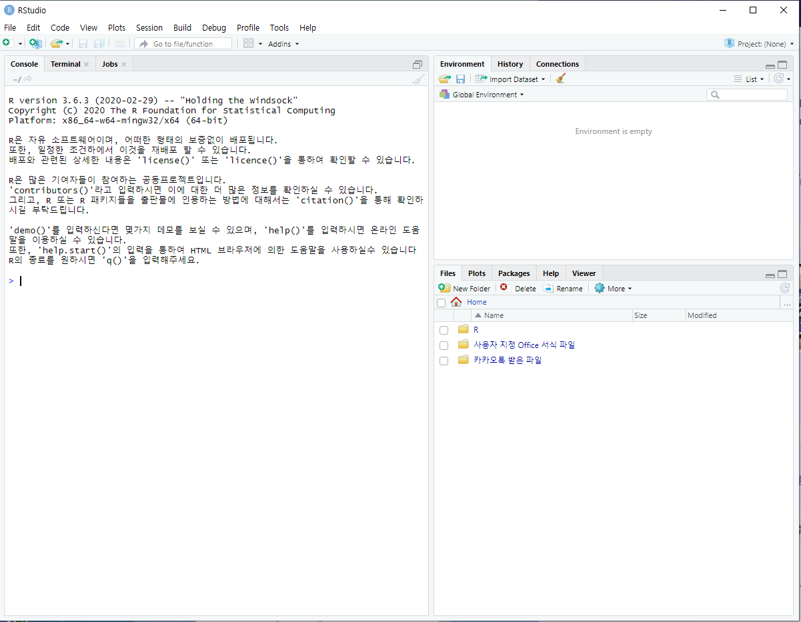
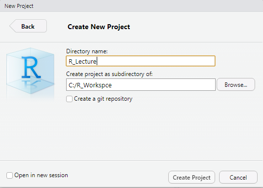
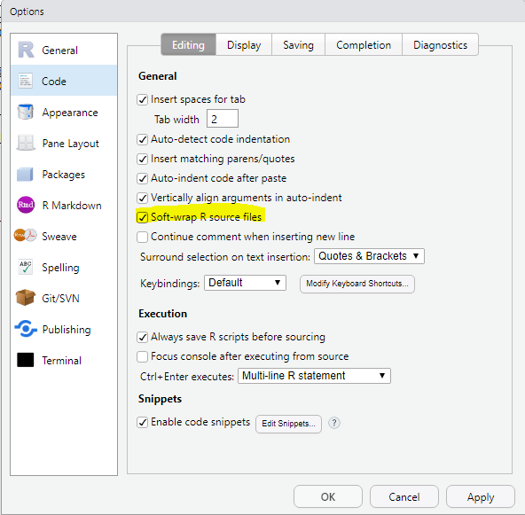
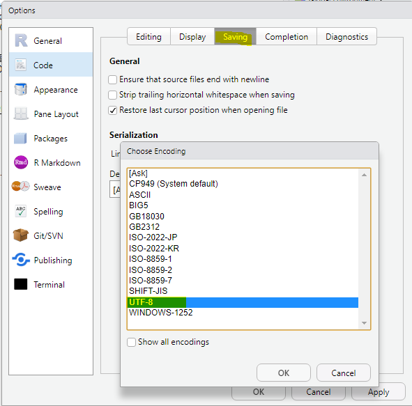

# R설치

## [CRAN](https://cran.r-project.org/)

## Rstudio

* [Rstudio](https://rstudio.com/)

 

* 최초 실행 화면

## 프로젝트 생성

* File - newProject - Directory name&경로설정 -  Create Project

 

## 인코딩 설정

* Tools - Global Option - Code - Soft Left R Sorce code Check

   

* Saving - encording

   

  

