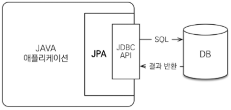
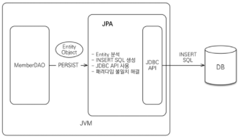
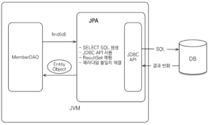
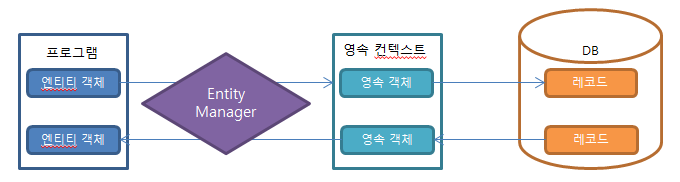
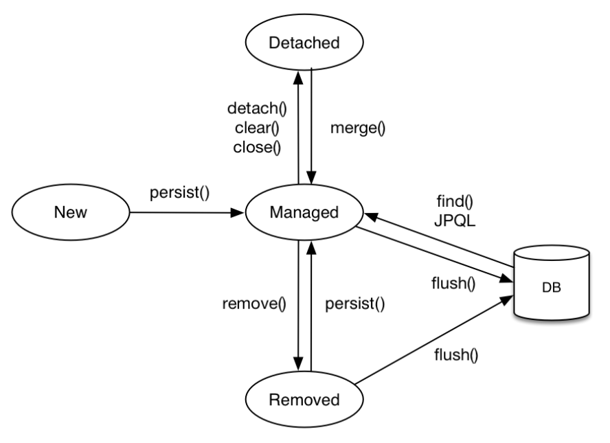

# JPA

> * Java ORM 기술에 대한 표준 명세로, Java에서 재공하는 API
> * Java 어플리케이션에서 관계형 데이터베이스를 사용하는 방식을 정의한 인터페이스
> * ORM이기 때문에 자바 클래스와 DB테이블을 매핑한다.

* ORM
  * Object-Relation Mapping
  * DB테이블을 Java객체로 매핑함으로써 객체간의 관계를 바탕으로 **SQL을 자동으로 생성**
  * RDB의 관계를 Object에 반영하는 것이 목적
  * DB데이터 <--mapping--> Object필드
    * 객체를 통해 간접적으로 DB데이터를 다룬다.
  * 객체와 DB의 데이터를 자동으로 매핑해준다.
    * SQL쿼리가 아니라 메서드로 데이터를 조작할 수 있다.
    * 객체간 관계를 바탕으로 sql을 자동으로 생성

## JPA동작 과정

* JPA는애플리케이션과 JDBC사이에서 동작한다.

 


* MemberDAO에서 객체를 저장하고 싶을 때 개발자는 JPA에 Member객체를 넘긴다.
  1. Member엑티티를 분석
  2. INSERT SQL을 생성
  3. JDBC API를 사용하여 SQL을 DB에 날린다.

 


* Member의 PK값을 JPA에 넘긴다
  1. 엔티티의 매핑 정보를 바탕으로 적절한 SELECT SQL을 생성
  2. JDBC API를 사용하여 SQL을 DB에 날린다
  3. DB로부터 결과를 받아온다.
  4. 결과fmf rprcpdp ahen aovldgksek
     * 쿼리를 JPA가 만들어 주기 때문에 Object와 RDB 간의 패러다임 불일치를 해결할 수 있다.

 


## JPA 특징

* 데이터를 객체지향적으로 관리할 수 있기 때문에 개발자는 비즈니스 로직에 집중할 수 있고 객체지향 개발이 가능
* Java 객체와 DB 테이블 사이의 매핑 설정을 통해 SQL을 생성
* 객체를 통해 쿼리를 작성할 수 있는 JPQL(Java Persistence Query Language)를 지원
* JPA는 성능 향상을 위해 지연 로딩이나 즉시 로딩고 같은 몇가지 기법을 제공하는데 이것을 잘 활영하면 SQL을 직접 사요하는 것과 유사한 성능을 얻을 수 있다.

## 영속성

* 데이터를 생성한 프로그램이 종료디어도 사라지지 않는 데이터의 특성
* 영송성르 갖지 않으면 데이터는 메모리에서만 존재하게 되고 프로그램이 종료되면 해당 데이터는 모두 사라지게 된다
* 데이터를 파일이나 DB에 영구 저장함으로써 데이터에 영속성을 부여
* 엔터티 매니저를 통해서 영속성 컨텍스트에 접근

 

## JAP에서의 영속성

* 엔티티가 **역속성 컨텍스트**에 포함되어 있냐 아니냐로 갈린다
* JPA의 **엔티티 매니저**가 활성화 된 상태로 트랜잭션 안에 DB에서 데이터를 가져오며 ㄴ이 데이터는 영속성 컨텍스트가 유지된 상태이다. 이 상태에서 해당 데이터 값을 변경하면 **트랜잭션이 끝나는 시점에 해당 테이블에 변경 내용을 반영하게 되다,**
  * 엔티티 객체의 필드 값만 병경해주면 **별도로 update()쿼리를 날리 필요가 없게 된다.(Dirty Checking)**

### 엔티티의 생명주기

* 비영속(new/transient)

  * 영속성 컨텍스트와 전혀 관계가 없는 새로운 상태

  ```java
  Member member = new Member();
  member.setId("member1");
  member.setUsername("회원1");
  ```

* 영속(managed)

  * 영속성 컨텍스트에 관리되는 상태

  ```java
  Member member = new Member();
  member.setId("member1");
  member.setUsername("회원1");
  
  EntityManager em = emf.createEntitymanager();
  em.getTransaction().begin();
  
  //객체를 저장한 상태(영속)
  em.persist(member);
  ```

* 준영속(detached)

  * 영속성 컨텍스트에 저장되었다가 분리된 상태

  ```java
  em.detach(member);	//회원 엔티티를 영속성 건텍스트에서 분리, 준영속 상태
  ```

* 삭제(removed)

  * 삭제된 상태

  ```java
  em.remove(member);	//객체를 삭제한 상태(삭제)
  ```

 

### 영속성 커넥스트의 이점

* 1차 캐시
* 동일성(idntity)보장
* 트랜잭션을 지원하는 쓰기 지연(transaction write-behind)
* 변경 감지(Dirty Checking)
* 지연 로딩(Lazy Loading)

