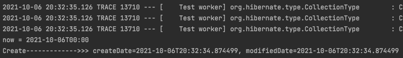

# JPA Auditing

PA를 사용하여 도메인을 관계형 데이터베이스 테이블에 매핑할 때 공통적으로 도메인들이 가지고 있는 필드나 컬럼들이 존재 (생성일자, 수정일자, 식별자 같은 필드및 칼럼)

JPA에서는 `Audit`이라는 기능을 제공하고 있습니다. Audit은 `감시하다, 감사하다`라는 뜻으로 Spring Data JPA에서 시간에 대해서 자동으로 값을 넣어주는 기능.

도메인이 영속성 컨텍스트에 저장하거나 조회를 수행한 후에 `update` 를 하는 경우 매번 시간 데이터를 입력하여 주어야 하는데, audit을 이용하면 자동으로 시간을 매핑하여 데이터베이스의 테이블에 넣어주게 된다.

* `@MappedSuperclss` 
  * JPA Entity클래스들이 BaseTimeEntity을 상속할 경우 필드들도 컬럼으로 인식하도록 한다.
* `@EntityListeners(AuditingEntityListener.class)`
  * BaseTimeEntity 클래스에 Auditing 기능을 포함시킨다.
* `@CreateDate`
  * Entity가 생성되어 저장될 때 시간이 자동 저장된다.
* `@LastModifiedDate`
  * 조회한 Entity의 값을 변경할 때 시간이 자동 저장된다.


## JPA Auditing으로 생성시간/수정시간 자동화 예제코드

* JPA Auditing 어노테이션들을 모두 활성화 할수 있도록 Application클래스에 활성화 어노테이션 추가

```java
@EnableJpaAuditing  //JPA Auditing 활성화
@SpringBootApplication
public class ApiApplication {

    public static void main(String[] args) {
        SpringApplication.run(ApiApplication.class, args);
    }

}
```

* BaseTimeEntity 클래스 생성

```java
@Getter
@MappedSuperclass   
@EntityListeners(AuditingEntityListener.class)
public abstract class BaseTimeEntity {

    @CreatedDate
    private LocalDateTime createDate;

    @LastModifiedDate
    private LocalDateTime modifiedDate;
}
```

* Entity - BaseTimeEntity클래스를 상속

```java
@Entity
@NoArgsConstructor
@Getter
public class UserInfo extends BaseTimeEntity {
  ...
}
```

* Test 코드

```java
@Test
@DisplayName("BaseTimeEntity_등록")
void BaseTimeEntity_등록(){
    //given
    LocalDateTime now = LocalDateTime.of(2021,10,06,0,0,0);
    long userNo = 989898;
    String userId = "userQ@semo.com";
    UserInfo userQ = UserInfo.builder()
            .userNo(userNo)
            .userId("userQ@semo.com")
            .userPw("semo1234")
            .userName("userQ")
            .userGender("M")
            .userBirth("19920519")
            .build();
    //when
    userRepository.save(userQ);
    UserInfo resultUser = userRepository.findByUserId(userId);
    //then
    System.out.println("now = " + now);
    System.out.println("------------->>> createDate="+resultUser.getModifiedDate()+", modifiedDate="+resultUser.getModifiedDate());

    assertThat(resultUser.getCreateDate()).isAfter(now);
    assertThat(resultUser.getModifiedDate()).isAfter(now);
}
```



