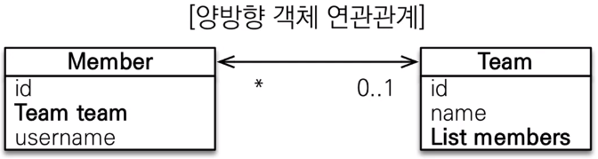
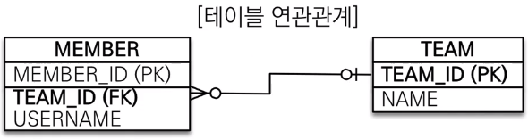

# 연관관계 매핑

>* 즉시로딩
>    * 객체 A를 조회할 때 A와 연관된 객체들을 한번에 가져오는것.
>* 지연로딩
>    * 객체 A를 조회할 때는 A만 가져오고 여관된 데이터는 프락시 초기화 방법으로 가온다.

## 단방향

```java
public class Member{
    @ID
    @GeneratedValue
    @Column(name = "MEMBER_ID")
    private Long id;
    
    @Column(name = "USER_NAME")
    private String userName;
    
    @ManyToOne
    @JonColumn(name = "TEAM_ID")
    private Team team;
}

public class Team{
    @ID
    @GeneratedValue
    @Column(name = "TEAM_ID")
    private Long id;
    
    @Column(name = "TEAM_NAME")
    private String name;
}
```

* 연관 관계 조회

```java
Team team = new Team();
team.setName("team01");
em.persist(team);

Member member = new Member();
member.setUserName("user01");
member.setTeam(team);
em.persist(member);

//DB에 쿼리를 보고싶을때 flush(), clear() 사용
em.flush();	//영송성컨텍스트에 있는 데이터를 DB에 쿼리를 날린다(싱크 맞춤)
em.clear();	//영속성 컨텍스트 초기화

//조회
Member findMember = em.find(Member.class, member.getId());
Team findTeam = findMember.getTeam();
//수정
Team newTeam = em.find(Team.class, 100L);
findMember.setTeam(newTeam)
```

## 양방향 

* Team.class 에 아래와 같은 코드를 추가해준다.

```java
//Team.class//
@OneToMany(mappedBy = "team")
private List<Member> members = new ArrayList<>();
```

* **mappedBy**
  
  * 가짜매핑
    
  * 객체와 테이블이 관계를 맺는 차이
  
    * 객체 연관관계 = 2
  
      * 회원 -> 팀 연관관계 1개(단방향)
      * 팀-> 회원 연관관계 1개(단방향)
  
       
  
      * 객체의 **양방향 관계는 사실 양방향 관계가 아니라 서로 다른 단방향 관계 2개다**
      * 객체를 양방향으로 참조하려면 **단방향 연관관계를 2개 만들어야 한다.**
  
    * 테이블 연관관계 = 1
  
      * 회원 <-> 팀의 연관관계 1개(양방향)
  
       
  
      * 테이블은 **외래 키 하나로 두 테이블의 연관관계를 관리**
  
  * 연관 관계 주인 설정
  
    * **외래키가 있는 곳을 주인으로 정해야한다**
    * 위 예시 코드에서는 Member.team이 연관관계의 주이니다
    * 연관관계의 주인에게 값 설정하는 예시
  
    ```java
    Team team = new Team();
    team.setName("TeamA");
    em.persist(team);
    
    Member meber = new Member();
    member.setUsername("member1");
    member.setTeam(team);//연관관계의 주인에 값 설정
    em.persist(member);
    
    em.flush();
    em.clear();
    ```
  
    


## 즉시로딩

* 엔티티 조회 시 연관관계에 있는 데이터까지 한 번에 조회해오는 기능

* @ManyToOne(fetch = FetchType.LAZY) 옵션으로 지정할 수 있다.

  ```java
  @ManyToOne(fetch = FetchType.LAZY)
  @JoinColumn(name = "member_id")
  private Member member; //주문 회원
  ```

* 즉시 로딩으로 조회된 엔티티의 연관관계 필드에는 실제 엔티티가 객체가 변환된다.

* 주의사항

  * 즉시로딩을 사용하면 예상하지 못한 SQL이발생할 수 있다.
  * 즉시 로딩은 JPQL 사용 시 **N+1 문제**를 유발한다.
    * JQPL이 수행되면 실제로 SELECT쿼리가 총 2회가 발생한다.

