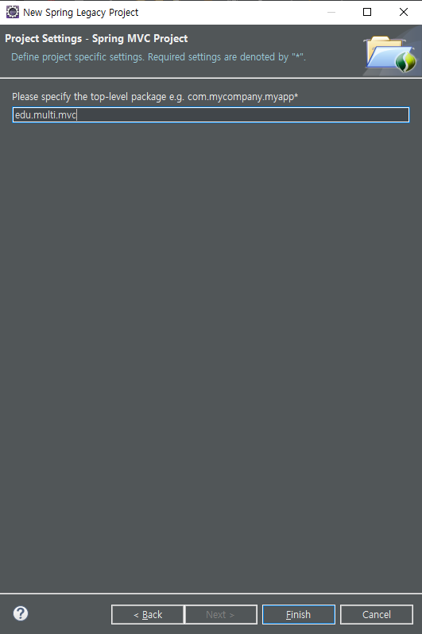
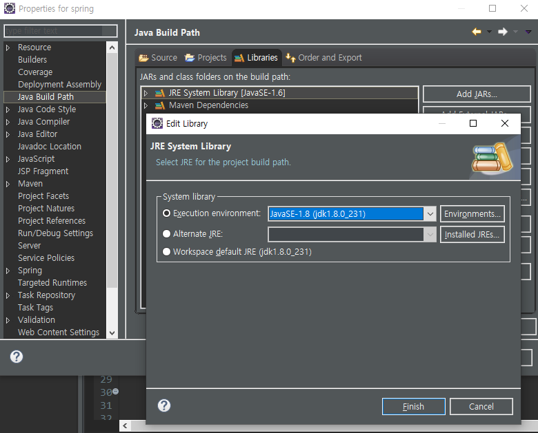
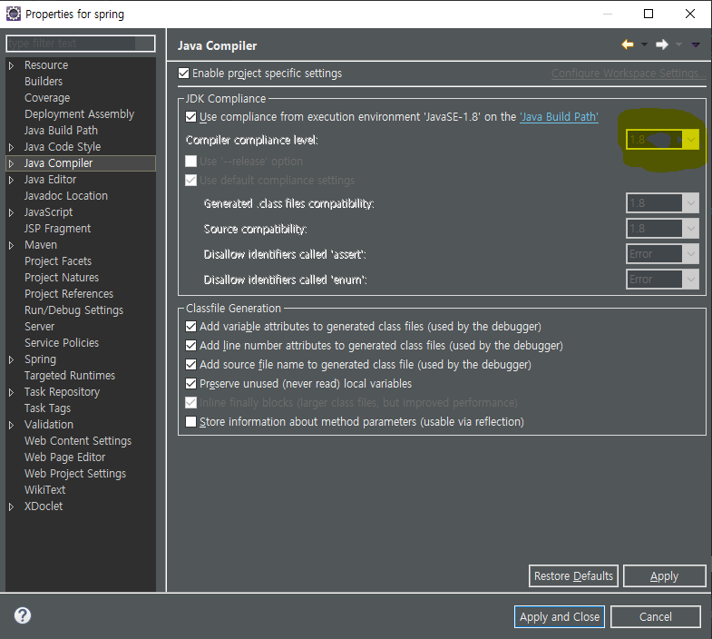
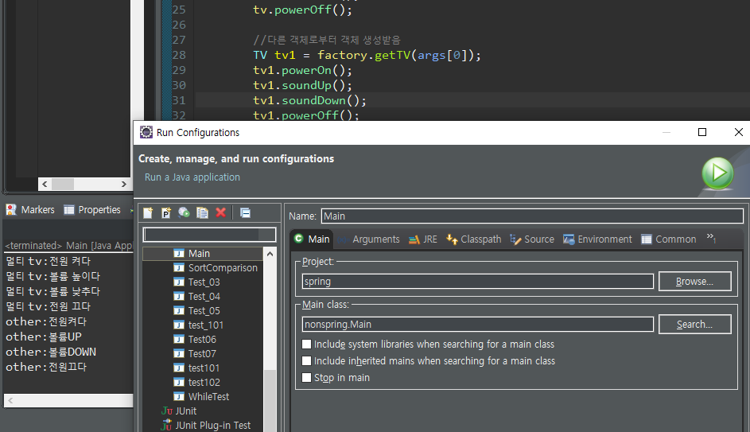
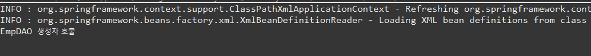
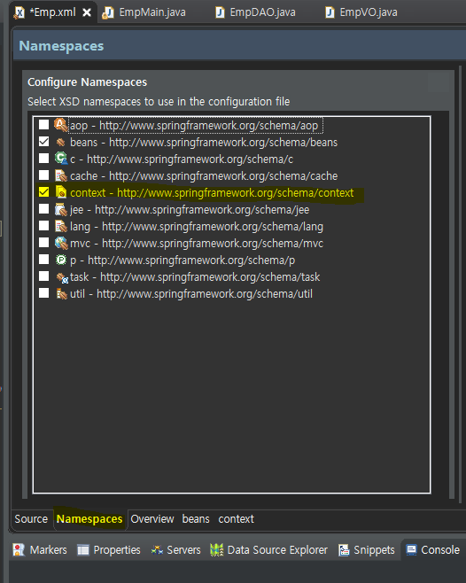

# Spring

> 조성희 강사(bluejeansh@hanmail.net)
>
> DAY 1, DI / MVC / mybatis

1. 여러가지 모듈 단위

2. Class A  extends HttpServlet

   Class B : main class실행 / 서블릿 실행/ 안드로이드 앱 실행 = plain old java object (pojo)

3. spring 이전 개발 자바 객체를 그대로 재사용 가능.

4. Spring Core - ID

* IOC 기능 지원

  * Inversion of control

  * IOC 기능 지원 =>스프링 내부 프로그래밍 방식 DI

  * DEPNDENCY INJECTION

    1.생성자

    2.setter

    ```java
    class A{
        B b1 = new B();
    }
    
    class Main(){
        
        A a1 = new A(new C());
        
    }
    
    //외부에서 전달 받음
    class A{
        B b1 = C객체, D객체;
        
        A(B b1){
            this.b1 = b1;
        }
        
        set(B b1){
            this.b1 = b1;
        }
    }
    
    interface B{}
    
    class c implements B(){
        
    }
    class D implements B(){
        
    }
    ```

    

## 환경설정

* Tomcat 8.5
* JDK 1.8
* Eclipse - Spring Tools 3(Standard Edition) - install
* Spring 4


## 프로젝트 생성





## 환경 설정 (POM.xml 수정)

```java
<?xml version="1.0" encoding="UTF-8"?>
<project xmlns="http://maven.apache.org/POM/4.0.0" xmlns:xsi="http://www.w3.org/2001/XMLSchema-instance"
	xsi:schemaLocation="http://maven.apache.org/POM/4.0.0 https://maven.apache.org/maven-v4_0_0.xsd">
	<modelVersion>4.0.0</modelVersion>
	<groupId>edu.multi</groupId>
	<artifactId>mvc</artifactId>
	<name>spring</name>
	<packaging>war</packaging>
	<version>1.0.0-BUILD-SNAPSHOT</version>
	<properties>
		<java-version>1.8</java-version>   //1.6 에서 1.8 로
		<org.springframework-version>4.3.18.RELEASE</org.springframework-version>  //3.1.1 에서 4.3.18로
```

* 수정 확인


우클릭 - Properties

* javaSE-1.6 에서 1.8 로 수정



* 1.8로 변경 되었는지 확인



* java 1.6 dptj 1.8로 수정


* Tomcat 8.5 Check


* 3개 Libraries 있는지 확인

  > Tomcat - Apache Tomcat v8.5
  >
  > jdk - JRE System Libray
  >
  > spring - Maven Dependencies




## DI -IoC

- pojo : 스프링/web/일반main 재사용 자바 객체
- 스프링 자바객체 = spring bean

1. 스프링 같은 이름 같은 타입 객체 1개 생성(공유) -singleton

2. 스프링 공장 생성 객체만 전달 - xml 파일에 요청.

3. 스프링 규칙대로 강제적으로 사용.

4. TAG - <bean>, <property>

5. @ 

    스프링은 여러가지 설정 XML파일을 사용. 또는 @(annotation).

### IOC 예제

> 왜ㅣ부 객체 전달(new 사라지고 xml 파일 설정)

```xml
<?xml version="1.0" encoding="UTF-8"?>
<beans xmlns="http://www.springframework.org/schema/beans"
	xmlns:xsi="http://www.w3.org/2001/XMLSchema-instance"
	xsi:schemaLocation="http://www.springframework.org/schema/beans http://www.springframework.org/schema/beans/spring-beans.xsd">

	<bean id='tv' class='tvspring.OtherTV'></bean>
	<bean id='tv2' class='tvspring.MultiTV'></bean>
	
</beans>
```

```java
package tvspring;

import org.springframework.context.ApplicationContext;
import org.springframework.context.support.ClassPathXmlApplicationContext;

public class Main {

	public static void main(String[] args) {
		ApplicationContext factory = new ClassPathXmlApplicationContext("tvspring/tv.xml");

		TV tv = factory.getBean("tv", TV.class);  //TV Type
		tv.powerOn();
		tv.soundUp();
		tv.soundDown();
		tv.powerOff();
		
		TV tv2 = factory.getBean("tv2", TV.class);  //TV Type
		tv2.powerOn();
		tv2.soundUp();
		tv2.soundDown();
		tv2.powerOff();
	}
}
```

```java
package tvspring;

//모든 tv들은 메소드 공통 약속: 구혀ㅑㄴ방법 다르다.
//상속 다른 클래스 '의무적' 메소드 Override

public interface TV {
	public void powerOn();
	public void powerOff();
	public void soundUp();
	public void soundDown();
}
```

```jade
package tvspring;

public class MultiTV implements TV{
	
	
	public void powerOn() {
		System.out.println("멀티 tv:전원 켜다");
	}
	public void powerOff() {
		System.out.println("멀티 tv:전원 끄다");
	}
	
	public void soundUp() {
		System.out.println("멀티 tv:볼륨 높이다");
	}
	public void soundDown() {
		System.out.println("멀티 tv:볼륨 낮추다");
	}

}
```


DO - 

값 접근 객체 :JDBC/ io/네트워크  DAO - Data access object

갑 저장 객체 = DATA OBJECT = Value object


### Costructor DI


### Setter DI

> DI: 스프링 객체 전달 받자.

```xml
<?xml version="1.0" encoding="UTF-8"?>
<beans xmlns="http://www.springframework.org/schema/beans"
	xmlns:xsi="http://www.w3.org/2001/XMLSchema-instance"
	xsi:schemaLocation="http://www.springframework.org/schema/beans http://www.springframework.org/schema/beans/spring-beans.xsd">

<bean id="vo" class="empspring.EmpVO">
	<property name="name" value="김사원"></property>
	<property name="salary" value="10000"></property>
	<property name="deptname" value="교육부"></property>
</bean>

<bean id="dao" class="empspring.EmpDAO">
	<property name="vo" ref="vo"/>
</bean>

</beans>
```

```java
package empspring;

import org.springframework.context.ApplicationContext;
import org.springframework.context.support.ClassPathXmlApplicationContext;

public class EmpMain {

	public static void main(String[] args) {
		ApplicationContext factory = new ClassPathXmlApplicationContext("empspring/Emp.xml");
		//Spring Bean configuration XML
		EmpDAO dao = factory.getBean("dao",EmpDAO.class);
		
		dao.insertEmp();
	}

}
```

```java
package empspring;

public class EmpVO {
	
	private String name;
	private double salary;
	private String deptname;
	
	public String getName() {
		return name;
	}
	public void setName(String name) {
		this.name = name;
	}
	public double getSalary() {
		return salary;
	}
	public void setSalary(double salary) {
		this.salary = salary;
	}
	public String getDeptname() {
		return deptname;
	}
	public void setDeptname(String deptname) {
		this.deptname = deptname;
	}
}
```

```java
package empspring;

public class EmpDAO {
	//FORM - 사원정보 - DB저장 메소드
	EmpVO vo;
	
	public void setVo(EmpVO vo) {
		this.vo = vo;
	}
	public void insertEmp() {
		//EmpVO객체 1개 생성(김사원 10000 교육부)
		System.out.println(vo.getName() + "사원은" + vo.getSalary() + "급여를 받으며" + vo.getDeptname() + "부서이다");
	}
}
```

#### Singleton

> singleton 방식 - 생성된 객체를 공유(아래 code에 여러번 호출해도 하나의 객체만을 공유사용)

```java
package empspring;

import org.springframework.context.ApplicationContext;
import org.springframework.context.support.ClassPathXmlApplicationContext;

public class EmpMain {

	public static void main(String[] args) {
		ApplicationContext factory = new ClassPathXmlApplicationContext("empspring/Emp.xml");
		//Spring Bean configuration XML
		//스프링 설정내용 객체생성 1 개 공유 - singleton 방식 - 생성된 객체를 공유
		EmpDAO dao = factory.getBean("dao",EmpDAO.class);
		//dao.insertEmp();
		
		//스프링 설정내용 객체생성 2 생성자 2
		EmpDAO dao1 = factory.getBean("dao",EmpDAO.class);
	}
}
```



### Anootation

- @Repository("dao")
- @Repository - () 가 없으면 class 이름 적용
- @Conponent - () => Repositoy 와 동일
- @Autowired  --> 유일하게 객체가아닌 변수 위에 위치


##### TAG추가 _(context)



```xml
<?xml version="1.0" encoding="UTF-8"?>
<beans xmlns="http://www.springframework.org/schema/beans"
	xmlns:xsi="http://www.w3.org/2001/XMLSchema-instance"
	xmlns:context="http://www.springframework.org/schema/context"
	xsi:schemaLocation="http://www.springframework.org/schema/beans http://www.springframework.org/schema/beans/spring-beans.xsd
		http://www.springframework.org/schema/context http://www.springframework.org/schema/context/spring-context-4.3.xsd">

<!-- @Repository, @Component, ->bean tag 대신 객체생성
	@Autowrired  -> property 대신
	설정 인식 표현 -->
	
<context:component-scan base-package="annotation.empspring"></context:component-scan>

<bean id="vo" class="annotation.empspring.EmpVO">
	<property name="name" value="김사원"></property>
	<property name="salary" value="10000"></property>
	<property name="deptname" value="교육부"></property>
</bean>

</beans>
```


### VO  

> 값 임시 저장소

### DAO

> 값 접근 객체
>
> 1개 sql 실행 단위 = 1개 method

### service

> 1개 기능 단위(예 : 회원가입)
>
> 

#### ex)회원 가입

0. select id
1. insert(EmpVO v0) sql

| 입력/출력    | service | DAO  | VO   | DataBase |
| ------------ | ------- | ---- | ---- | -------- |
| main/servlet |         |      |      |          |


## AOP

> (선택적)

## MVC

## mybatis

> data Base 이연결 == jdbc
>
> 현업에서 주로 사용 


# 사이트

[android](https://elfinlas.tistory.com/category/DevF/Android)


