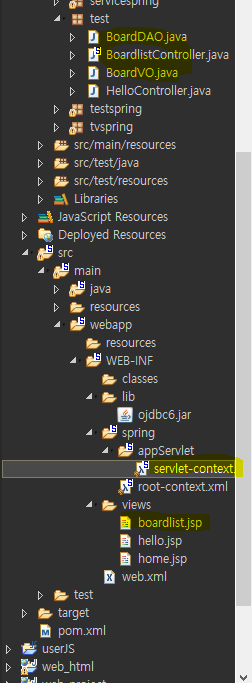

# Spring

> 조성희 강사(bluejeansh@hanmail.net)
>
> DAY 1. DI / MVC / mybatis
>
> DAY 2. AOP 

1. 여러가지 모듈 단위

2. Class A  extends HttpServlet

   Class B : main class실행 / 서블릿 실행/ 안드로이드 앱 실행 = plain old java object (pojo)

3. spring 이전 개발 자바 객체를 그대로 재사용 가능.

4. Spring Core - ID

* IOC 기능 지원

  * Inversion of control

  * IOC 기능 지원 =>스프링 내부 프로그래밍 방식 DI

  * DEPNDENCY INJECTION

    1.생성자

    2.setter

    ```java
    class A{
        B b1 = new B();
    }
    
    class Main(){
        
        A a1 = new A(new C());
        
    }
    
    //외부에서 전달 받음
    class A{
        B b1 = C객체, D객체;
        
        A(B b1){
            this.b1 = b1;
        }
        
        set(B b1){
            this.b1 = b1;
        }
    }
    
    interface B{}
    
    class c implements B(){
        
    }
    class D implements B(){
        
    }
    ```

    

## 환경설정

* Tomcat 8.5
* JDK 1.8
* Eclipse - Spring Tools 3(Standard Edition) - install
* Spring 4


## 프로젝트 생성


## 환경 설정 (POM.xml 수정)

```java
<?xml version="1.0" encoding="UTF-8"?>
<project xmlns="http://maven.apache.org/POM/4.0.0" xmlns:xsi="http://www.w3.org/2001/XMLSchema-instance"
	xsi:schemaLocation="http://maven.apache.org/POM/4.0.0 https://maven.apache.org/maven-v4_0_0.xsd">
	<modelVersion>4.0.0</modelVersion>
	<groupId>edu.multi</groupId>
	<artifactId>mvc</artifactId>
	<name>spring</name>
	<packaging>war</packaging>
	<version>1.0.0-BUILD-SNAPSHOT</version>
	<properties>
		<java-version>1.8</java-version>   //1.6 에서 1.8 로
		<org.springframework-version>4.3.18.RELEASE</org.springframework-version>  //3.1.1 에서 4.3.18로
```

* 수정 확인


우클릭 - Properties

* javaSE-1.6 에서 1.8 로 수정


* 1.8로 변경 되었는지 확인


* java 1.6 dptj 1.8로 수정


* Tomcat 8.5 Check


* 3개 Libraries 있는지 확인

  > Tomcat - Apache Tomcat v8.5
  >
  > jdk - JRE System Libray
  >
  > spring - Maven Dependencies


## DI -IoC

- pojo : 스프링/web/일반main 재사용 자바 객체
- 스프링 자바객체 = spring bean

1. 스프링 같은 이름 같은 타입 객체 1개 생성(공유) -singleton

2. 스프링 공장 생성 객체만 전달 - xml 파일에 요청.

3. 스프링 규칙대로 강제적으로 사용.

4. TAG - <bean>, <property>

5. @ 

    스프링은 여러가지 설정 XML파일을 사용. 또는 @(annotation).

### IOC

* 기능 - DL / DI
  * DL 은 사용하지않음
  * DI - Constructor DI/ Setter DI

* inversion of control

> 왜ㅣ부 객체 전달(new 사라지고 xml 파일 설정)

```xml
<?xml version="1.0" encoding="UTF-8"?>
<beans xmlns="http://www.springframework.org/schema/beans"
	xmlns:xsi="http://www.w3.org/2001/XMLSchema-instance"
	xsi:schemaLocation="http://www.springframework.org/schema/beans http://www.springframework.org/schema/beans/spring-beans.xsd">

	<bean id='tv' class='tvspring.OtherTV'></bean>
	<bean id='tv2' class='tvspring.MultiTV'></bean>
	
</beans>
```

```java
package tvspring;

import org.springframework.context.ApplicationContext;
import org.springframework.context.support.ClassPathXmlApplicationContext;

public class Main {

	public static void main(String[] args) {
		ApplicationContext factory = new ClassPathXmlApplicationContext("tvspring/tv.xml");

		TV tv = factory.getBean("tv", TV.class);  //TV Type
		tv.powerOn();
		tv.soundUp();
		tv.soundDown();
		tv.powerOff();
		
		TV tv2 = factory.getBean("tv2", TV.class);  //TV Type
		tv2.powerOn();
		tv2.soundUp();
		tv2.soundDown();
		tv2.powerOff();
	}
}
```

```java
package tvspring;

//모든 tv들은 메소드 공통 약속: 구혀ㅑㄴ방법 다르다.
//상속 다른 클래스 '의무적' 메소드 Override

public interface TV {
	public void powerOn();
	public void powerOff();
	public void soundUp();
	public void soundDown();
}
```

```jade
package tvspring;

public class MultiTV implements TV{
	
	
	public void powerOn() {
		System.out.println("멀티 tv:전원 켜다");
	}
	public void powerOff() {
		System.out.println("멀티 tv:전원 끄다");
	}
	
	public void soundUp() {
		System.out.println("멀티 tv:볼륨 높이다");
	}
	public void soundDown() {
		System.out.println("멀티 tv:볼륨 낮추다");
	}

}
```


DO - 

값 접근 객체 :JDBC/ io/네트워크  DAO - Data access object

갑 저장 객체 = DATA OBJECT = Value object


### Costructor DI


### Setter DI

> DI: 스프링 객체 전달 받자.

```xml
<?xml version="1.0" encoding="UTF-8"?>
<beans xmlns="http://www.springframework.org/schema/beans"
	xmlns:xsi="http://www.w3.org/2001/XMLSchema-instance"
	xsi:schemaLocation="http://www.springframework.org/schema/beans http://www.springframework.org/schema/beans/spring-beans.xsd">

<bean id="vo" class="empspring.EmpVO">
	<property name="name" value="김사원"></property>
	<property name="salary" value="10000"></property>
	<property name="deptname" value="교육부"></property>
</bean>

<bean id="dao" class="empspring.EmpDAO">
	<property name="vo" ref="vo"/>
</bean>

</beans>
```

```java
package empspring;

import org.springframework.context.ApplicationContext;
import org.springframework.context.support.ClassPathXmlApplicationContext;

public class EmpMain {

	public static void main(String[] args) {
		ApplicationContext factory = new ClassPathXmlApplicationContext("empspring/Emp.xml");
		//Spring Bean configuration XML
		EmpDAO dao = factory.getBean("dao",EmpDAO.class);
		
		dao.insertEmp();
	}

}
```

```java
package empspring;

public class EmpVO {
	
	private String name;
	private double salary;
	private String deptname;
	
	public String getName() {
		return name;
	}
	public void setName(String name) {
		this.name = name;
	}
	public double getSalary() {
		return salary;
	}
	public void setSalary(double salary) {
		this.salary = salary;
	}
	public String getDeptname() {
		return deptname;
	}
	public void setDeptname(String deptname) {
		this.deptname = deptname;
	}
}
```

```java
package empspring;

public class EmpDAO {
	//FORM - 사원정보 - DB저장 메소드
	EmpVO vo;
	
	public void setVo(EmpVO vo) {
		this.vo = vo;
	}
	public void insertEmp() {
		//EmpVO객체 1개 생성(김사원 10000 교육부)
		System.out.println(vo.getName() + "사원은" + vo.getSalary() + "급여를 받으며" + vo.getDeptname() + "부서이다");
	}
}
```

#### Singleton

> singleton 방식 - 생성된 객체를 공유(아래 code에 여러번 호출해도 하나의 객체만을 공유사용)

```java
package empspring;

import org.springframework.context.ApplicationContext;
import org.springframework.context.support.ClassPathXmlApplicationContext;

public class EmpMain {

	public static void main(String[] args) {
		ApplicationContext factory = new ClassPathXmlApplicationContext("empspring/Emp.xml");
		//Spring Bean configuration XML
		//스프링 설정내용 객체생성 1 개 공유 - singleton 방식 - 생성된 객체를 공유
		EmpDAO dao = factory.getBean("dao",EmpDAO.class);
		//dao.insertEmp();
		
		//스프링 설정내용 객체생성 2 생성자 2
		EmpDAO dao1 = factory.getBean("dao",EmpDAO.class);
	}
}
```


### Anootation

* Repository - 클래스위 선언

* Service -클래스위 선언

* Component -클래스위 선언

* Autowired -맴버변수, 생성자 , sertter 위에 선언

* Resource -맴버변수, 생성자 , sertter 위에 선언

* Qualifier -맴버변수, 생성자 , sertter 위에 선언 ex) B type 객체가 여러개 즉 ,b1 or b2 가 있을때

  Qualifier("b2") 처럼 선언하면 b2객체를 불러온다.

>@Repository("dao")
>
>@Repository - () 가 없으면 class 이름 적용
>
>@Conponent - () => Repositoy 와 동일
>
>@Autowired  --> 유일하게 객체가아닌 변수 위에 위치


##### TAG추가 _(context)


```xml
<?xml version="1.0" encoding="UTF-8"?>
<beans xmlns="http://www.springframework.org/schema/beans"
	xmlns:xsi="http://www.w3.org/2001/XMLSchema-instance"
	xmlns:context="http://www.springframework.org/schema/context"
	xsi:schemaLocation="http://www.springframework.org/schema/beans http://www.springframework.org/schema/beans/spring-beans.xsd
		http://www.springframework.org/schema/context http://www.springframework.org/schema/context/spring-context-4.3.xsd">

<!-- @Repository, @Component, ->bean tag 대신 객체생성
	@Autowrired  -> property 대신
	설정 인식 표현 -->
	
<context:component-scan base-package="annotation.empspring"></context:component-scan>

<bean id="vo" class="annotation.empspring.EmpVO">
	<property name="name" value="김사원"></property>
	<property name="salary" value="10000"></property>
	<property name="deptname" value="교육부"></property>
</bean>

</beans>
```


### VO  

> 값 임시 저장소

### DAO

> 값 접근 객체
>
> 1개 sql 실행 단위 = 1개 method

### service

> 1개 기능 단위(예 : 회원가입)
>
> 

#### ex)회원 가입

0. select id
1. insert(EmpVO v0) sql

| 입력/출력    | 서비스단 | DAO         | VO         | DataBase |
| ------------ | -------- | ----------- | ---------- | -------- |
| main/servlet | Service  | @Repository | @Component |          |


## AOP

> ASPECT ORIENTED PROGRAMMING
>
> 구현 필요 - 핵심관심코드 = 종단관심코드
>
> Weaving
>
> aspect - 모든 스프링 클래스 공통 구현 사항(공통관심코드 = 횡단관심코드 = 핵심관심코드)
>
> ​			- 구현 공통 필요 반복 구현 사항들
>
> (반복적 코딩 필요 - 한번 정의 - 필욯나 클래스에 연결/해제)

* @Aspect -공통관심 클래스 위 선언
* @PointCut - 메소드 내부 위 선언(내용 구현x)
* @Around - 메도스 위 선언(핵심 관심메소드 전 후)

### weaving

> 핵심관심모듈과 횡단관심 모듈은 연결해주는 역할


### 자바개발자 디자인 패턴 23 가지

> 1.proxy
>
> 2.factory
>
> 3.commeand -인터 페이스 (메소드 다른 모든 클래스 공통 저으이 규칙)/상속 하위 클래스(오버라이딩)
>
> 4.singleton
>
> 5.front controller + mvc

#### 1. proxy

```java
package proxypattern;

public class ProxyMain {

	public static void main(String[] args) {
		ProxyInter p = new C();
		B b1 = new B(); //A, C객체 실행 공통 실행 내용 객체
		
		b1.setP(p);
		b1.action();//B +(A or c)  ==>B 는 공통관심 , A or C 는 핵심관심
	}
}

```

```java
package proxypattern;

public interface ProxyInter {
	public void action();
}
```

```java
package proxypattern;

public class A implements ProxyInter{
	
	@Override
	public void action() {
		System.out.println("A class action");
	}
}


package proxypattern;

public class B implements ProxyInter{
	
	ProxyInter p;
	
	public void setP(ProxyInter p) {
		this.p = p;
	}
	@Override
	public void action() {
		System.out.println("B class action stat");
		p.action();
		System.out.println("B class action end");
	}
}

package proxypattern;

public class C implements ProxyInter{
	
	@Override
	public void action(){
		System.out.println("C class action");
	}
}

```


### AOP Libraries

> [AspectJ Weaver](https://mvnrepository.com/artifact/org.aspectj/aspectjweaver) » [1.9.2](https://mvnrepository.com/artifact/org.aspectj/aspectjweaver/1.9.2) Libraries


```xml
		
				<!-- https://mvnrepository.com/artifact/org.aspectj/aspectjweaver -->
		<dependency>
		    <groupId>org.aspectj</groupId>
		    <artifactId>aspectjweaver</artifactId>
		    <version>1.9.2</version>
		    <scope>runtime</scope>
		</dependency>
		
	</dependencies>

xml 파일에 붙여넣기
```

libraries 추가 확인


#### aop pointcut


```xml
<?xml version="1.0" encoding="UTF-8"?>
<beans xmlns="http://www.springframework.org/schema/beans"
	xmlns:xsi="http://www.w3.org/2001/XMLSchema-instance"
	xmlns:aop="http://www.springframework.org/schema/aop"
	xsi:schemaLocation="http://www.springframework.org/schema/beans http://www.springframework.org/schema/beans/spring-beans.xsd
		http://www.springframework.org/schema/aop http://www.springframework.org/schema/aop/spring-aop-4.3.xsd">
	
	<bean id="member" class="aop1.Member"></bean>
	<bean id="board" class="aop1.Board"></bean>
	<bean id="common" class="aop1.Common"></bean>
	
	<aop:config>
		<aop:pointcut expression="execution(public * aop1.*.*(..))" id="pc"/> 리턴타입 패키지명.클래스명.메소드(매개변수) 
		<aop:aspect id="aspect1" ref='common'>
			<aop:before method="dateTime" pointcut-ref="pc"/>
		</aop:aspect>
	</aop:config>

</beans>
```

> ​     = > 리턴타입 패키지명.클래스명.메소드(매개변수)
>
> *** :** **모든 **
>
> **(..) : 모든 매개변수**
>
> **.. :** **하위패키지 포함** 

#### pointcut

>● execution 명시자 : Advice를 적용할 메서드를 명시할 때 사용
>
> 기본 형식  execution(리턴타입 패키지명.클래스명.메소드(매개변수) )
>
> ▶ 수식어패턴 : public, private 등등의 수식어를 명시, 생략 가능
>
> ▶ 리턴타입 : 리턴 타입을 명시
>
> ▶ 클래스이름, 이름패턴 : 클래스 이름 및 메서드이름을 패턴으로 명시
>
> ▶ 파라미터패턴 : 매칭될 파라미터에 대해 명시
>
> ▶ '*' : 모든 값을 표현
>
> ▶ '..' : 0개 이상을 의미

#### within 명시자

> 특정 타입에 속하는 메서드를 PointCut으로 설정 할떄 사용

```xml
 within(sp.aop.service.*)

  => sp.aop.service 패키지에 있는 모든 메서드

 within(sp.aop.service..*)

  => sp.aop.service 패키지 및 하위 패키지에 있는 모든 메서드
```

#### bean 명시자

> Spring bean 이름을 이용하여 PointCut을 정의

```xml
bean(faqBoard)

  => 이름이 faqBoard인 빈의 메서드 호출

bean(*noticeBoard)

  => 이름이 noticeBoard로 끝나는 빈의 메서드 호출
```

#### Aspect

> **@Before** (이전) : 어드바이스 타겟 메소드가 호출되기 전에 어드바이스 기능을 수행
>
> **@After (이후)** : 타겟 메소드의 결과에 관계없이(즉 성공, 예외 관계없이) 타겟 메소드가 완료 되면 어드바이스 기능을 수행
>
> @AfterReturning (정상적 반환 이후)타겟 메소드가 성공적으로 결과값을 반환 후에 어드바이스 기능을 수행
>
> @AfterThrowing (예외 발생 이후) : 타겟 메소드가 수행 중 예외를 던지게 되면 어드바이스 기능을 수행
>
> **@Around** (메소드 실행 전후) : 어드바이스가 타겟 메소드를 감싸서 타겟 메소드 호출전과 후에 어드바이스 기능을 수행

## MVC

> Web 프로그램 3가지
>
> html
>
> javaScript+jQuery
>
> serrblet+jsp


- MVC 의 핵심은 비즈니스 로직과 프리젠테이션 로직의 분리이다.
- 레이어별 역할이 뚜렷하기 때문에 협업이 용이하고, 디자인과 코딩의 분리가 자연스럽다.
- 비즈니스 로직은 재사용 가능하도록 자바 클래스로 독립적으로 존재하며, 뷰는 어떤 것(JSP, Velocity, Freemarker)이든 상관 없어야 한다.
- JSP 페이지에 비즈니스 로직이 제외되므로 가독성이 증가하고 유지보수가 용이하다.

#### 1.1 Model

- MVC 모델의 각 계층 사이에서 정보를 전송하는데 사용한다.
- 객체지향 분석화 모델링의 결과로 나오는 모델을 오브젝트 모델로 활용한다.
- Model을 사용하면 코드가 이해하기 쉽고, 로직 작성이 수월해지고, 코드 재사용성이 높아진다.
- DAO 레벨에서 모든 필드를 채워보내는 것이 성능상의 낭비일 수 있고, 모델 객체를 설계하는 것이 모호하다.

#### 1.2 View 

- 사용자 뷰(프리젠테이션) 부분이다.
- 사용자가 입력한 정보를 컨트롤에게 넘겨주거나, 컨트롤러부터 처리 정보를 반환 받는다.
- 뷰는 컨트롤러와 비즈니스 로직에 독립적이어야 한다.
- jsp 파일

#### 1.3 Controller

- 사용자 Request를 받아 Business Logic에 처리를 요청하는 제어를 담당한다.
- 제어를 어느 Business Login에 넘길 것인가를 결정하고, 처리 결과를 받아 뷰로 Response하는 역할을 담당한다.

```java
package test;

import javax.servlet.http.HttpServletRequest;
import javax.servlet.http.HttpServletResponse;

public interface Controller {
	
	public String handleRequest(HttpServletRequest request, HttpServletResponse response);

}
```

```java
package test;

import java.util.HashMap;

public class HandlerMapping {
	
	HashMap<String, Controller> mappings;
	public HandlerMapping() {
		mappings = new HashMap<String, Controller>();
		mappings.put("hello", new HelloController()); // hello url 끝나면 HelloController를 불러오겠다
	}
	
	public Controller getController(String name) {
		return mappings.get(name);
	}
}
```

- **HandlerMapping**은 클라이언트 요청에 해당하는 Controller가 어떤것인지를 결정 한다.
- 즉 클라이언트 요청 URL과 Controller를 맵핑 한다.
- Spring MVC는 다수의 HandlerMapping설정이 가능하며 이경우 order프로퍼티를 이용하여 사용순서를 정할 수 있다

| **HandlerMapping**구성요소        | 설 명                                                       |
| :-------------------------------- | :---------------------------------------------------------- |
| SimpleUrlHandlerMapping           | URL과 컨트롤러 이름을 직접 매핑 한다.                       |
| BeanNameUrlHandlerMapping         | URL과 일치하는 이름을 갖는 빈을 컨트롤러로 사용한다.        |
| ControllerClassNameHandlerMapping | URL과 매칭되는 클래스 이름을 갖는 빈을 컨트롤러로 사용한다. |
| DefaultAnnotationHandlerMapping   | @RequestMapping 어노테이션을 이용하여 컨트롤러와 매핑한다.  |

```java
package test;

import javax.servlet.http.HttpServletRequest;
import javax.servlet.http.HttpServletResponse;

public class HelloController implements Controller{
	
	@Override
	public String handleRequest(HttpServletRequest request, HttpServletResponse reponse) {
		System.out.println("HelloController 실행중");
		//servlet -->jsp 데이터 전달 = 공유
		request.setAttribute("model", "hello Spring"); 
		return "hello.jsp";
		
//	표현식 request.getAttribute("model") == $(model) 
	}
}
```

- **handleReqeust()** 메소드에서는 클라이언트의 요청을 처리한 후 View를 생성하는데 필요한 정보를 리턴

```java
package test;

import java.io.IOException;
import java.io.PrintWriter;

import javax.servlet.RequestDispatcher;
import javax.servlet.ServletException;
import javax.servlet.http.HttpServlet;
import javax.servlet.http.HttpServletRequest;
import javax.servlet.http.HttpServletResponse;

public class FrontControllerServlet extends HttpServlet {

	//web.xml :'/' ->FrontControllerServlet
	//1.모든 요청 FrontControllerServlet
	//2.http:..../board.list
	protected void doGet(HttpServletRequest request, HttpServletResponse response) throws ServletException, IOException {
		response.setContentType("text/html;charset=utf-8");
		PrintWriter out = response.getWriter();
		out.println("<h1> FrontControllerServlet</h1>");
		out.println(request.getRequestURL());
		out.println(request.getRequestURI());
		String s[] = request.getRequestURI().split("/");
		out.println("<h1>"+s[s.length-1]+"</h1>");
		//3.boardlist - 일 시키자 MVC --> SPRING 내부환경 이해 로직
		HandlerMapping mapping = new HandlerMapping();
		Controller controller = mapping.getController(s[s.length-1]);
		String viewname = controller.handleRequest(request, response);
		
		RequestDispatcher rd = request.getRequestDispatcher("/hello.jsp");  //http://localhost:port/컨텍스트명/hello.jsp
		rd.forward(request, response);
	}
}
```

```jsp
<%@ page language="java" contentType="text/html; charset=UTF-8"
    pageEncoding="UTF-8"%>
<!DOCTYPE html>
<html><head>
<meta charset="UTF-8">
<title>Spring MVC Test</title>
</head>
<body>
	<h1>
		${model }
	</h1>
	<h1>
		<%=request.getAttribute("model") %>
	</h1>
</body>
</html>
```

List를 받기 위해서는 setAttribute()와 getAttribute()를 써야 한다. 
이때 type이 Object 이기 때문에 반드시 형변환을 해줘야 한다

action에서 객체를 request에 담을 때.

**request.setAttribute("객체명", 객체);**

이렇게 해서 jsp를 호출하면 jsp에서 "객체명"을 이용해서 객체를 받을 수 있다.

```jsp
< %
	Object x = request.getAttribute("객체명");
% >
```

**Object 형으로 받아야함**


web 서버

> http 요청 -> servlet ->DAO ->DB ->VO->JSP

servlet - 클라이언트 요청 받아서 분석(회원가입, 조회 :id, pw, name...) =>결과 생성 객체 생성, 메소드 호출

jsp -브라우저  전달(html)

dao - 요청 기증 1개 수행

vo - data return

```html
<?xml version="1.0" encoding="UTF-8"?>
<web-app xmlns:xsi="http://www.w3.org/2001/XMLSchema-instance" xmlns="http://java.sun.com/xml/ns/javaee" xsi:schemaLocation="http://java.sun.com/xml/ns/javaee http://java.sun.com/xml/ns/javaee/web-app_2_5.xsd" id="WebApp_ID" version="2.5">
  <display-name>mvc2</display-name>
  <welcome-file-list>
    <welcome-file>index.html</welcome-file>
    <welcome-file>index.htm</welcome-file>
    <welcome-file>index.jsp</welcome-file>
    <welcome-file>default.html</welcome-file>
    <welcome-file>default.htm</welcome-file>
    <welcome-file>default.jsp</welcome-file>
  </welcome-file-list>
  <servlet>
    <description></description>
    <display-name>FrontControllerServlet</display-name>
    <servlet-name>FrontControllerServlet</servlet-name>
    <servlet-class>test.FrontControllerServlet</servlet-class>
  </servlet>
  <servlet-mapping>
    <servlet-name>FrontControllerServlet</servlet-name>
    <url-pattern>/front</url-pattern> // 1개 url 만 호출 가능  ( <servlet-class>test.FrontControllerServlet</servlet-class>) //
  </servlet-mapping>
</web-app>
```

.mvc

```xml
 <servlet-class>test.FrontControllerServlet</servlet-class>
  </servlet> 
<servlet-mapping>
    <servlet-name>FrontControllerServlet</servlet-name>
    <url-pattern>*.mvc</url-pattern>  확장자자가 .mvc면 모두 실행 된다
  </servlet-mapping>
```

```xml
<servlet-class>test.FrontControllerServlet</servlet-class>
  </servlet>
  <servlet-mapping>
    <servlet-name>FrontControllerServlet</servlet-name>
    <url-pattern>/</url-pattern>
  </servlet-mapping>
</web-app>
```

> http://localhost:8081/mvc2/뒤에 아무거나 와도 실행됨

## Spring MVC

> C - M -V 순으로 진행 된다. ex) .jsp(jps는 View이다) 파일에서 컴파일 하면 파일을 찾을 수 없다는 err가 발생

#### .jsp 경로


* handleMapping 역할 

  ```xml
  <?xml version="1.0" encoding="UTF-8"?>
  <beans:beans xmlns="http://www.springframework.org/schema/mvc"
  	xmlns:xsi="http://www.w3.org/2001/XMLSchema-instance"
  	xmlns:beans="http://www.springframework.org/schema/beans"
  	xmlns:context="http://www.springframework.org/schema/context"
  	xsi:schemaLocation="http://www.springframework.org/schema/mvc https://www.springframework.org/schema/mvc/spring-mvc.xsd
  		http://www.springframework.org/schema/beans https://www.springframework.org/schema/beans/spring-beans.xsd
  		http://www.springframework.org/schema/context https://www.springframework.org/schema/context/spring-context.xsd">
  
  	<!-- DispatcherServlet Context: defines this servlet's request-processing infrastructure -->
  	
  	<!-- Enables the Spring MVC @Controller programming model -->
  	<annotation-driven />
  <!-- @Component @Service @Repository @Autowired 인식 -->
  	<context:component-scan base-package="edu.multi.mvc" />
  	
  	
  	<!-- Handles HTTP GET requests for /resources/** by efficiently serving up static resources in the ${webappRoot}/resources directory -->
  	<resources mapping="/resources/**" location="/resources/" />
  
  	<!-- Resolves views selected for rendering by @Controllers to .jsp resources in the /WEB-INF/views directory -->
  	<beans:bean class="org.springframework.web.servlet.view.InternalResourceViewResolver">
  		<beans:property name="prefix" value="/WEB-INF/views/" />
  		<beans:property name="suffix" value=".jsp" />
  	</beans:bean>
  	
  <!--========= 	1. xml 태그 만으로 spring mvc 설정     ===============-->
  	<beans:bean id="hc" class="test.HelloController">
  	</beans:bean> <!--  ==>  HelloController hc = new HelloController(); -->
  	
  	<beans:bean id ="urlMapping" class="org.springframework.web.servlet.handler.SimpleUrlHandlerMapping">
		<beans:property name="mappings">
  			<beans:props>
				<beans:prop key="/hello">hc</beans:prop>
  			</beans:props>
		</beans:property>
  	</beans:bean>
	
  	<!-- <beans:bean id="bc" class="test.BoardlistController"></beans:bean>
	<beans:bean id ="urlMapping" class="org.springframework.web.servlet.handler.SimpleUrlHandlerMapping">
  		<beans:property name="mappings">
			<beans:props>
  				<beans:prop key="/board">bc</beans:prop>
			</beans:props>
  		</beans:property>
	</beans:bean> -->
  	
  </beans:beans>
  ```
  
  #### HandlerMapping 종류
  
  | 구성요소                          | 설 명                                                       |
  | :-------------------------------- | :---------------------------------------------------------- |
  | SimpleUrlHandlerMapping           | URL과 컨트롤러 이름을 직접 매핑 한다.                       |
  | BeanNameUrlHandlerMapping         | URL과 일치하는 이름을 갖는 빈을 컨트롤러로 사용한다.        |
  | ControllerClassNameHandlerMapping | URL과 매칭되는 클래스 이름을 갖는 빈을 컨트롤러로 사용한다. |
  | DefaultAnnotationHandlerMapping   | @RequestMapping 어노테이션을 이용하여 컨트롤러와 매핑한다   |
  
  - URL과 컨트롤러 빈 name을 직접 매핑
  - 손쉽게 사용할 수 있기 때문에 많이 사용한다
  - bean 등록 후 URL 매핑을 별도로 설정해야 한다.
  
  
  
  ```java
  package test;
  
  import javax.servlet.http.HttpServletRequest;
  import javax.servlet.http.HttpServletResponse;
  
  import org.springframework.web.servlet.ModelAndView;
  import org.springframework.web.servlet.mvc.Controller;
  //Command 패턴
  public class HelloController implements Controller{
  
  	@Override
  	public ModelAndView handleRequest(HttpServletRequest request, HttpServletResponse reponse) {
  		System.out.println("HelloController 실행중");
  		ModelAndView mv = new ModelAndView();
  		//servlet -->jsp 데이터 전달 = 공유 == model(view 보여줄 데이터)용어
  		mv.addObject("model", "hello Spring");//  model setting// <==request.setAttribute("model", "hello Spring"); 
  		mv.setViewName("hello"); //view setting
  		return mv;
  	}
  }
  ```
  
  ```jsp
  <%@ page language="java" contentType="text/html; charset=UTF-8"
      pageEncoding="UTF-8"%>
  <!DOCTYPE html>
  <html><head>
  <meta charset="UTF-8">
  <title>Spring MVC Test</title>
  </head>
  <body>
  	<h1>
  		${model }
  	</h1>
  	<h1>
  		<%=request.getAttribute("model") %>
  	</h1>
  </body>
  </html>
  ```
  
  ```xml
  <?xml version="1.0" encoding="UTF-8"?>
  <web-app version="2.5" xmlns="http://java.sun.com/xml/ns/javaee"
  	xmlns:xsi="http://www.w3.org/2001/XMLSchema-instance"
  	xsi:schemaLocation="http://java.sun.com/xml/ns/javaee https://java.sun.com/xml/ns/javaee/web-app_2_5.xsd">
  
  	<!-- The definition of the Root Spring Container shared by all Servlets and Filters -->
  	<context-param>
  		<param-name>contextConfigLocation</param-name>
  		<param-value>/WEB-INF/spring/root-context.xml</param-value>
  	</context-param>
  	
  	<!-- Creates the Spring Container shared by all Servlets and Filters -->
  	<listener>
  		<listener-class>org.springframework.web.context.ContextLoaderListener</listener-class>
  	</listener>
  
  	<!-- Processes application requests -->
  	<servlet>
  		<servlet-name>appServlet</servlet-name>
  		<servlet-class>org.springframework.web.servlet.DispatcherServlet</servlet-class>
  		<init-param>
  			<param-name>contextConfigLocation</param-name>
  			<param-value>/WEB-INF/spring/appServlet/servlet-context.xml</param-value>
  		</init-param>
  		<load-on-startup>1</load-on-startup>
  	</servlet>
  		
  	<servlet-mapping>
  		<servlet-name>appServlet</servlet-name>
  		<url-pattern>/</url-pattern>
  	</servlet-mapping>
  
  </web-app>
  ```
  
  
  
  
  
  spring bean configuration file => di,aop
  
  
  
  spring mvc configuration file => di, aop, mvc
  
  
  
  web server configuration file => spring mvc, servlet.jsp
  
  


### Spring MVCxml TAG 설정




### Spring MVC annotation

> <context:component-scan:

web.xml =>servlet 진입을 도와주는 역할 (요청을 받아 servlet으로 보냄, front controller 설정)

#### @Controller

> Class A implements org.sprin...Controller  를 선언 안해도 됨.

#### @RequestMapping

> @RequestMapping("/hello")
>
> @RequestMapping(name="/hello", method=RequestMethod.GET);
>
> @RequestMapping(name="/hello", method=RequestMethod.POST);

```java
@RequestMapping("/crud/start")
	public String start(){
		System.out.println("===첫 화면 입니다===");
		return "crud/start"; //view로 start.jsp 를 넘긴다.
	}
	@RequestMapping("/crud/list")
	public void list() {
		//return type이 void 이면  ("/crud/list") url이름과 동일하게 정의된다.
		//모든 회원 정보
	}
```

```java
package edu.multi.mvc;

import java.util.HashMap;
import java.util.Map;

import javax.servlet.http.HttpServletRequest;

import org.springframework.stereotype.Controller;
import org.springframework.web.bind.annotation.RequestMapping;
import org.springframework.web.servlet.ModelAndView;

@Controller
public class CRUDController {
	//회원 관리
	
	Map<String, String> members = new HashMap<String, String>();  //Map 는 key 와 벨류이다 Map<key, value>
	
	//http:/ip:prot/컨텍스트명/crud/start
	@RequestMapping("/crud/start")
	public void start(){
		System.out.println("===첫 화면 입니다===");
		members.put("String", "김길동");
		members.put("Oracle", "오라클");
		members.put("mybatis", "바티스");
		//return "crud/start"; //view로 start.jsp 를 넘긴다.
	}
	@RequestMapping("/crud/list")
	public ModelAndView list() {
		//모든 회원 정보
		//Model 컴트롤러에서 jsp로 전달 출력 데이터
		ModelAndView mv = new ModelAndView();
		mv.addObject("member", members);
		//mv.setViewName("/crud/list");  ==>url 과 이름이 같음으로 안억어도 된다
		//return type이 void 이면  ("/crud/list") url이름과 동일하게 정의된다.
		return mv;
	}
	@RequestMapping("/crud/get")
	public ModelAndView get(HttpServletRequest request) {
		String id = request.getParameter("id");
		String name = members.get(id);
		ModelAndView mv = new ModelAndView();
		mv.addObject("member", id+":"+name);
		return mv;
	}
	@RequestMapping("/crud/add")
	public void add() {
		//form입력 , members 추가 - crud/add.jsp
		members.put("new", "신입사원");
		
	}
	@RequestMapping("/crud/delete")
	public String delete() {
		members.remove("new");
		return "redirect:/crud/list"; //list 메소드 호출하는 url (redirect: 를 붙여줘야함)
	}
	@RequestMapping("/crud/update")
	public Map<String, String> update(){
		Map<String, String> informs = new HashMap<String, String>();
	
		
		return informs; //자동으로 Model이 된다 , View 이름은 자동으로 url인 "/crud/update" 가 된다
	}
}
```


##### GET

@RequestMapping(name="/hello", method=RequestMethod.GET);

1. http:...login?name1=value1&name2=value2.

2. url 뒤 요청파라미터값 전송 방식

3. url?변수명 1=값&

4. 영문자 그대로 전송

5. 특수문자나 한글 인코딩 전송

6. url 공백 포함하면 안된다.(공백에는 +가 포시된다)

7. 웹서버 url 제한

8. code

   ```html
   url?id=키보드입력 값
   <a href="/hello?id"=spring>이동</a>
   브라우져
   <form action ="url" method="get(기본)">
       <input type=text name=id>
   	<input type=submit value="로그인">
   </form>
   ```

   

##### post

1. (post 전송 값 보이지 않는다)name1=value1&name2=value2.

2. url 별도 분리

3. 영문자 그대로 전송

4. 특수문자나 한글 인코딩 전송

5. url 공백 포함하면 안된다.(공백에는 +가 포시된다)

6. 전달 길이 무제한

7. 파일 Upload, 암호 전송

8. code

   <form action ="url" method="get(기본)">
       <input type=text name=id>
   	<input type=submit value="로그인">
   </form>

```html
<form action ="url" method="post">
    <input type=text name=id>
	<input type=submit value="로그인">
</form>
```


#### @RequestParam

#### Controller Methd return type

1. ModeAndView - model + View(명시 or url자동)
2. Stgring - View(명시)
3. void - View(url 자동)
4. Map - model + Veiw(url 자동)

#### Controller Method Prameter  type

1. HtteServletRequest 등 서블릿 메소드

   1. request.getParameter("id")

2. String, int ,double, boolean type + 변수명(=요청파라미터 명) - 요청파라미터 값 자동저장

   -form 입력 name값 = aoroqustn dlfma ehddlf = DB컬럼명 동일 저장  ==> DB의 컬럼 이름, jsp의 form name 값,  controller 의 메소드 매개변수 이름을 동일하게 하면 편하다

3. @RequestParam("i") String j, int, double, boolean type + 변수명(=요청파라미터명) - 요청 파리미터 값 자동 저장

4. 요청 파리미터 갯수가 많으면 VO 객체로 정의하고 - > @ModelAttribute("m")LoginVO vo

   1. 요청 파리미터 명과 LoginVO 맴버변수명 동일 자동 저장
   2. LoginVO 객체는 자동 Model -jsp 전달

   @Cotroller

   @RequestMapping(value="", method=....) - 메소드위

   @RequestParam(value="", required= , defaultVaule="")

   @ModelAttrivute("") LoginVO

```java
@RequestMapping(name="/login", method = RequestMethod.POST)
	public ModelAndView loginsuccess ( String id, String pw) {
		//form inputname="id" : 요청파라미터 이름 id전송한다
		//요청파라미터 이름과 컨트롤러 메소드 매개변수 이름 동일하면 자동 저장
		//form 입력 name값 = aoroqustn dlfma ehddlf = DB컬럼명 동일 저장  ==>DB의 컬럼 이름, jsp의 form name 값, controller 의 메소드 매개변수 이름을 동일하게 하면 편하다
		ModelAndView mv = new ModelAndView();
		if(id.equalsIgnoreCase("spring") && pw.equals("spring")){
			mv.addObject("loginresult",true);
		}else {
			mv.addObject("loginresult",false);
		}
		mv.setViewName("loginsuccess");
		return mv;
	}
}
```

```java
@RequestMapping(name="/login", method = RequestMethod.POST)
	public ModelAndView loginsuccess (@RequestParam("id") String id2, String pw) {
		//form inputname="id" : 요청파라미터 이름 id전송한다
		//요청파라미터 이름과 컨트롤러 메소드 매개변수 이름 동일하면 자동 저장
		//form 입력 name값 = aoroqustn dlfma ehddlf = DB컬럼명 동일 저장  ==>DB의 컬럼 이름, jsp의 form name 값, controller 의 메소드 매개변수 이름을 동일하게 하면 편하다
		ModelAndView mv = new ModelAndView();
		if(id2.equalsIgnoreCase("spring") && pw.equals("spring")){
			mv.addObject("loginresult",true);
		}else {
			mv.addObject("loginresult",false);
		}
		mv.setViewName("loginsuccess");
		return mv;
	}
}
```

@RequestParam("id")

- 

```java
@RequestMapping(name="/login", method = RequestMethod.POST)
	public ModelAndView loginsuccess (@RequestParam(value="id", required = false, defaultValue = "spring") String id2, String pw) {  
        
        //required = false 이면 입력 필수X, true면 필수
		//defaultValue = "spring" --> id에 값이 안들어가 있으면 deault로 spring 이 적용 된다
		ModelAndView mv = new ModelAndView();
		if(id2.equalsIgnoreCase("spring") && pw.equals("spring")){
			mv.addObject("loginresult",true);
		}else {
			mv.addObject("loginresult",false);
		}
		mv.setViewName("loginsuccess");
		return mv;
	}
}
```

#### CRUD 

> 프로그램 기능 제공
>
> 조회.생성,수정,삭제 "기본필요기능"


## mybatis

> data Base 이연결 == jdbc
>
> 현업에서 주로 사용 


# 사이트

[android](https://elfinlas.tistory.com/category/DevF/Android)


