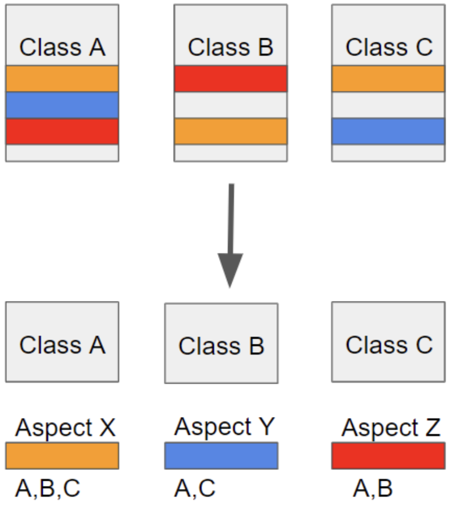
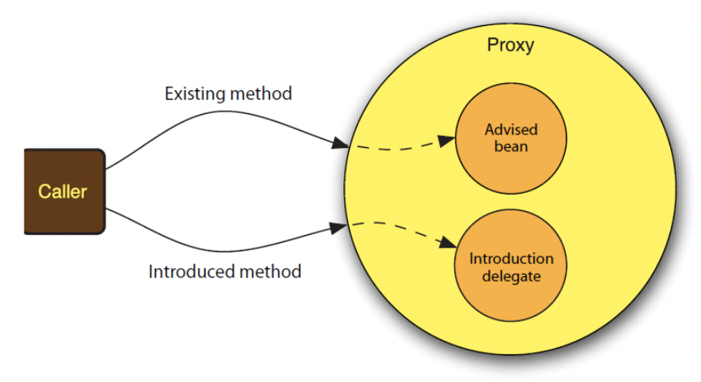

# AOP

* 관점 기향 프로그래밍(Aspect Object Programming)
* 관점지향은 어떤 **로직을 기준으로 핵심적인 관점, 부가적인 관점으로 나누어서 보고 그 관점을 기준으로 각각 몾듈화하겠다는 것**
  * 핵심적인 관점은 적용하고자하는 핵심 비지니스 로직
  * 부가적인 관점은 핵심 로직을 실행하기 위해서 행해지는 데이터베이스 연결, 로킹, 파일 입출력 등
* 흩어진 관심사(Crosscutting Concerns)
  * 소스코드상에서 다른 부분에 계속 반복해서 쓰는 코드

* 위와 같이 **흩어진 관심사를 Aspect로 무듈화하고 핵심적인 비지니스 로직으로 분리하여 재사용하겠다는 것이 AOP의 취지**

## AOP용어

* Aspect :  흩어진 관심사를 모듈화 한것, 주로 부가기능을 모듈화
* Target : Aspect를 적용한 곳(어떤 대상에 부가 기능을 부여할 섯인가.)
* Advice : 어떤 부가기능을 해야할지에 대한것(Before, AfterReturning, AfterThrowing, After, Around)
* JoinPoint : Advice가 작용될 지점, 끼어들 수 있는 지점(**메서드**, 필드, 객체, 생성자 등)
* Point cut : JoinPoint의 상세한 스팩을 정리한 것, Spring AOP에서는 advice가 적용될 메서드를 선정 
* Proxy
  * 타겟을 감싸서 타켓의 요청을 대신 받아주는 랩핑(Wrapping) 오브젝트
  * 클라이언트에서 타겟을 호출하게 되면 타겟이 아닌 타켓을 감싸고 있는 프로시가 호출되어, 타겟 메소드 실행전에 선처러, 타겟 메소드 실행 후, 후처리를 실행시키도록 구성되어 있다.
  * AOP에서 프록시는 호출을 가로챈 후, 어드바이스에 등록된 기능을 수행 후 타겟 메소드를 호출한다.

* Introduction
  * 타겟 클래스에 코드 변경없이 신규 메소드나 맴버변서를 추가하는 기능
* Weaving
  * 지정된 객체에 Aspect를적용해서 새로운 프록시 객체를 생성하는 과정
  * A라는 객체에 트랜잭션 aspect가 지정되어 있다면, A라는 객체가 실행되기전 커넥션을 오픈하고 실행이 끝나면 커넥션을 종료한는 기능이 추가된 프로시가 객체가 생성디고, 이 프록시 객체가 앞으로  A객체가 호출되는 시점에서 사용된다. 이때의 프록시객체가 생성되는 과정을 위빙이라고 한다.
  * 컴파일 타임, 클래스로드 타임, 런타임과 같은 시점에서 실행
    * Spring AOP는 런타임에서 프로시 객체가 생성된다.

## Spring AOP특징

* 프록시 패턴 기반의 AOP구현체, 프로시 객체를 쓰는 이유는 접근 제어 및 부가기능을 추가하기 위해서
* **Spring Been에만 AOP를 적용 가능**
* 모든 AOP기능을 제공하는 것이 아닌 **스프링 IoC와 연동하여 엔터프라이즈 애플리케이션에서 중복코드, 프록시 클래스 작성의 번거로움, 객체들 간 관계 복잡도 증가등에 대한 해결책**을 지원.

