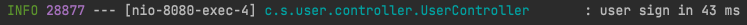

# AOP

* 관점 기향 프로그래밍(Aspect Object Programming)
* 관점지향은 어떤 **로직을 기준으로 핵심적인 관점, 부가적인 관점으로 나누어서 보고 그 관점을 기준으로 각각 몾듈화하겠다는 것**
  * 핵심적인 관점은 적용하고자하는 핵심 비지니스 로직
  * 부가적인 관점은 핵심 로직을 실행하기 위해서 행해지는 데이터베이스 연결, 로킹, 파일 입출력 등
* 흩어진 관심사(Crosscutting Concerns)
  * 소스코드상에서 다른 부분에 계속 반복해서 쓰는 코드


* 위와 같이 **흩어진 관심사를 Aspect로 무듈화하고 핵심적인 비지니스 로직으로 분리하여 재사용하겠다는 것이 AOP의 취지**


## AOP용어

* Aspect :  흩어진 관심사를 모듈화 한것, 주로 부가기능을 모듈화
* Target : Aspect를 적용한 곳(어떤 대상에 부가 기능을 부여할 것인가.)
* Advice : 어떤 부가기능을 해야할지에 대한것(Before, AfterReturning, AfterThrowing, After, Around)
* JoinPoint : Advice가 작용될 지점, 끼어들 수 있는 지점(**메서드**, 필드, 객체, 생성자 등)
* Point cut : JoinPoint의 상세한 스팩을 정리한 것, Spring AOP에서는 advice가 적용될 메서드를 선정 
* Proxy
  * 타겟을 감싸서 타켓의 요청을 대신 받아주는 랩핑(Wrapping) 오브젝트
  * 클라이언트에서 타겟을 호출하게 되면 타겟이 아닌 타켓을 감싸고 있는 프로시가 호출되어, 타겟 메소드 실행전에 선처러, 타겟 메소드 실행 후, 후처리를 실행시키도록 구성되어 있다.
  * AOP에서 프록시는 호출을 가로챈 후, 어드바이스에 등록된 기능을 수행 후 타겟 메소드를 호출한다.


* Introduction
  * 타겟 클래스에 코드 변경없이 신규 메소드나 맴버변서를 추가하는 기능
* Weaving
  * 지정된 객체에 Aspect를적용해서 새로운 프록시 객체를 생성하는 과정
  * A라는 객체에 트랜잭션 aspect가 지정되어 있다면, A라는 객체가 실행되기전 커넥션을 오픈하고 실행이 끝나면 커넥션을 종료한는 기능이 추가된 프로시가 객체가 생성디고, 이 프록시 객체가 앞으로  A객체가 호출되는 시점에서 사용된다. 이때의 프록시객체가 생성되는 과정을 위빙이라고 한다.
  * 컴파일 타임, 클래스로드 타임, 런타임과 같은 시점에서 실행
    * Spring AOP는 런타임에서 프로시 객체가 생성된다.

## Spring AOP특징

* 프록시 패턴 기반의 AOP구현체, 프로시 객체를 쓰는 이유는 접근 제어 및 부가기능을 추가하기 위해서
* **Spring Been에만 AOP를 적용 가능**
* 모든 AOP기능을 제공하는 것이 아닌 **스프링 IoC와 연동하여 엔터프라이즈 애플리케이션에서 중복코드, 프록시 클래스 작성의 번거로움, 객체들 간 관계 복잡도 증가등에 대한 해결책**을 지원.


## 구현 예제

> 메서드가 실행된 시간을 측정하는 예제

### AOP 사용X

```java
public ResponseEntity<UserResponse> signInCon(@Parameter @RequestBody UserSignInRequest userSignInRequest) {
    StopWatch stopWatch = new StopWatch();
    stopWatch.start();
    try {
        return ResponseEntity.ok(userService.signIn(userSignInRequest));
    }finally {
        stopWatch.stop();
        log.info("user sign in {} ms", stopWatch.getLastTaskTimeMillis());
    }
}
```



### Spring AOP적용

#### execution을 이용한 방법

* 접근제한자, 리턴타입, 인자타입, 클래스/인터페이스, 메소드명, 파라미터타입, 예외타입 등을 전부 조합가능(특정 타입내의 모든 메소드를 지정가능)

```java
@Component
@Aspect
@Slf4j
public class Performance {
    @Around("execution(* com.semobook..*.UserController.*(..))")
    public Object calculatePerformanceTime(ProceedingJoinPoint proceedingJoinPoint) {
        Object result = null;
        try {
            long start = System.currentTimeMillis();
            result = proceedingJoinPoint.proceed();
            long end = System.currentTimeMillis();
            log.info("{} ms", end - start);
        } catch (Throwable throwable) {
            log.info("Exception");
            throwable.printStackTrace();
        }
        return result;
    }
}
```

`@Aspect`어노테이션을 붙여 Aspect를 나타내는 클래스라는 겻을 명시하고 `@Component`를 사용해 스프링 빈에 등록.

`@Around`어노테이션은 타겟 메서드를 감싸서 특정 Advice를 실행한다는 의미이며, `@Around("execution(* com.semobook..*.UserController.*(..))")`는 com.semobook 아래의 패키지 경로의 UserController객체의 모든 메서드에 이 Aspect를 정용한다는 의미.

* `@Around` : 어드바이스
* `execution` : 포인트컷 지정자
* `*`리턴타입을 나타냄, 위코드에서는 모든 타입 리턴 가능
* `com.semobook..*.UserController.*` : 타겟이 되는 메소드 지정
* `(..)` : 인자(agument)타입, 위코드에서는 모든 타입 인자 허용

* 어드바이스
  *  `@Before` : 어드바이스 타겟 메소드가 호출되기 전에 어드바이스 기능을 수행
  * `@After`: 타겟 메소드의 결과에 관계없이(성공, 예외 관게 없음) 타겟 메소드가 완료 되면 어드바이스 기능을 수행
  * `@AfterReturning`:타겟 메소드가 성곡적으로 결과값을 반환 후에 어드바이스 기능을 수행
  * `@AfterThrowing`: 타겟 메소드가 수행 중 예외를 던지게 되면 어드바이스 기능을 수행
  * `@Around`: 어드바이스가 타겟 메소드를 감싸서 타게 ㅅ메소드 흐름전과 후에 어드바이스 기능을 수행

#### @annotation 적용하기

* annotation 작성

```java
@Documented
@Target(ElementType.METHOD)
@Retention(RetentionPolicy.CLASS)
public @interface PerformanceCheck {
}
```

* Aspect

```java
@Component
@Aspect
@Slf4j
public class PerformanceAspect {

//    @Around("execution(* com.semobook..*.UserController.*(..))")
    @Around("@annotation(com.semobook.tools.PerformanceCheck)")
    public Object calculatePerformanceTime(ProceedingJoinPoint proceedingJoinPoint) {
        Object result = null;
        try {
            long start = System.currentTimeMillis();
            result = proceedingJoinPoint.proceed();
            long end = System.currentTimeMillis();
            log.info("{} ms", end - start);
        } catch (Throwable throwable) {
            log.info("Exception");
            throwable.printStackTrace();
        }
        return result;
    }
}
```

execution expression을 `"@annotation(com.semobook.tools.PerformanceCheck)"`로 대체

* 적용 메서드

```java
/**
 * userId로 회원조회
 **/
@PerformanceCheck
public UserInfoDto findByUserId(String userId) {
  	UserInfoDto userInfoDto = new UserInfoDto(userRepository.findByUserId(userId));
    return userInfoDto;
}
```

