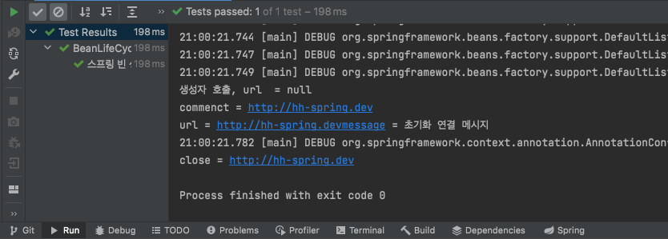

# 빈 생명주기 콜백

> 데이터베이스 커넥션 풀이나, 네트워크 소켓처럼 애플리케이션 시작 시점에 필요한 연결을 미리 해두고, 애플리케이션 종료 시점에 연결을 모두 종료하는 작업을 진행하려면, 객체의 초기화와 종료 작업이 필요하다

* 스프링 빈의 이벤트 라이프 사이클(싱글톤)
  *  `스피링 컨테이너 생성`->`스프링 빈 생성`->`의존관계 주입`->`초기화 콜백`->`사용`->`소멸전 콜백`->`스프링 종료`

* 초기화 콜백 : 빈이 생성되고, 빈의 의존관계 주입이 완료된 후 호출
* 소멸전 콜백 : 빈이 소멸되기 직전에 호출

* 스프링은 **3가지 방법으로 빈 생명주기 콜백을 지원**
  * 인터페이스(InitializingBean, DisposableBean)
  * 설정 정보에 초기화 메서드, 졸료 메서드 지정
  * `@PostConstruct`, `@PreDestory`에노테이션 지원


* 인터페이스(InitializingBean, DisposableBean)
  * InitializingBean 은 afterPropertiesSet() 메서드로 초기화를 지원.
  * DisposableBean 은 destroy() 메서드로 소멸을 지원.

```java
public class NetworkClient implements InitializingBean, DisposableBean {

    private String url;

    public NetworkClient(){
        System.out.println("생성자 호출, url  = " + url);
//        connect();
//        call("초기화 연결 메시지");
    }

    public void setUrl(String url){
        this.url = url;
    }

    //서비스 시작시 호출
    public void connect(){
        System.out.println("commenct = " + url);
    }

    private void call(String message){
        System.out.println("url = "+url+"message = " + message);
    }

    //서비스 종료시 호출
    public void disconnect(){
        System.out.println("close = " + url);
    }

    @Override
    public void afterPropertiesSet() throws Exception {
        connect();
        call("초기화 연결 메시지");
    }
  	@Override
    public void destroy() throws Exception {
        disconnect();
    }
}
```

 


* 빈 등록 초기화, 소멸 메서드 지정

  * 설정 정보에 `@Bean(initMethod = "init", destroyMethod = "close")`  초기화, 소멸 메서드를

    지정

```java
public class BeanLifeCycleTest {

    @Test
    @DisplayName("스프링 빈 생명 주기")
    void lifeCycleTest(){
        ConfigurableApplicationContext ac = new AnnotationConfigApplicationContext(LifeCycleConfig.class);
        ac.getBean(NetworkClient.class);
        ac.close();
    }

    @Configuration
    static class LifeCycleConfig{
        @Bean(initMethod = "init", destroyMethod = "close")
        public NetworkClient networkClient(){
            NetworkClient networkClient = new NetworkClient();
            networkClient.setUrl("http://hh-spring.dev");
            return networkClient;
        }
    }
}


public class NetworkClient{
  public void init(){
        connect();
        call("초기화 연결 메시지");
    }
    public void close(){
        disconnect();
    }
  ...
}
```


* `@PostConstruct`, `@PreDestory`에노테이션 지원
  * 최신 프르링에서 권장하는 방법
  * javax.annotation.PostConstruct 패키지 이다. 스프링에 종속적인 기술이 아니라 JSR-250 라는 자바 표준이다. 따라서 스프링이 아닌 다른 컨테이너에서도 동작
  * 컴포넌트 스캔과 잘 어울린다.
  * 외부 라이브러리에는 적용하지 못한다는 단점이 존재
    * 외부 라이브러리를 초기화, 종료 해야하면 `@Bean`의 기능을 사용

```java
public class NetworkClient{
  @PostConstruct
    public void init(){
        connect();
        call("초기화 연결 메시지");
    }
    @PreDestroy
    public void close(){
        disconnect();
    }
	}
  ...
}
```

