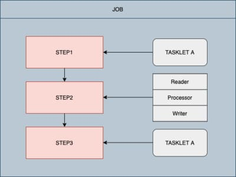

# Spring Batch

## Spring Batch 구조

* Spring Batch 구조
  * Batch는 하나의 job이며, 여러개의 step이 모여 job을 이루게 된다


 

* Job
  * 배치 처리 과정을 하나의 단위로 만들어 표현한 객체이고 여러 Step인스턴스를 퐘하는 컨테이너
* Step 
  * Step은 실질적인 배치 처리를 저의하고 제어 하는데 필요한 ㅗㅁ든 정보가 있는 도메인 객체
* Tasklet
  * Step안에서 수행될 비즈니스 로직 전략의 인터페이스

> 일반적으로 스프링 배치는 대용량 데이터를 다루는 경우가 많기 때문에 Tasklet보다 상대적으로 **트랜잭션의 단위를 짧게 하여 처리할 수 있는 Reader, Proccessor, Writer를 이용한 Chunk** 지향 프로세싱을 이용

## Setting & Basic Code


* build.gradle

```groovy
dependencies {
    implementation 'org.springframework.boot:spring-boot-starter-batch'
    compileOnly 'org.projectlombok:lombok'
    developmentOnly 'org.springframework.boot:spring-boot-devtools'
    annotationProcessor 'org.projectlombok:lombok'
    implementation("org.mariadb.jdbc:mariadb-java-client:2.1.2")
    testImplementation 'org.springframework.boot:spring-boot-starter-test'
    testImplementation 'org.springframework.batch:spring-batch-test'
    compile('org.springframework.boot:spring-boot-starter-data-jpa')
}
```

## Simple Job생성

* Batch Job을 만들기 전, `Application.java`에 어노테이션 (`@EnableBatchProcessing`)을 추가
  * **Spring Batch 기능 활성화** 
  * Spring Batch의 여러 기능들을 사용할 수 있음.
  * 필수로 선언(선언하지 않으면 Spring Batch기능을 사용할 수 없다.)

```java
@EnableScheduling //chron (스케쥴링) 설정
@EnableBatchProcessing //batch 활성화 설정
@SpringBootApplication
public class SemobookApplication {
    public static void main(String[] args) {
        SpringApplication.run(SemobookApplication.class, args);
    }
}
```

### JobConfiguration생성

* `@Configuration`
  * Spring Batch의 모든 Job은 `@Configuration`으로 등록해서 사용
* `jobBuilderFactory.get(JOB_NAME`)
  * JOB_NAME 이란 이름으로 Batch Job를 생성
  * Job의 이름은 별도로 지정하지 않고, Builder를 통해 아룸 지정
* `stepBuilderFactory.get("bestSellerBatchStep")`
  * `bestSellerBatchStep`란 이름의 Betch Step을 생성
  *  Builder를 통해 이름 지정
* `.tasklet((contribution, chunkContext))`
  * Step 안에서 수행될 기능들을 명시
  * Tasklet은 Step안에서 단일로 수행될 커스텀한 기능들을 언할때 사용.
  * Batch가 수행되면 `startBatch()`,`endBatch()`가 순차적으로 호출

```java
//read process write - chunk
@Slf4j
@RequiredArgsConstructor
@Configuration  //Spring Batch의 모든 Job은 @Configuration으로 등록해서 사용
public class JobConfiguration {
    private static final String JOB_NAME = "JobConfiguration";

    private final JobBuilderFactory jobBuilderFactory;
    private final StepBuilderFactory stepBuilderFactory;
    private final BestSellerRepository bestSellerRepository;

    @Bean
    public Job testJob() throws Exception {
        log.info("Start testJob");
        return jobBuilderFactory.get(JOB_NAME)
                .start(bestSellerBatchStep())
                .build();
    }

    @Bean
    public Step testBatchStep() {
        return stepBuilderFactory.get("testBatchStep")
                //contribution - 현재 단계 실행을 업데이트하기 위해 다시 전달되는 변경 가능한 상태
                // chunkContext - 호출 간에는 공유되지만 재시작 간에는 공유되지 않는 속성
                .tasklet((contribution, chunkContext) -> {
                    startBatch();
                    endBatch();
                    return RepeatStatus.FINISHED;
                })
                .build();
    }

    private void startBatch() {
      log.info("This is startBatch----------");
    }

    private void endBatch() {
      log.info("This is endBatch----------");
    }
}

```

* Tasklet과 Reader & Processor & Writer는 같은 레벨이다.
  * 개발자가 지정한 커스텀한 기능ㅇ르 위한 단위

###  Scheduler생성

* `@Scheduled` 를 이용해 주기적인 작업을 실행할 수 있다.

```java
@Slf4j
@Component
@RequiredArgsConstructor
public class Scheduler {
    private final JobLauncher jobLauncher;
    private final JobConfiguration jobConfiguration;

    @Scheduled(initialDelay = 1000, fixedDelay = 1000 * 60)
    public void updateByBestSellerJob() {
        JobExecution execution;
        try {
            log.info("start updateByBestSellerJob");
            execution = jobLauncher.run(jobConfiguration.testJob(), simpleJobParam());
            log.info("Job finished with status : " + execution.getStatus());
            log.info("Current Thread: {}", Thread.currentThread().getName());
        } catch (Exception e) {
            log.error(e.getMessage());
            e.printStackTrace();
        }
    }

    //같은 이름의 batch는 생길 수 없기 때문에 param에 시간을 넣는다.
    private JobParameters simpleJobParam() {
        Map<String, JobParameter> confMap = new HashMap<>();
        confMap.put("time", new JobParameter(System.currentTimeMillis()));
        return new JobParameters(confMap);
    }
}
```

* `@Scheduled`속성

| Type              | 설명                                                         |
| ----------------- | ------------------------------------------------------------ |
| fixedDelay        | @Scheduled(fixedDelay=1000) <br />이전 작업이 종료된 후 설정시간(mm/s)이후에 다시시작 |
| fixedDelayString  | @Scheduled(fixedDelay="1000") <br />fixedDelay와 동일하고 지연시간을 문자료 입력 |
| fixedRate         | @Scheduled(fixedRate=1000) <br />설정된 시간마다 시작을 한다.(이전 작업이 종료되지 않아도 시작) |
| fixedRateString   | @Scheduled(fixedRateString="1000") <br />fixedRate와 동일하고 지연시간을 무자로 입력 |
| initalDelay       | @Scheduled(fixedRate=5000, initalDelay=3000) <br />프로그램이 시작하자마자 작업하는게 아닌, 설정된 시간만큼 지연하여 시작.<br /> ex)  3초 후 부터 5초 간격으로 잡업 |
| initalDelayString | @Scheduled(fixedRate=5000, initalDelay="3000") <br />initalDelay와 동일 하고 지연시간을 문자로 입력 |
| Cron              | @Scheduled(cron - "* * * * * *") <br />각 위치별 입력 사항<br />"초(0~59), 분(0~59), 시간(0~23), 일(1~31), 월(1~12) 요일(0~)" |
| Zone              | @Scheduled(cron = "* * * * * *", zone = "Asia>Seoul") <br />미설정시 local 시간을 사용<br />[oracle 참조 문서](https://docs.oracle.com/cd/B13866_04/webconf.904/b10877/timezone.htm) |

* 실행 결과 화면.

 

