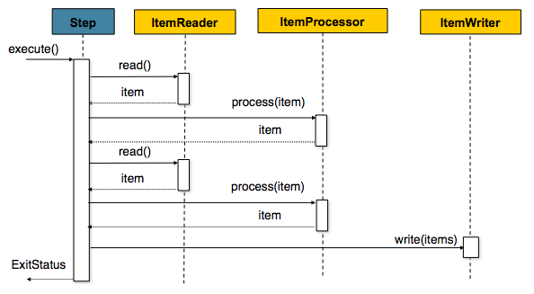

# [Spring Batch] - Chunk

> chunk - 데이터 덩어리로 작업 할 때 각 커밋 사이에 처리되는 row수
>
> Step은 Tasklet 단위로 처리되고, Tasklet 중에서 **ChunkOrientedTasklet**을 통해 Chunk를 처리하며 이를 구성하는 3 요소 ItemReader, ItemWriter, ItemProcessor

* Chunk 지향처리
  *  **한 번에 하나씩 데이터를 읽어 Chunk라는 덩어리를 만든뒤, chunk 단위로 트랜잭션을 다루는것** (프로세싱은 트랜잭션 경계 내에서 청크 단위로 데이터를 읽고 생성)
  * Chunk 단위로 트랜재견을 수해앟기 떄문에 **실패할 경우엔 해당 Chunk 만큼만 콜맥**이 되고, 이전에 커밋된 드랜잭션 범위까지는 반영이 된다.
    * tasklet 방식이나 청크로 데이터를 지정하지 않은 경우 대량의 데이터 중 한 개의 데이터라도 업데이트를 실패하여 Exception 발생할 경우 천 개의 데이터를 롤백 해야 합

[](https://docs.spring.io/spring-batch/docs/4.0.x/reference/html/index-single.html#chunkOrientedProcessing)

* **Reader와 Processor에서는 1건씩 다뤄지고, Writer에선 Chunk 단위로 처리**
  * Reader에서 데이터를 하나 읽어옴.
  * 읽어온 데이터를 Processor에서 가공
  * 가곧된 데이터들을 별도의 공간에 모은 뒤,  Chunk단위만큼 쌓이게 되면 Writer에 전달하고 Writer는 일괄 저장

## Page Size vs Chunk Size

* Chunk Size
  * 한번에 처리될 트랜잭션 단위
* Page Size
  * 한전에 조회할 item의 양

## Code

> JPA를 사용하여 구현
>
> 아래 code는 Book에 kdc 정보를 update하는것을 작성한 것입니다.

* Entity

```java
@Entity
@Getter
@NoArgsConstructor
public class Book {
    @Id
    @Column(name = "ISBN")
    private String isbn;

    @Column(name = "BOOK_NAME")
    private String bookName;

    @Column(name = "AUTHOR")
    private String author;

    @Column(name = "PUBLISHER")
    private String publisher;

    @Column(name = "contents")
    private String contents;

    @Column(name = "KDC")
    private String kdc;

    @Column(name = "CATEGORY")
    private String category;

    @Column(name = "KEYWORD")
    private String keyword;

    @Column(name = "BOOK_IMAGE")
    private String img;

    @OneToMany(mappedBy = "book", cascade = CascadeType.ALL)
    private List<BookReview> bookReviewList = new ArrayList<>();

    @Builder
    public Book(String isbn, String bookName, String author, String publisher,
                String kdc, String category, String keyword, String img, String contents) {
        this.isbn = isbn;
        this.bookName = bookName;
        this.author = author;
        this.publisher = publisher;
        this.kdc = kdc;
        this.category = category;
        this.keyword = keyword;
        this.img = img;
        this.contents = contents;
    }

    /**
     * update kdc
     *
     * @author hyunho
     * @since 2021/08/23
    **/
    public void updateKdc(String kdc){
        this.kdc = kdc;
    }
}
```

* Configuration

```java
@Slf4j
@Configuration
@RequiredArgsConstructor
public class UpdateBookConfiguration {

    private static final String JOB_NAME = "updateBookJob";

    private final JobBuilderFactory jobBuilderFactory;
    private final StepBuilderFactory stepBuilderFactory;
    private final EntityManagerFactory entityManagerFactory;

    private static String LIBRARY_OF_KOREA_BASE_URL = "https://www.nl.go.kr/NL/contents/search.do?pageNum=1&pageSize=30&srchTarget=total&kwd=";

    private int chunkSize = 10;

    @Bean
    public Job updateBookJob() {
        return jobBuilderFactory.get(JOB_NAME)
                .start(jpaBookItemReaderStep())
                .build();
    }

    @Bean
    public Step jpaBookItemReaderStep() {
        return stepBuilderFactory.get("jpaBookItemReaderStep")
                .<Book, Book>chunk(chunkSize)
                .reader(jpaBookItemReader())
                .processor(updateBook())
                .writer(jpaPagingItemWriter())
                .build();
    }

    @Bean
    public JpaPagingItemReader<Book> jpaBookItemReader() {
        return new JpaPagingItemReaderBuilder<Book>()
                .name("jpaBookItemReader")
                .entityManagerFactory(entityManagerFactory)
                .pageSize(chunkSize)
                .queryString("select b from Book b where b.kdc is null")
                .build();
    }

    @Bean
    public ItemProcessor<Book, Book> updateBook() {
        return item -> {
//            item.updateKdc("");
            log.info("updateBook() :: book list = {}", item.getBookName());

            String url = LIBRARY_OF_KOREA_BASE_URL + item.getIsbn();
            Document doc = Jsoup.connect(url).get();
            String[] tempKdc = doc.select("#sub_content > div.content_wrap > div > div.integSearch_wrap > div.search_cont_wrap > div > div > div.search_right_section > div.section_cont_wrap > div:nth-child(1) > div.cont_list.list_type > div.row > span:nth-child(10)").text().replaceAll(" ", "").split(":");
            tempKdc = tempKdc[1].split("-");
            String kdc = tempKdc[0];
            log.info("updateBook() :: kdc is = {}", kdc);

            item.updateKdc(kdc);

            return item;
        };
    }

    @Bean
    @StepScope
    public JpaItemWriter<Book> jpaPagingItemWriter() {
        JpaItemWriter<Book> jpaItemWriter = new JpaItemWriter<>();
        jpaItemWriter.setEntityManagerFactory(entityManagerFactory);
        return jpaItemWriter;
    }
}
```


## JPA를 사용시 주의

* JpaRepository를 ListItemReader, QueueItemReader에 사용하면 안됨.
  - JpaRepository를 사용할 경우 Spring Batch의 장점인 페이징 & Cursor 구현이 없어 대규모 데이터 처리가 불가능. (Chunk 단위 트랜잭션은 됩니다.)
  - JpaRepository를 써야 하신다면 `RepositoryItemReader`를 사용.
    - Paging을 기본적으로 지원.
* Hibernate, JPA 등 영속성 컨텍스트가 필요한 Reader 사용시 fetchSize와 ChunkSize는 같은 값을 유지해야 한다.


## Reference

[https://jojoldu.tistory.com/331](https://jojoldu.tistory.com/331)