mybatis

> spring dao == jdbc ==>maybatis
>
> sql은 xml frile 로 따로 관리안하 (java와 sql 분리 관리)

>**1>**자바 객체 생성-관리=bean의 라이프 사이클 관리한다
>
>**2> bean**의 의존성을 관리한다.(ioc , di)
>
>**3> AOP** 기능 제공한다.
>
>**4> MVC** 기능 제공한다.
>
>**5> dao, vo** 등 기존 non-spring 환경에서도 사용하던 객체 그대로 사용 가능하다(스프링 라이브러리를 상속받거나 하지 않아도)
>
>**= pojo bean** 사용 가능하다
>
>**(plain old java object)**
>
>**6> spring dao** 기능으로 db 연동 기능 제공한다.
>
>**7>** 각종 다른 프레임워크 연동 기능 제공한다.
>
>**8> mybatis** 프레임워크 연동 가능하다
>
>​	= spring dao 기능 대신 사용하는 형태로 현재 개발 추세
>
>**9> spring** 은 db 연결 기능으로
>
>spring + jdbc
>
>spring + spring dao
>
>spring + mybatis
>
>

1. jdbc driver
2. jdbc url
3. account&password


## 기존 jdbc

```java
try{
1. class.forNma("")
2. Connection c = DriverManager.getConnection(jdbc url, account, password)
3. sql - 결과
4. c.close()
}catch(Exception e){
}
```

> jdbc 단점 : mybatis 대체
>
> 1. 코드 반복이 많다 : db-config.xml
> 2. 자바 언어 내부에 spl언어 포함이 많다 : sql-mapping.xml
> 3. DB 연결 복잡한 정보 매번 작성 해야 한다.: db-config.xml


DB 연결 파일 은 1개 mapping 파일은 여러개

1. db-config.xml  - DB연결 파일
   1. board-mapping.xml  - 개시글과 관련 -mapping 파일
   2. memver-mapping.xml - 맴버 관리 -mapping 파일

# mabatis

> 1. db 연결정보 설정.xml
>
> - jdbc driver, url, id, pw ===>sqlSession api
>
> 2. sql mapping.xml
>
> - < select id="" resultType="xxxVO" parameterType="int["]
>   - 특정 함수 는 resultType 는 String or Int 사용
>   - resultType, parameterType 모든 객체가 올 수 있다.
> - < insert id=""
> - < delete id=""
> - < update id=""
>
> 3. XXXVO - (Mybatis = sql mapper framwork)
>
> * spl결과(레코드) =>mapping
>
> 4. XXXDAO - mybatis 코드 작성 

1. xml 설정 읽기

2. DB 연결 객체 가져오기

3. sql 정보 가져와서 실행 요청 - 결과(Board VO, String, ArrayLIst) Type 설정 해야함.

4. 출력

   => 1, 2(설정파일) 번은 한 번만 설정 하면 되고 3,4(sql 정의) 번을 활용한다


## 환경 설정

* mybatis.jar => pom.xml 파일에  <dependency>  적용

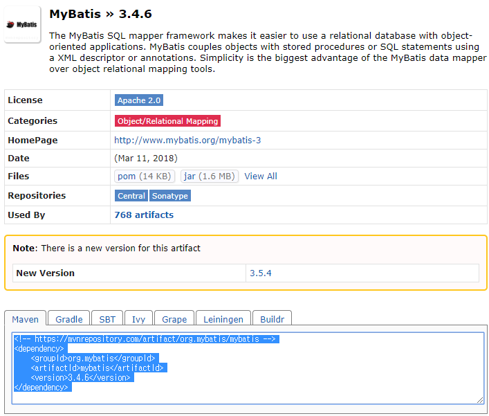

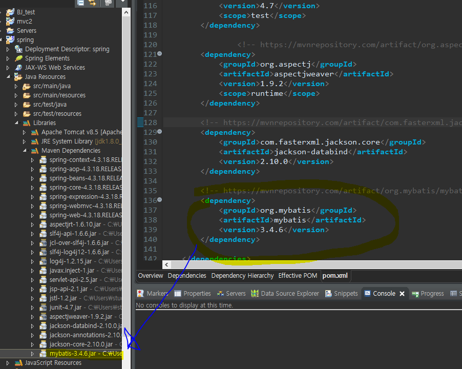


* ojdbc6.jar : 오라클 jdbc driver 파일 압축파일 등록

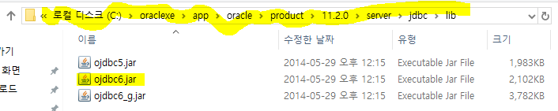

spring project file -> properties -> java Build Path -> Add External -> ojdbc6.jar 파일 경로 찾아서 추가

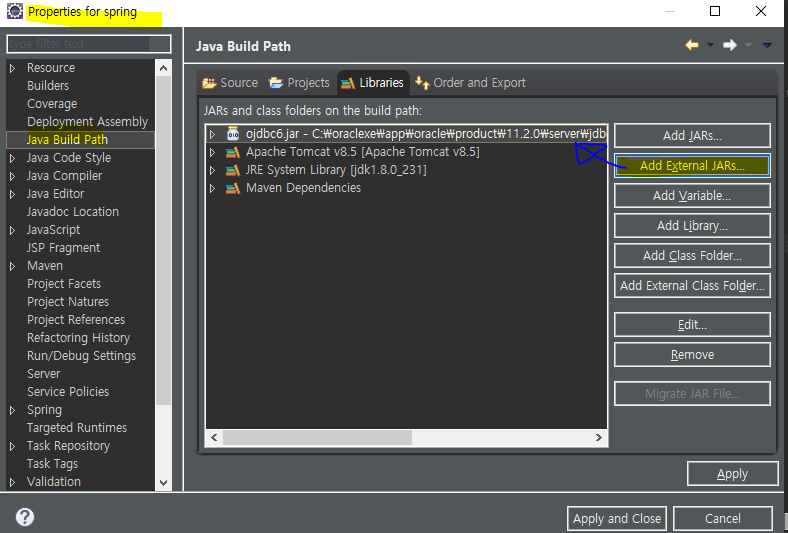

* xml file 탬플릿

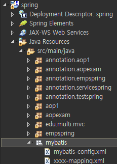


* 설정파일(DB연결) : xxx.config.xml

```xml
<?xml version="1.0" encoding="UTF-8" ?>
<!DOCTYPE configuration
  PUBLIC "-//mybatis.org//DTD Config 3.0//EN"
  "http://mybatis.org/dtd/mybatis-3-config.dtd">
  
<configuration>
	<typeAliases>
		<typeAlias type="mybatis.EmpVO" alias="emp"/>  <!-- mybatis.EmpVO 가 필요할떄 'emp' 로 불러올수 있다 -->  
	</typeAliases>
	
	<environments default="mydb">
		<environment id="mydb">
			<transactionManager type="JDBC"></transactionManager>
			<dataSource type="POOLED">
				<property name="driver" value="oracle.jdbc.driver.OracleDriver"/>
				<property name="url" value="jdbc:oracle:thin:@localhost:1521:xe"/>
				<property name="username" value="hr"/>
				<property name="password" value="hr"/>
			</dataSource> <!-- <environment id="mydb"> 지금은 hr계정인데 추가하여서 다른 계정도 등록 가능  -->
		</environment>
	</environments>
	
	<mappers>
		<mapper resource="mybatis/emp-mapping.xml"/>
		<!-- <mapper resource="mybatis/board-mapping.xml"/> -->
	</mappers>
</configuration>
```

* maping file

```xml
<?xml version="1.0" encoding="UTF-8" ?>
<!DOCTYPE mapper PUBLIC "-//mybatis.org//DTD Mapper 3.0//EN"
  "http://mybatis.org/dtd/mybatis-3-mapper.dtd">
<mapper namespace="emp">
	<!-- crud -> insert, select, update, delete, sql  -->
	 <!-- 1개 레코드 type는 = EmpVO 자바 객체 타입으로 mapping -->
	<select id="allemp" resultType="mybatis.EmpVO"> <!--resultType="mybatis.EmpVO 는 리턴 type이 EmpVO이다  -->
		select * from employees
	</select>
	
	<!-- <select id="oneemp" resultType="mybatis.EmpVO">
		select * from employees where employee_id = 100
	</select> -->
	<select id="oneemp" resultType="mybatis.EmpVO" parameterType="int">
		select * from employees where employee_id = #{a}
	</select>
	
	<select id="nameemp" resultType="mybatis.EmpVO" parameterType="String">
		select * from employees where first_name = #{name}
	</select>
		<!-- 
		session.selectList("nameemp", "P%"); -->
	<select id="namelikeemp" resultType="mybatis.EmpVO" parameterType="String">
		select * from employees where first_name LIKE 'P%' = #{name}
	</select>
	
	<!-- <select id="idemp" resultType="mybatis.EmpVO" parameterType="int">
		select * from employees where employee_id > 200
	</select> -->
	
	<select id="idemp" resultType="mybatis.EmpVO" >
		<![CDATA[select * from employees where employee_id < 150]]> <!-- 부등호 < 는 테그 처리로 인식해서 해당 줄처럼 해줘야 태그로 인식 안함 -->
	</select>
	
</mapper>
```

```xml
<?xml version="1.0" encoding="UTF-8" ?>
<!DOCTYPE mapper PUBLIC "-//mybatis.org//DTD Mapper 3.0//EN"
  "http://mybatis.org/dtd/mybatis-3-mapper.dtd">
<mapper namespace="emp">
	<!-- crud -> insert, select, update, delete, sql  -->
	 <!-- 1개 레코드 type는 = EmpVO 자바 객체 타입으로 mapping -->
	<select id="allemp" resultType="mybatis.EmpVO"> <!--resultType="mybatis.EmpVO 는 리턴 type이 EmpVO이다  -->
		select * from employees
	</select>
	
	<!-- <select id="oneemp" resultType="mybatis.EmpVO">
		select * from employees where employee_id = 100
	</select> -->
	<select id="oneemp" resultType="emp" parameterType="int">  <!-- emp는 mybatis-config 에서 저으이되어있다 -->
		select * from employees where employee_id = #{a}
	</select>
	
	<select id="nameemp" resultType="emp" parameterType="String">
		select * from employees where first_name = #{name}
	</select>
		<!-- 
		session.selectList("nameemp", "P%"); -->
	<select id="namelikeemp" resultType="emp" parameterType="String">
		select * from employees where first_name LIKE 'P%' = #{name}
	</select>
	
	<!-- <select id="idemp" resultType="mybatis.EmpVO" parameterType="int">
		select * from employees where employee_id > 200
	</select> -->
	
	<select id="idemp" resultType="emp" >
		<![CDATA[select * from employees where employee_id < 150]]> <!-- 부등호 < 는 테그 처리로 인식해서 해당 줄처럼 해줘야 태그로 인식 안함 -->
	</select>
	
</mapper>
```

```java
package mybatis;

import java.util.List;

import org.apache.ibatis.io.Resources;
import org.apache.ibatis.session.SqlSession;
import org.apache.ibatis.session.SqlSessionFactory;
import org.apache.ibatis.session.SqlSessionFactoryBuilder;

public class EmpMain {

	public static void main(String[] args) throws Exception{
		//1.
		SqlSessionFactoryBuilder builder = new SqlSessionFactoryBuilder();
		//2.SqlSessionFactory = 연결 설정 파일 읽어라
		//sql mapping 파일명 
		SqlSessionFactory factory = builder.build(Resources.getResourceAsReader("mybatis/mybatis-config.xml"));
		//3. SqlSession = jdbc Connection과 유사한 역할 ==>연결 생성
		SqlSession session = factory.openSession();
		
		System.out.println(session);
		
		//test1 여러개 레코드 리턴 조회
//		List<EmpVO> list = session.selectList("allemp"); //여러개가 리턴 되기때문에 List 형태로 받아와야함 ,하나하나가 EmpVO 타입이라서 empVO적용
//		for(EmpVO vo:list) {
//			System.out.println(vo.getEmployee_id()+":"+vo.getFirst_name());
//		}
		
//		EmpVO vo = session.selectOne("oneemp");
//		System.out.println(vo.getEmployee_id()+":"+vo.getFirst_name());
		//test2 1개 레코드 리턴 조회 : 100 사번
//		EmpVO vo = session.selectOne("oneemp", 100);
//		System.out.println(vo.getEmployee_id()+":"+vo.getFirst_name());
		
		//test3 1개 레코드 리턴 조회 : 이름이 Steven 사원
//		List<EmpVO> list = session.selectList("nameemp", "Steven");
//		for(EmpVO vo:list) {
//			System.out.println(vo.getEmployee_id()+":"+vo.getFirst_name());
//		}
//		//test4 cdata섹션 실행
		List<EmpVO> list1 = session.selectList("idemp");
		for(EmpVO vo:list1) {
			System.out.println(vo.getEmployee_id()+":"+vo.getFirst_name()+":"+vo.getHire_date());
		}
	}
```


* spring mvc

form acition="/mvc/test" 

< input name="a" ==>요청 파라미터 변수

@RequestMapping("/test")

public String test(EmpVO vo)

EmpVO : 맴버변수 a: setA( 요청 파라미터 변수'a' 값 )


* mybatis

  <select id="" resultType="test.A"

  select * from employees

  

DDL DATA DEFINITION LANG(데이터 정의언어)

CREATE TABLE / ALTER / DROP   (자동 반영)

DML : DATA MANIPULATION LANG(데이터 조작 언어)

테이블 데이터 저장/ 수정/ 삭제 (insert, update delete) (자동 반영X)


DCL

TCL:COMIT / ROLLBACK


COMMIT

```java
SqlSession session = factory.openSession();  // insert 자동 commit처리 X 
SqlSession session = factory.openSession(true);  //true이면 insert 자동 commit처리 O
```

```java
SqlSession session = factory.openSession(); // true가 없으면 session.commit(); 명령을 해줘야한다

EmpVO vo = new EmpVO();
		vo.setEmployee_id(1000);
		vo.setFirst_name("길");
		vo.setLast_name("홍");
		vo.setEmail("gil@multi.com");
		vo.setJob_id("IT_PROG"); //SQL 키워드는 대소문자 구분 X (단. 값은 대소문자 구분은 함)
		dao.insertEmp(vo);  //insert sql 수행
		
		session.commit(); //commit 수행
```


select first_name, hire_date from employees order by hire_date desc;

## ROWNUM (sql)

> '>', '>=' 연산 못한다 (단. 1 제외)

```
SQL> select rownum, first_name, hire_date from employees where rownum >=1 and rownum <= 10;

    ROWNUM FIRST_NAME                               HIRE_DAT
---------- ---------------------------------------- --------
         1 발                                       20/02/07
         2 Steven                                   03/06/17
         3 Neena                                    05/09/21
         4 Lex                                      01/01/13
         5 Alexander                                06/01/03
         6 Bruce                                    07/05/21
         7 David                                    05/06/25
         8 Valli                                    06/02/05
         9 Diana                                    07/02/07
        10 Nancy                                    02/08/17

```


* employees 테이블에서 11번째 부터 20번 사이 값 가져오기

  > 영역별로 보여줄 수 있따.

```
select r, first_name, hire_date from(select rownum r, first_name, hire_date from(select * from employees order by hire_date desc)) where r>=11 and r<=20;
```

int page = 2;

int statr = 

order by hire_date desc


dao 는 mapping file 호출


# mybatis Spring

* spring mvc(cmv) + spring orm(= 다른 db프레임워크 연동) + mybaits 연동 

object - relational db - mapping

* 라이브러리 다운로드

  pom.xml:<dependency>

  * mybatis-spring.jar(orm기능)
  * spring-jdbc.jar(orm기능)

  oracle jdbc드라이버(ojdbc6.jar)

  1. java main -java application

     * 메인 에서 실행할떄

  2. servlet, jsp, spring mvc - java web server

     * serblet , jsp 에서 실행할떄
* (탐색기 - tomcat 경로 \lib\ojdbc6.jar붙여넣기) (톰켓 환경에서 모두 사용가능)
     
     * 프로젝트\main\webapp\web-inf\lib(생성)\ojdbc6.jar 붙여넣기 (이클립스 project  환경 에서 사용)

1. db 연결정보 설정.xml

- jdbc driver, url, id, pw ===>sqlSession api
- typeAlias 제외

2. sql mapping.xml

- < select id="" resultType="xxxVO" parameterType="int["]
  - 특정 함수 는 resultType 는 String or Int 사용
  - resultType, parameterType 모든 객체가 올 수 있다.
- < insert id=""
- < delete id=""
- < update id=""

3. XXXVO - (Mybatis = sql mapper framwork)

* spl결과(레코드) =>mapping

4. XXXDAO - mybatis 코드 작성 

5. main 삭제

6. mybatis - <bean tag 없다, @annotation 없다. (Spring 에만 존제) = jdbc driver, url, id, pw - DataSource생성(connection poll - ,,,)

   * Mybatis - spring 연동 설정파일(spring bean 설정파일)
     1. Mybatis -dbc driver, url, id, pw - DataSource생성
     2. mapper 파일 이름
     3. typealias 이름
     4. SqlSessionTemplate bean 생성

   * JDBC - ConnectionPool = spring 에서 DataSource
   * JDBC - Connection = spring 에서 sqlSessionTemplate = mybatis에서 SqlSession

7. Controller - Model - View


​		6.

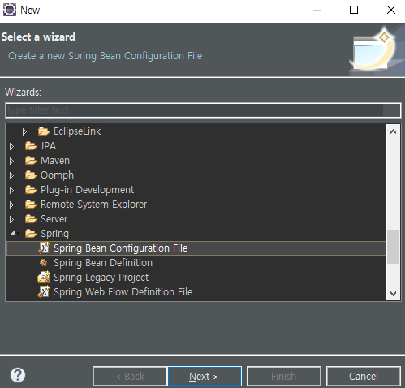

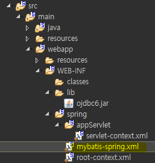

* mybatis-spring.xml

  ```xml
  <?xml version="1.0" encoding="UTF-8"?>
  <beans xmlns="http://www.springframework.org/schema/beans"
  	xmlns:xsi="http://www.w3.org/2001/XMLSchema-instance"
  	xsi:schemaLocation="http://www.springframework.org/schema/beans http://www.springframework.org/schema/beans/spring-beans-4.2.xsd">
  
  <!-- 1. DataSource 생성 =>connectionpoll mybatis에 sqlSession 믄든것과 동일-->
  <bean id="dataSource" class="org.springframework.jdbc.datasource.DriverManagerDataSource">
  	<property name="driverClassName" value="oracle.jdbc.driver.OracleDriver"></property>
  	<property name="url" value="jdbc:oracle:thin:@localhost:1521:xe"></property>
  	<property name="username" value="hr"></property>
  	<property name="password" value="hr"></property>
  </bean>
  <!-- 2.mapper file, mybatis 설정파일 정보 알려줌 -->
  <bean id="sqlSessionFactory" class="org.mybatis.spring.SqlSessionFactoryBean">
  	<property name="dataSource" ref="dataSource"></property>
  	<property name="configLocation" value="classpath:/edu/multi/mybatis/mybatis-config.xml"></property>
  	<property name="mapperLocations" value="classpath:/edu/multi/mybatis/emp-mapping.xml"></property>
  </bean>
  <!-- 3.SqlSessionTemplate(스프링 객체(spring api))생성 -->
  <bean id="sqlSession" class="org.mybatis.spring.SqlSessionTemplate">
  	<constructor-arg ref="sqlSessionFactory"></constructor-arg>
  </bean>
  
  </beans>
  ```

* web.xml 수정

  ```xml
  <?xml version="1.0" encoding="UTF-8"?>
  <web-app version="2.5" xmlns="http://java.sun.com/xml/ns/javaee"
  	xmlns:xsi="http://www.w3.org/2001/XMLSchema-instance"
  	xsi:schemaLocation="http://java.sun.com/xml/ns/javaee https://java.sun.com/xml/ns/javaee/web-app_2_5.xsd">
  
  	<!-- The definition of the Root Spring Container shared by all Servlets and Filters -->
  	<!-- 컨텍스트 = 프로젝트 내부 모든 파일 변수공유 -->
  	<!-- /web -inf/spring/mybatis-spring:xml -->
  	<context-param>
  		<param-name>contextConfigLocation</param-name>
  		<param-value>
  		/WEB-INF/spring/root-context.xml
  		/WEB-INF/spring/mybatis-spring.xml    <--> 해당 코드 추가</-->
  		</param-value>
  	</context-param>
  ```

* servlet-context.xml 수정

  ```xml
  <?xml version="1.0" encoding="UTF-8"?>
  <beans:beans xmlns="http://www.springframework.org/schema/mvc"
  	xmlns:xsi="http://www.w3.org/2001/XMLSchema-instance"
  	xmlns:beans="http://www.springframework.org/schema/beans"
  	xmlns:context="http://www.springframework.org/schema/context"
  	xsi:schemaLocation="http://www.springframework.org/schema/mvc https://www.springframework.org/schema/mvc/spring-mvc.xsd
  		http://www.springframework.org/schema/beans https://www.springframework.org/schema/beans/spring-beans.xsd
  		http://www.springframework.org/schema/context https://www.springframework.org/schema/context/spring-context.xsd">
  
  	<!-- DispatcherServlet Context: defines this servlet's request-processing infrastructure -->
  	<!-- Enables the Spring MVC @Controller programming model -->
  	<annotation-driven />
  <!-- @Component @Service @Repository @Autowired 인식 -->
  	<context:component-scan base-package="edu.multi.mvc" />
  	<context:component-scan base-package="edu.multi.mybatis" />  <-- 추가 삽입</-->
  	<!-- Handles HTTP GET requests for /resources/** by efficiently serving up static resources in the ${webappRoot}/resources directory -->
  	<!-- *.png, *.mp3, *.mp4, *.js 저장 위치 -->
  	<resources mapping="/resources/**" location="/resources/" />
  ```

  

## 환경설정

* mvc

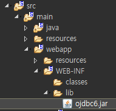


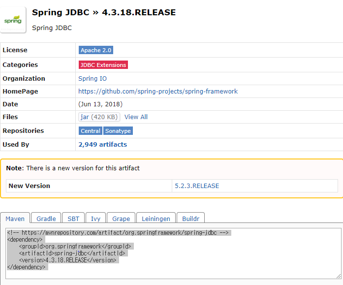

> Spring JDBC 4.3.18 Release 는 설치되어있는 spring version 과 동일한것으로 선택

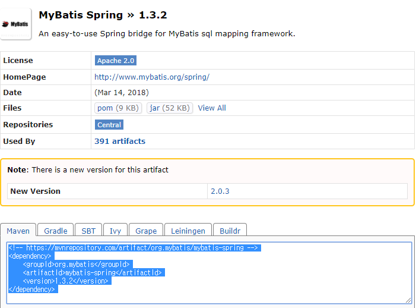

* 

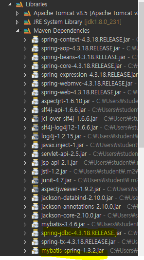


* \ModelAndView mv

mv.addObject("", 객체) ==>1개 VIew에 적용

1개 요청 처리동안 ( C M V) 공유


* 여러개 View 1번 로그인 정보 지속 공유(브라우저 종료 이전/ 브라우저 실행 30분동안 사용 움직임 없을떄)

  *  javax.servlet.http.HttpSession

    

  1. HttpSession생성

     ```java
     HttpSession session = request.getSession();
     ```

  2. HttpSession 공유정보 저장

     ```java
     session.setAttribute("세션 값 이름", 객체);
     ```

  3. HttpSession 저장 정보 추출

     ```java
     ??? = (형변환)session.getAttribute("세션 이름");
     ```

  4. HttpSession 저장 정보 삭제

     ```java
     session.removeAttibute("세션 값 이름");
     ```

  5. HttpSession 소멸

     ```java
     session.invalidate();
     ```

     

여러개 쓸때

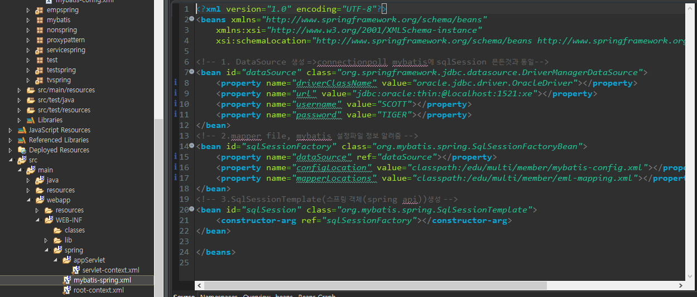

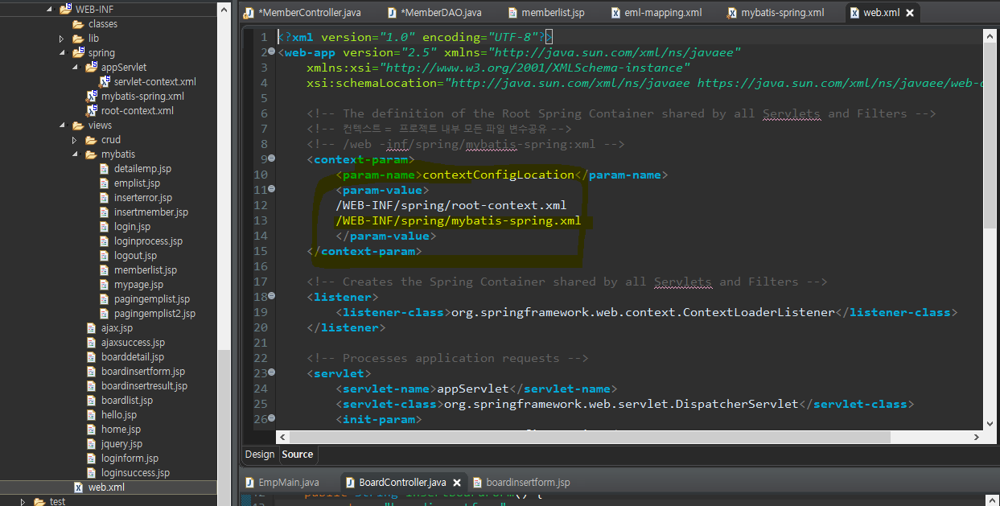

해당 영역 처럼 추가하여 사용

```xml
<param-value>
		/WEB-INF/spring/root-context.xml
		/WEB-INF/spring/mybatis-spring.xml
    	/WEB-INF/spring/xxxxxxx.xml
    	/WEB-INF/spring/yyyyyyy.xml
</param-value>
```

