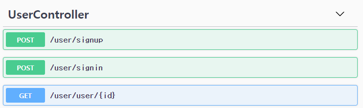
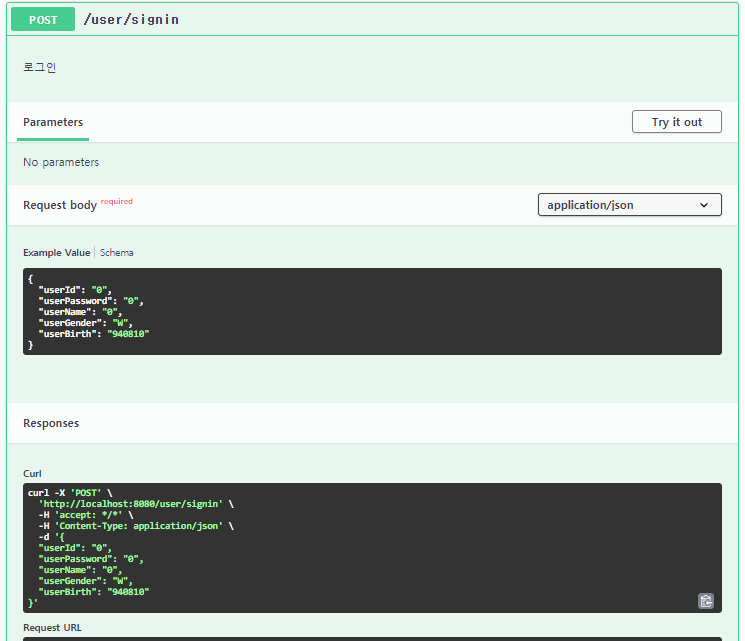
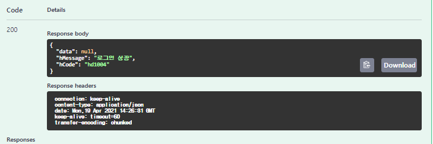

# Swagger

> API 명세를 간단하게 할 수 있는 swagger를 springdoc을 이용해 사용해보자

## Swagger

* RestAPI 서버가 어떤 request가 필요하고 결과가 어떻게 나오는지 문서작업이 필요하다.하지만 일일히 만들기는 번거롭다. 이 때 필요한 것이 Swagger!
  Swagger로는 api spec 문서를 자동화해줄 뿐만 아니라 test도 가능하다 (=postman)

## Dependency

* Swagger를 받으려면 springdoc 이나 Springfox를 이용해야 한다.
  *Springdoc이 Springfox에 비해 꾸준히 업데이트가 되어있고 webflux를 지원한다고 한다.*

* springdoc를 디펜던시에 추가하면 바로 사용이 가능하다

### maven

```bash
<dependency>
  <groupId>org.springdoc</groupId>
  <artifactId>springdoc-openapi-ui</artifactId>
  <version>1.4.6</version>
</dependency>
```

### gradle

```bash
implementation 'org.springdoc:springdoc-openapi-ui:1.5.7'
```


## 사용방법

* 어노테이션을 이용해서 원하는 설명을 적으면 된다. 주로 컨트롤러에 무슨 역할을 하는 컨트롤러인지, HTTP 메서드의 역할, 필요한 파라미터가 무엇인지, 파라미터 값 설명을 입력한다

### 1.컨트롤러

`@Tag(name = "")` 로 컨트롤러를 설명하고
`@Operation(description = "")` 으로 HTTP 메서드 대한 명세를 설정
`@Parameter` 로 api 파라미터 리스트를 보여줄 수 있다

```java
    	//회원조회
    @Operation(description = "회원조회")
    @GetMapping(value = "/user/{id}")
    public ResponseEntity<UserResponse> getUser(@Parameter @PathVariable String id) {
        return ResponseEntity.ok(userService.findByUserId(id));
    }
    
        //로그인
    @Operation(description = "로그인")
    @PostMapping(value = "/signin")
    public ResponseEntity<UserResponse> signIn(@Parameter @RequestBody UserRequest userRequest) {
        return ResponseEntity.ok(userService.signIn(userRequest));
    }
```



### 2.Schema

reqbody resbody에 설명을 해주는 어노테이션이다
`description` 으로 설명을 하고 `example` 로 예시값을 넣을 수 있다. 그 외에도 swagger에서 숨기거나 필수 표시 등을 할 수 있다

```java
public class UserRequest {
    @Schema(description = "유저아이디" , example = "0")
    String userId;
    @Schema(description = "유저패스워드" , example = "0")
    String userPassword;
    @Schema(description = "유저이름" , example = "0")
    String userName;
    @Schema(description = "유저성별" , example = "W")
    String userGender;
    @Schema(description = "유저생일" , example = "940810")
    @Schema(hidden = true)
    String userStatus;

}
```



여기서 `try it out` 을 누르면 테스트가 간다. POSTMAN 처럼 데이터를 실제로 요청하고 결과값을 확인할 수 있다



## 설정

* 설정은 application.properties 에서 간편하게 할 수 있다.

### 필요한 컨트롤러만 보이게 하기

* pathsToMatch를 이용해서 보여주고 싶은 컨트롤러만 보여주게 할 수 있다여주게 할 수 있다

```yaml
springdoc.pathsToMatch=/상대경로
```

### root에서 보여주게하기

* Swagger 이용하려면 루트에 /swagger-ui.html# 를 붙여서 이동해야하는데 번거롭기 때문에 root로 이동하면 바로 Swagger 보여지도록 리다이렉트 설정을 했다

```java
@Controller
@RequestMapping(value="/")
public class RootController {
    @RequestMapping("/")
    public String homeRedirect() {
        return "redirect:/swagger-ui.html";
    }

}
```

