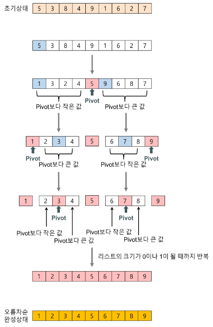

# Quick sort

## 기본 개념

* 불안정 정렬

* 비교정렬

  * 다른 원소와의 비교만으로 정렬 수행

* 분할 정복 알고리즘의 하나로, 평균적으로 매우 빠른 수행 속도로 정렬 한다

  * merge sort와 달리 quick sort는 리스트를 비균등하게 분할 한다.

* 분할정복 방법

  * 문제를 작은 2개의 문제로 분리하고 각각을 해겨한 다음, 결과를 모아서 원래의 문제를 해걸
  * 분할 정복 방법은 순환 호출을 이용하여 구현한다.

* 과정

  1. 리스트 안에 있는 한 요소를 선택한다 = pivot
  2. pivot을 기준으로 pivot보다 작은 요소들을 모두 피벗의 왼졲으로 옮겨지고 피벗보다 큰 요소들은 피버스이 오른쪽으로 옮겨진다
  3. 피벗을 제외한 왼쪽 리스트와 오른쪽 리스트를 다시 정렬
     * 분할된 부분 리스트에 대하여 순환 호출을 이용하여 정렬을 반복
     * 부분 리스트에서더 다시 피벗을 정하고 피벗을 기준으로 작은수와 큰수로 나눈다
  4. 부분 리스트들이 더이상 분할이 불가능할 떄까지 반복한다
     * 리스트의 크기가 0이나 1이 될떄까지 반복

  

  * 퀵정렬 단계

    * 분할(Divide) - 입력 배열을 피벗을 기준으로 비균등하게 2개의 부분 배열로 분할
      * 피벗을 중심으로 왼쪽은 작은 수 오른쪽은 큰 수의 리스트
    * 정복(Conquer) - 부분 배열을 정렬한다, 
      * 부분 배열의 크기가 충분히 작지 않으면 **순환 호출** 을 이용하여 다시 분할 정복 적용
    * 결합(Combine) - 정렬된 부분 배열들을 하나의 배열에 합병
      * 순환호출이 한번 진행될 떄마다 최소한 하나의 피벗은 최종적으로 위치가 정해지므로, 이 알고리즘은 반드시 끝난다는 것을 보장할 수 있다.

    

## 특징

* 장점
  * 속도가 빠르다
    * 시간 복잡도가 O(nlog2n)을가지는 다른 정렬 알고리즘과 비교했을 때도 가장 빠르다
  * 추가 메모리 공간을 필요로 하지 않는다
    * 퀵정렬은 O(log n)만큼의 메모리를 필요로 한다
* 단점
  * 정렬된 리스트에 대해서는 퀵 정렬의 불균형 분할에 의해 오히려 수행시간이 더 많이 걸린다.

* 시간 복잡도

