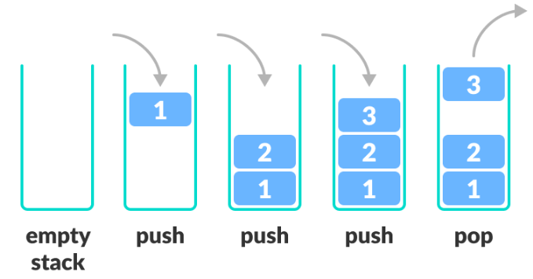

# Stack

> * 마지막에 들어온 data가 먼저 나가는 LIFO(Last In First Out)구조를 가진 자료구조
> * 사용 사례
>   * 재귀 Algorithm을 사용하는 경우 유용
>     * 재귀적으로 함수를 호출해야 하는 경우에 임시 데이터를 스텍에 넣어준다
>     * 재귀함수를 빠져나와 퇴각 검색(Backtrack)을 할 때는 stack에 넣어 두었던 임시 데이터를 빼줘야 한다
>     * stack은 이런 일려느이 행위를 직관적으로 가능하게 해준다.
>   * 웹 브라우져 방문기록(뒤로가기)
>   * 실행 취소
>   * 역순 문자열 만들기
>   * 수식의 괄호 검사(연산자 우선순의 표현을 위한 괄호 검사)
>   * 후위 표기법 계산

* Stack 구조




## Stack 구현

* pop() - Stack에서 가장 위에 있는 항목을 제거
* push() - item하나를 Stack의 가장 윗 부분에 추가
* peek() - 스텍의 가장 위에 있는 항목을 반환
* empty() - Stack이 비어있으면 1, 아니면 0출력

```java
public class No10828 {

	static ArrayList<Integer> numList;
	
	public static void main(String[] args) {
		Scanner scan = new Scanner(System.in);
		int inputSize = scan.nextInt();
		String command;
		numList = new ArrayList<>();
		
		for(int i=0; i<=inputSize; i++) {
			command = scan.nextLine();
			if(command.contains("push")) {
				command = command.replace("push", "").trim();
				push(Integer.parseInt(command));
			}else if(command.equals("pop")) {
				System.out.println(pop());
			}else if(command.equals("size")) {
				System.out.println(size());
			}else if(command.equals("empty")) {
				System.out.println(empty());
			}else if(command.equals("top")) {
				System.out.println(top());
			}
		}
		scan.close();
	}
	/*
	 * 정수 x를 스텍에 넣는 연산
	 */
	public static void push(int data) {
		numList.add(data);
	}
	/*
	 * 가장위에있는 정수를 빼고
	 * 그 수를 출력
	 * 스텍에 들어있는 정수가 없는경우 -1 출력
	 */
	public static int pop() {
		if(numList.isEmpty()) {
			return -1;
		}else {
			return numList.remove(numList.size()-1);
		}
	}
	/*
	 * Stack에 들어있는 정수의 개수 출력
	 */
	public static int size() {
		return numList.size();
	}
	/*
	 * 스텍이 비어있으면 1, 아니면 0출력
	 */
	public static int empty() {
		if(numList.isEmpty()) {
			return 1;
		}else {
			return 0;
		}
		
	}
	/*
	 * Stack의 가장 위에 있는 정수를 출력
	 * Stack에 들어있는 정수가 없을 경우-1 출력
	 */
	public static int top() {
		if(numList.isEmpty()) {
			return -1;
		}else {
			return numList.get(numList.size()-1);
		}
	}
}
```

