# Web 

> HTMLS
>
> CSS
>
> JavaScript
>
> jQuery

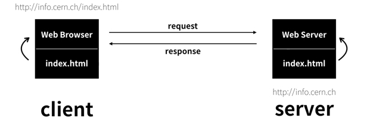

* Client

  요청

  html,css,JavaScript.....

  Client Side Script (해석이 client에 있는)

  * 문서구조 - HTML

    정적태그, 단항태그

  * 디자인 - CSS

  * 기능동작 - JavaScript

* Server

  응답

  Database,Framework,Java,python.....

  Server Side Script (해석이 server에 있는) - 코드 연산을 하고 client 에 응답을 해주기때문에 보안에 강하다.(client에서 코드 확인 불가)

  * jsp - tomcat
  * aspx - IIS
  * php - apache

# HTML

# Eclipse Web

## Tomcat

[	Apache Tomcat](http://tomcat.apache.org/) -> Download ->Tomcat8

* Tomcat 환경설정

```bash
## Tomcat과 eclipse port가 8080이 충돌이나서 eclipse port 변경

select dbms_xdb.gethttpport()from dual;  # port 확인

exec dbms_xdb.sethttpport(9090); # 기존 port를 9090으로 변경
```

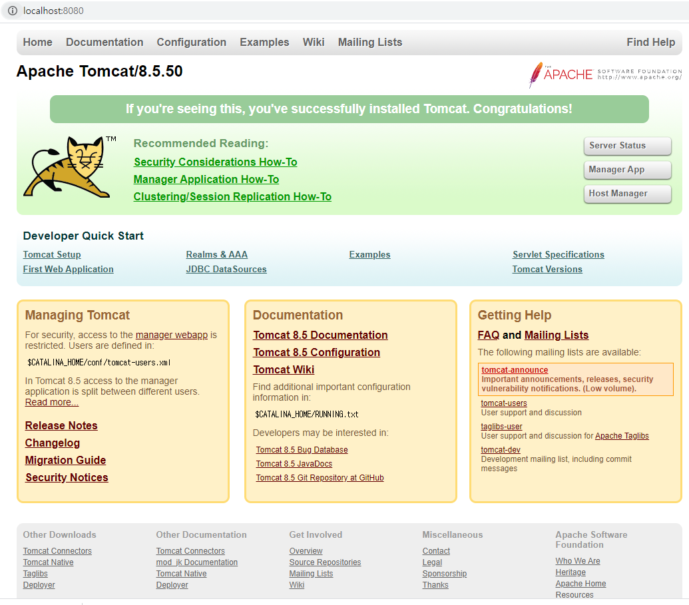


## jar 파일 Java 폴더 복사

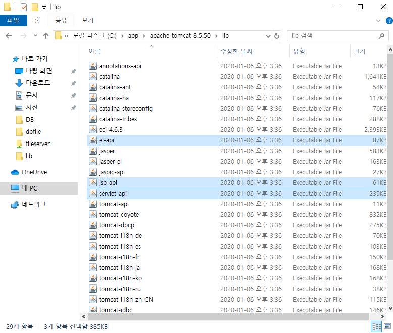

해당 경로로 복사 붙여넣기(el-api, jsp-api, servlet-api)

  C:\app\apache-tomcat-8.5.50\lib  ->  C:\Program Files\Java\jre1.8.0_231\lib\ext

## 

## Eclipse web setting

### Perspective

- Eclipse창의 우측 위의 `Open Perspective`를 사용하거나 `Windows` - `Perspective` - `Open Perspective`를 클릭하여 `Web`을 선택한다. 안보인다면 `Other`에서 탐색하면 된다.

### Dynamic Web Project

- Dynamic Web Project를 생성한다.
- 이 때, Dynamic Web module Version을 3.1로 조정한다. Java 8버전에 맞도록 설정하는 것이다.
- Next를 두번 눌러서 마지막 설정 페이지에서 Generate web.xml Deployment Descript를 체크한다.
  - JSP, Spring등에서는 설정파일로 `.XML`파일을 사용한다.

### Tomcat

- [Tomcat Site](https://tomcat.apache.org/)에서 Tomcat 8버전을 다운로드 받는다.

  - 8.5.50버전을 다운로드 받는다. 원하는 형태로 다운로드 받아도 되나, 압축형 파일이 문제가 생겼을 때 폴더를 삭제하고 새로 압축을 푸는 형태로 쉽게 다시 받을 수 있어서 압축형 파일로 다운로드 받았다.

- 압축파일을 해제하면 나오는 폴더를 살펴본다

  - `\bin\startup.bat`파일이 서버 시작파일이다.

  - `\conf\server.xml`파일이 서버 설정파일이다.

  - `\webapps\ROOT\index.jsp`파일이 `localhost:8080`으로 진입시 나오는 웹페이지이다.

    - 이 때 사용자이름과 비밀번호를 입력하는 창이 뜨거나 Tomcat창이 아닌 다른창이 뜬다면 문제가 있는 것이다. `8080`으로 설정된 `TOMCAT Port`가 이미 사용중이란 소리인데, `Oracle DB`를 사용중이고, `Port`를 건든적이 없다면 해당 `Oracle DB`의 `Port`가 `8080`일 것이다.

      - `Oracle DB`의 `Port`를 확인하고자 하면 관리자 계정으로 로그인하여 다음 쿼리문을 실행한다.

        ```
        SELECT dbms_xdb.gethttpport() from dual;
        ```

      - `Oracle DB`의 `Port`를 `9090`으로 변경해준다.

        ```
        EXEC dbms_xdb.sethttpport(9090);
        ```

  - 환경변수 설정

    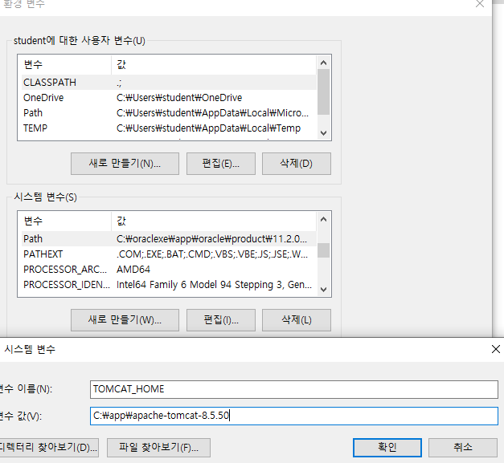

### Content Type

-   `Windows` - `Preferences` - `Content Type`의 다음 항목들의 `Default Encoding`을 `UTF-8`로 변경한 후 `Update`한다

  - ```
    CSS`, `HTML`, `Java Properties file`, `Java Source file`, `Javascript Source file`, `JSP
    ```

## ServerTest

- 생성한 후 `EUC-KR`을 전부 `UTF-8`로 변경해준다.

- `<%@ page %>`는 JSP시작태그이다.

  - TOMCAT의 lib폴더의 `el-api.jar`, `jsp-api.jar`, `servlet-api.jar`를 JAVA의 jre폴더의 ext폴더로 복사하여 붙여넣는다.

- `HTML`을 실행하여 웹페이지를 살펴보는 것은 `java`코드 실행과 동일하게 `Ctrl + F11`로 진행한다.

  - Tomcat을 Server로 지정하고 구동하면 Eclipse내부에 웹페이지가 표시된다
  - Eclipse 내부 웹페이지를 사용하지 않고 Chrome을 사용하기 위하여 `Windows` - `Web Browser` - `Chrome`을 선택해두고 다시 실행하면 된다.

- `HTML`파일 내부에 `JAVA Code`를 작성하고 싶다면 `<% %>`내부에 작성하면 된다.

  - Tomcat에서 해석되서 내용만 `HTML`파일로 나가기 때문에, 웹페이지에서 소스를 살펴보면 코드가 보이는 것이 아니라 코드의 완성내용만 보인다.
  - Server Side Script

  ```bash
  <%@ page language="java" contentType="text/html; charset=UTF-8"
      pageEncoding="UTF-8"%>
      
  <%@ page import = "java.util.*" %>
  
  <!DOCTYPE html>
  <html>
  <head>
  <meta charset="UTF-8">
  <title>Insert title here</title>
  </head>
  <body>
  <h1>Server Test 입니다.</h1>
  <% Date today = new Date(); %>  #
  <%= today %>                    #
  </body>
  </html>
  ```

  

  - 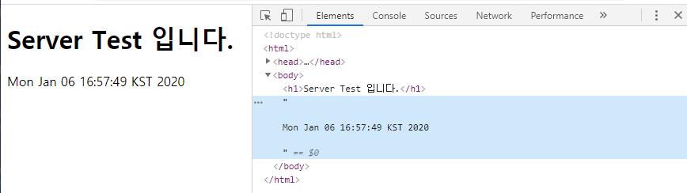

# HTML TAG

```bash
<!DOCTYPE html>
<html>
<head>
<meta charset="EUC-KR">
<title>처음 만든 웹페이지</title>
</head>
<body>
여기 쓴내용이 보입니다.<br/>
즐변경 안되었네요.<br>
여러번 쓸때 한번에 한칸씩 줄바꿈 됨<br><br><br><br>
문단이 바뀐다.<p>
줄변경
</body>
</html>
```


## HTML TEMPLATE 생성/변경/적용

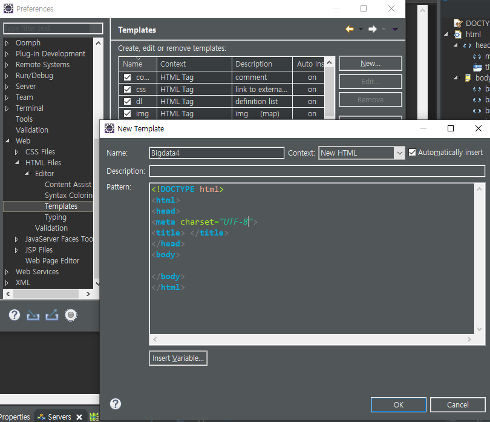

##  Image

### 상대경로

```bash
<!DOCTYPE html>  <!-- html5 dtd type -->
<!-- <!DOCTYPE HTML PUBLIC "-//W3C//DTD HTML 4.01//EN"
            "http://www.w3.org/TR/html4/strict.dtd"> -->
<html>
<head>
<meta charset="UTF-8">
<title>image tag </title>
</head>
<body>
<!-- 상대경로 -->
<!--  -->

가나다라마바사아자차카파타하가나다라마바사아자차카파타하
가나다라마바사아자차카파타하

<!-- 절대경로 -->
</br><br><br>

</body>
</html>
```

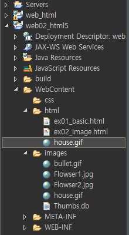


### 절대경로


## <a tag

## <table tag

## &nbsp ;

> tap 역할

# CSS

## Usage

```bash
.accent{
		font-size:20px;
		color:red;
		font-weight: bold;
	}
```

- `@import`를 통하여 다른 파일의 `CSS`를 가져와서 적용시킬 수 있다.

- `.className` : 특정 태그에서 선언된 class에 대해서 선언할 때 이용한다.
  
  - `div`와 같은 태그를 생략할 수 있다.
  
- `#idName` : 특정 태그에서 선언된 id에 대해서 선언할 때 사용한다.
  
  - `.className ul li` : `className`라는 `class`를 가진 태그 내부에 있는 `ul`태그 내부의 `li`태그의 CSS를 지정해줄 때 사용한다.
  - 선택자 다중 지정
  
  
## 선택자 다중지정

  ```bash
  body, h1, p{
  	background-color: yellow;
  	}
  ```

  * 여러개의 태그에 대한 CSS를 한번에 설정할 수 있다.

## 우선순위

  > id > class > selector

  - id의 우선순위가 가장 높으며 선택자의 우선순위가 가장 낮다.

## In HTML

```
<head>
    <link rel="stylesheet" href="../../CSS/Test.css" type="text/css">
</head>
```

- `link`로 `CSS File`을 호출해서 가져온다.


## Parameter

> 지정할 수 있는 수많은 Parameter가 있지만 자주 쓰거나, 유의해야할 것 몇개만 짚어본다.

- `margin` : 여백을 만들어주는 인자

  ```
  margin: 100px 50px;
  ```

  - `top`, `right`, `bottom`, `left`순으로 선언되며 선언되지 않은 부분은 대칭된 부분의 값과 같다.

  - 하나의 값만 선언되면 모든 방향이 그 값으로 지정된다.

  - `px`단위는 생략될 수 있다. `px`가 아닌 `%`로 값을 지정할 수도 있다.

  - 혹은 `margin-bottom`처럼 각 방향을 언급한 `parameter`를 사용할 수 있다.

  - 맞붙은 두 태그의

     

    ```
    margin
    ```

    이 중첩될경우 두

     

    ```
    margin
    ```

    중 수치가 큰 것 하나만 적용된다.

    - 위 태그의 `margin-bottom`이 50이고 아래 태그의 `margin-top`이 100일 때 두 태그 사이의 `margin`은 150으로 적용되는 것이 아닌 큰 수치인 100으로 적용된다.

- `color`관련 인자에서 `rgba`

  - `(0, 0, 0, 0)`처럼 4개의 인자를 받는다. 앞의 세개는 r,g,b를 의미하며 0~~255까지의 값을 가진다. 맨뒤의 값은 투명도를 의미하며 0~~1까지의 값을 가진다.

# JavaScript

> 위치 상관 없다.
>
> jsp&servlet, javaScript에서는 tag와 쿼리문은 문자열 안에서 선언한다.

* javaScript와 HTML에서 출력 비교

```javascript
<!DOCTYPE html>
<html>
<head>
<meta charset="UTF-8">
<meta name="viewport" content="width=device-width, initial-scale=1.0" />
<meta http-equiv="X-UA-Compatible" content="ie=edge" />
<title>ex01_js.html JavaScript Test </title>

<script type="text/javascript">
	document.write("javaScript를 이용한 출력<br>");
	document.write("javaScript는 대보문자 구분한다<br>");
	document.writeln(" <font color='red' size='5'> javaScript를 이용한 출력</font>");
	
	function hello(){
		alert('안녕');  /* 우선 순위가 높다 (가장 상위에 출력)*/
	}
</script>

</head>
<body onload="hello()"> 

	<p>브라우저에서 출력되었습니다.</p>
	<input type="button" value="눌러봐" onclick=hello()>  
	

</body>
</html>
```

* document.write - 출력 method
* method 호출은 "hello()", hello() 둘다 사용 가능하다

### type

> 티입선을 을 하지않아도 된다, 단 var str= 선언시 초기화 값을 지정해 줘야한다(초기화 지정시에 타입이 자동 형성되기 때문에 -.>초기화 값 지정해주지 않으면 undefinde 가 뜬다)

# jQuery_library

## 1. File link 

> 인터넷 환경이 안좋을때 사용.

다운로드 - 우클릭 링크주소로 복사

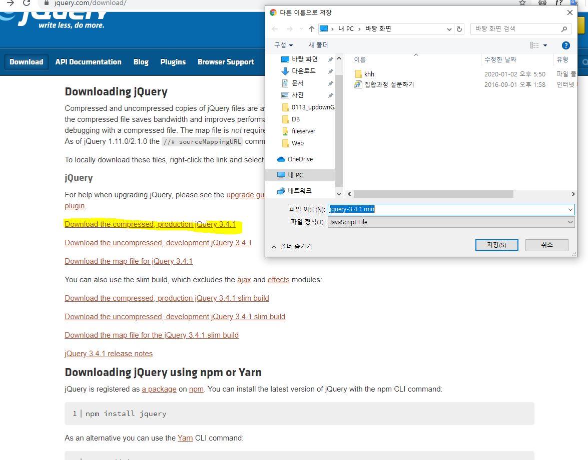

```javascript
<!DOCTYPE html>
<html>
<head>
<meta charset="UTF-8">
<meta name="viewport" content="width=device-width, initial-scale=1.0" />
<meta http-equiv="X-UA-Compatible" content="ie=edge" />
<title> </title>
<!-- <!-- CDN -->
<script
  src="https://code.jquery.com/jquery-3.4.1.slim.min.js"></script> -->
  
  <!-- file 로 like -->
 <script type="text/javascript" src="../js/jquery-3.4.1.min.js"></script>
  
<script type="text/javascript">
	
	/* 아래 두 코드가 같다 */
	$(document).ready(function(){
		alert('hi');
	});
	
	$(function() {
		alert('hi1');
	});
	
</script>
</head>
<body>

</body>
</html>
```


## 2. CDN 방식


다운로드-past releases -복사-붙여넣기


```javascript
<script
  src="https://code.jquery.com/jquery-3.4.1.slim.min.js"></script>   해당 주소 붙여넣기
  
<script type="text/javascript">
   $(document).ready(function() {
      $('tr:even').css('backgroundColor', 'pink');
      $('tr:odd').css('backgroundColor', 'yellow');
   });
</script>
```

```javascript
<!DOCTYPE html>
<html>
<head>
<meta charset="UTF-8">
<meta name="viewport" content="width=device-width, initial-scale=1.0" />
<meta http-equiv="X-UA-Compatible" content="ie=edge" />
<title> </title>
<!-- CDN -->
<script
  src="https://code.jquery.com/jquery-3.4.1.slim.min.js"></script>
  
<script type="text/javascript">
	
	/* 아래 두 코드가 같다 */
	$(document).ready(function(){
		alert('hi');
	});
	
	$(function() {
		alert('hi1');
	});
	
</script>
</head>
<body>

</body>
</html>
```

```java
<!DOCTYPE html>
<html>
<head>
<meta charset="UTF-8">
<meta name="viewport" content="width=device-width, initial-scale=1.0" />
<meta http-equiv="X-UA-Compatible" content="ie=edge" />
<title> </title>
<!-- <!-- CDN -->
<script
  src="https://code.jquery.com/jquery-3.4.1.slim.min.js"></script> -->
  
  <!-- file 로 like -->
 <script type="text/javascript" src="../js/jquery-3.4.1.min.js"></script>
  
<script type="text/javascript">
	
	
	$(document).ready(function(){
		$('h1').hide();   //h1 tag
		$('#id1').hide();  //id 이름 앞에 #을 붙인다
		$('.c2').css('backgroundColor', 'red');   //클레스 사용 시에는 '.' 이 붙어야한다.
		$('h3.c3').css('backgroundColor', 'green');
		$('*').css('backgroundColor', 'green');  //정체 적용
	});
	
	/* 아래 두 코드가 같다 */
/* 	$(document).ready(function(){
		alert('hi');
	});
	
	$(function() {
		alert('hi1');
	}); */
	
</script>
</head>
<body>
<h1 id="id1">Hello
	<p>포함된 p태그</p>
</h1>
<h2>19315555</h2>
<h1 id="id2">big data</h1>
<h2 id="id2">big datah2</h2>
<h3 id="id2">big datah h3</h3>

<div>
	영역 지정함
</div>
	
<h1 class="c1">빅데이터 4기 b반</h1>
<h2 class="c2">빅데이터 4기 b반1</h2>
<h3 class="c3">빅데이터 4기 b반1</h3>
</body>
</html>
```


### .val()

```java
 $('input').val('helloworld); //input의 value 값에 helloworld라고 넣는다
 $('input').val(); //input의 value값을 가져온다.
```

# Ajax

* 에제

```java
<!DOCTYPE html>
<html>
<head>
<meta charset="EUC-KR">
<title>Insert title here</title>
<script>
	var httpRequest = null;

	function getXMLHttpRequest() {
		if (window.XMLHttpRequest) {
			return new XMLHttpRequest();
		} else if (window.ActiveXObject) {
			return new ActiveXObject("Microsoft.XMLHTTP");
		} else {
			return null;
		}
	}

	function sendRequest(method, url, params, callback) {
		httpRequest.onreadystatechange = callback;
		httpRequest.open(method, url, true);
		httpRequest.send(params);
	}

	function requestMsg() {
		httpRequest = getXMLHttpRequest();
		sendRequest("GET", "hello.html", null, responseMsg);
	}

	function responseMsg() {
		if (httpRequest.readyState == 4 && httpRequest.status == 200) {
           
	//             - [AJAX 상태코드 표]
	//0
	//초기화 되지 않음. open 메소드가 아직 호출되지 않았음.
	//1
	//열기. open 메소드가 호출되었으나 send 메소드는 호출되지 않았음.
	//2
	//송신완료. send 메소드가 호출되었음. 요청이 시작되었음
	//3
	//수신 중, 서버가 응답을 보내는 중임.
	//4
	//수신완료. 서버가 응답을 다 보내고 작업을 완료했음
            
          //  status
	// 서버 처리 결과 상태 코드
	// 200 : OK (요청 성공)
	// 404 : Not Found (페이지를 못찾을 경우)
	// 500 : Server Error (서버에서 결과 생성 시 오류 발생)

			var msgView = document.getElementById("msgView");
			msgView.innerHTML += httpRequest.responseText; //responseText -문자열로 응답 데이터를 얻음
		}
	}
</script>
</head>
<body>
	<h1>서버에서 받은 메세지</h1>
	<div id="msgView" style="height: 100px; width: 500px; border: 1px solid black"></div>
	<input type="button" value="서버에서 자료 요청" onclick="requestMsg()" />
</body>
</html>
```

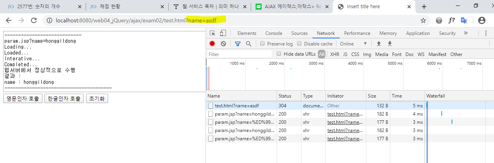

# JSP & Servlet

​	- servlet

* Java + HTML  - java 코드안에 html tag 작성

> 대규모, 장기, 유지보수를 위해서는 servlet 사용 해야함.
>
> java 에 jsp 가 섞여서 코딩하기가 어려웠음.

​	- jstl

* java jsp, servlet 에서는 Tag, sql 문은 문자열 취급함.


## JSP

### jsp 문법

* 스크립트릿

```java
1) 스크립트릿
     <%
	코드작성(변수선언, 제어문,...)
     %>
```

* 선언문

```jade
 2) 선언문
    <%!
	코드작성(변수선언, 함수 )
     %>
```

* 표현식

```java
 3) 표현식
   <%= 변수 또는 값 또는 메소드 %>
```

* 지시어

```java
<%@ page inport="java.util.*" %>
```


* 예시

```java
<%@ page language="java" contentType="text/html; charset=UTF-8"
    pageEncoding="UTF-8"%>
<!DOCTYPE html>
<html><head>
<meta charset="UTF-8">
<title>ex01_basic.jsp</title>
<script type="text/javascript">
	document.write("javascript 이요해서 출력했어요");
</script>
</head>
<body>
	<h1>안녕하세요</h1>
	<p>tag 이용한 웹 브라우저에 출력합니다.</p>
	
	<%
	String str = "안녕!!! JSP를 이용한 웹 브라우저에 출력합니다";
	/* out.print(str); */
	%><br>
	
	<!-- 변수 선언부 -->
	<%!
	public int show(){
		return 3+5;
	}
	%>
	
	<!-- 서버사이드는 해석기가 따로있따 서버에서 해석이 이루어지고  -->
	<%= "표현식 이용"+ str%><br>           <!-- JSP출력하는 문구,표현식 -->
	<font size = '7' color='red'> <%= show() %> </font>
</body>
</html>
```

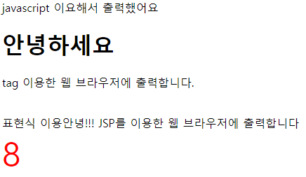


## Servlet

* HTML + java - html 안에서 java 코드 작성

> 혼합 되어있어 자료 구조가 복잡함 (java는 컴파일을 해야함) - 코드 갱신에 있어서 웹페이지를 중단했다 컴파일후 다시 열어야한다.

### servlet Lifecycle

* client가 Servlet에 요청하면 Servlet은 바로 호출되지 않는다. Servlet은 객체를 생성하고 초기화 작업을 거친 후 , 요청을 처리하는 생명주기를 갖는다.
* client가 호출하면 Class를 생성하고 다른 client가 호출하면 이미 생성된 class를 재사용 한다. 

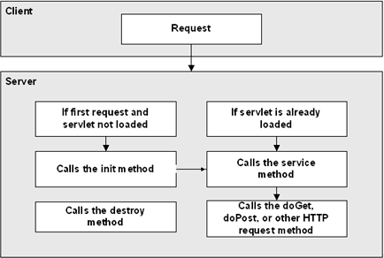

1. 요청이 오면, Servlet 클래스가 로딩되어 요청에 대한 **Servlet 객체가 생성**
2. 서버는 init() **메소드를** 호출해서 **Servlet을  초기화** 
3. service() 메소드를 호출해서 Servlet이 **브라우저의 요청을 처리**.
4. service() 메소드는 특정 **HTTP 요청(GET, POST 등)을 처리**하는 메서드 (doGet(), doPost() 등)를 호출
5. 서버는 destroy() 메소드를 호출하여 **Servlet을 제거**


## Class 방식

### java Servlet 설정

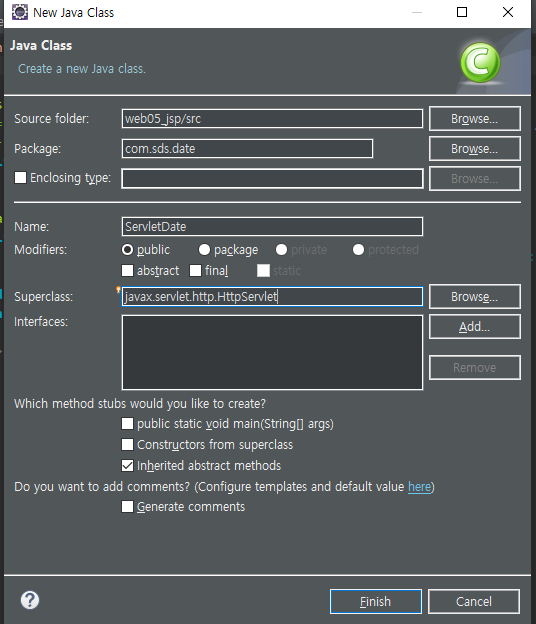

[tomcat dot](http://tomcat.apache.org/tomcat-8.5-doc/index.html)

```java
get ,post
```

### GEt, POST Override

> Defaul - get

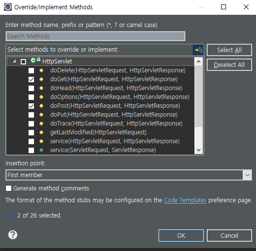

```java
package com.sds.date;

import java.io.IOException;

import javax.servlet.ServletException;
import javax.servlet.http.HttpServlet;
import javax.servlet.http.HttpServletRequest;
import javax.servlet.http.HttpServletResponse;

public class ServletDate extends HttpServlet {

	@Override
	protected void doGet(HttpServletRequest req, HttpServletResponse resp) throws ServletException, IOException {
		process(req, resp);
	}

	@Override
	protected void doPost(HttpServletRequest req, HttpServletResponse resp) throws ServletException, IOException {
		process(req, resp);
	}
	protected void process(HttpServletRequest req, HttpServletResponse resp) throws ServletException, IOException {
		System.out.println("Hello Servlet");
	}
}
```


### Servlet 등록

> 1.설정파일
>
> 2.어노테이션

1. 설정파일에 등록

   web.xml

   ```java
   <?xml version="1.0" encoding="UTF-8"?>
   <web-app xmlns:xsi="http://www.w3.org/2001/XMLSchema-instance"
   	xmlns="http://xmlns.jcp.org/xml/ns/javaee"
   	xsi:schemaLocation="http://xmlns.jcp.org/xml/ns/javaee http://xmlns.jcp.org/xml/ns/javaee/web-app_3_1.xsd"
   	id="WebApp_ID" version="3.1">
   	<display-name>web05_jsp</display-name>
   	
   	<servlet>
   		<servlet-name>ServletDate</servlet-name>  // 이름입력 (Class name로 하는걸 권장)
   		<servlet-class>com.sds.date.ServletDate</servlet-class> //classs 경로 입력
   	</servlet>
   	<servlet-mapping>
   		<servlet-name>ServletDate</servlet-name>
   		<url-pattern>/</url-pattern>
   	</servlet-mapping>
   	
   	
   	<welcome-file-list>
   		<welcome-file>index.html</welcome-file>
   		<welcome-file>index.htm</welcome-file>
   		<welcome-file>index.jsp</welcome-file>
   		<welcome-file>default.html</welcome-file>
   		<welcome-file>default.htm</welcome-file>
   		<welcome-file>default.jsp</welcome-file>
   	</welcome-file-list>
   </web-app>
   ```

   

2. 어노테이션 등록

   ```java
   package com.sds.date;
   
   import java.io.IOException;
   
   import javax.servlet.ServletException;
   import javax.servlet.annotation.WebServlet;
   import javax.servlet.http.HttpServlet;
   import javax.servlet.http.HttpServletRequest;
   import javax.servlet.http.HttpServletResponse;
   
   @WebServlet("/serverDate")  // 어노테이션
   public class ServletDate extends HttpServlet {
   
   	@Override
   	protected void doGet(HttpServletRequest req, HttpServletResponse resp) throws ServletException, IOException {
   		process(req, resp);
   	}
   
   	@Override
   	protected void doPost(HttpServletRequest req, HttpServletResponse resp) throws ServletException, IOException {
   		process(req, resp);
   	}
   	
   	protected void process(HttpServletRequest req, HttpServletResponse resp) throws ServletException, IOException {
   		System.out.println("Hello Servlet"); //console 출력
   	}
   }
   
   ```

   


###  java에서 html 작성

* html에 시간 찍기

```jade
package com.sds.date;

import java.io.IOException;
import java.io.PrintWriter;
import java.util.Calendar;

import javax.servlet.ServletException;
import javax.servlet.annotation.WebServlet;
import javax.servlet.http.HttpServlet;
import javax.servlet.http.HttpServletRequest;
import javax.servlet.http.HttpServletResponse;

@WebServlet("/serverDate")
public class ServletDate extends HttpServlet {

	@Override
	protected void doGet(HttpServletRequest req, HttpServletResponse resp) throws ServletException, IOException {
		process(req, resp);
	}

	@Override
	protected void doPost(HttpServletRequest req, HttpServletResponse resp) throws ServletException, IOException {
		process(req, resp);
	}
	
	protected void process(HttpServletRequest req, HttpServletResponse resp) throws ServletException, IOException {
//		System.out.println("Hello Servlet");
		resp.setCharacterEncoding("euc-kr"); // 한글 깨짐 처리
		Calendar c = Calendar.getInstance(); // system이가지고 있는ㄴ 날짜를 얻어옴.
		int hour = c.get(Calendar.HOUR_OF_DAY);
		int minute = c.get(Calendar.MINUTE);
		int second = c.get(Calendar.SECOND);
		
		PrintWriter pw = resp.getWriter();
		pw.write("<html><head><title>서버축 시간을 얻어서 씁니다.</title></head>");
		pw.write("<body><h1>Hello Servlet</h1>");
		pw.write("<h2>현재 시간은");
		pw.write(Integer.toString(hour)+"시");
		pw.write(Integer.toString(minute)+"분");
		pw.write(Integer.toString(second)+"초");
		pw.write("</h2></body></html>");
		pw.close();
	}
}
```


## Servlet 방식

```jade

```


#### jsp -> jsp 방식

* model 1방식 

> Model1
>
> model2 == MVC

```java
<%@ page language="java" contentType="text/html; charset=UTF-8"
    pageEncoding="UTF-8"%>
<!DOCTYPE html>
<html><head>
<meta charset="UTF-8">
<title>ex03_login.jsp</title>
</head>
<body>
<table>
	<form action="ex03_loginOK.jsp" method="get">
		<tr>
			<td>ID: <input type="text" name="id" value=""></td>
		</tr>
		<tr>
			<td>PWD: <input type="text" name="pwd" value=""></td>
		</tr>
		<tr>
			<td>Hobby:<input type="checkbox" name="hobby" value="baseball">baseball
			<input type="checkbox" name="hobby" value="football">football
			<input type="checkbox" name="hobby" value="basketball">basketball</td>
		</tr>
		<tr>
			<td><input type="submit" id="sub" value="전송"></td> 
		</tr>
	</form>
</table>
</body>
</html>
```

```java
<%@page import="java.util.Map"%>
<%@ page language="java" contentType="text/html; charset=UTF-8"
    pageEncoding="UTF-8"%>
<!DOCTYPE html>
<html><head>
<meta charset="UTF-8">
<title>ex03_loginOK.jsp</title>
</head>
<body>
<%
	request.setCharacterEncoding("UTF-8");
	String id = request.getParameter("id");
	String pass = request.getParameter("pwd");
	//out.print(id + "," + pass);

	//여러개의 데이터 받아오기
	//String[] hobbys = request.getParameterValues("hobby");  //getParameterValues 방식을 이용한것
	
	
	//getParameterMap 을 이용한 방식
	Map map = request.getParameterMap();
	String[] hobbys = (String[])map.get("hobby");
		
%>
<%= "당신의 아이디 :" +id %><br>
<%= "당신의 비밀번호 :" +pass%><br>

<%
	if(hobbys != null){
		for(int i=0; i<hobbys.length; i++){
			out.print(hobbys[i] + "<br>");
		}
	}
%>
</body>
</html>
```


# JSTL

## 리이브러리  Download(JSTL, Standard)

### Core

[Tomcat](http://tomcat.apache.org/taglibs.html)

[MVNrepository](https://mvnrepository.com/search?q=jstl)

다운로드(JSTL, standard) - >lib폴더 

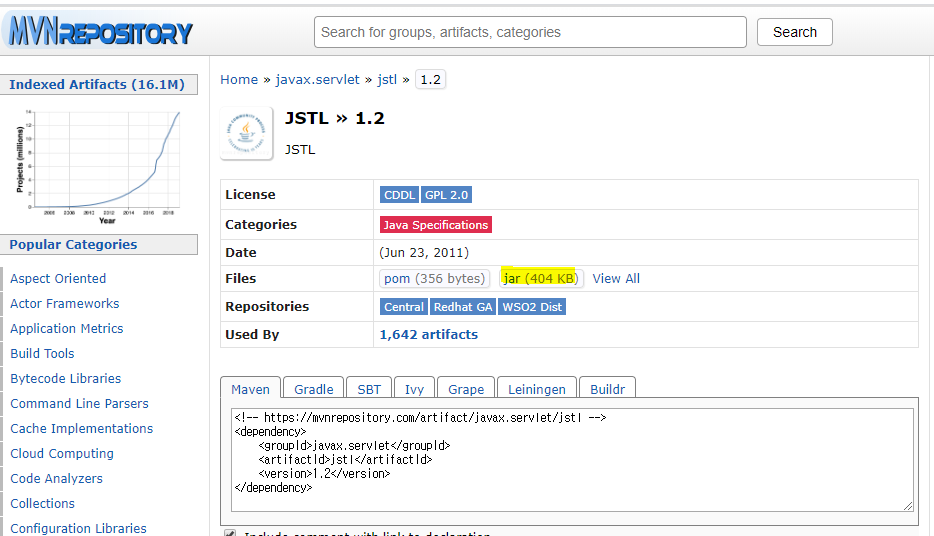

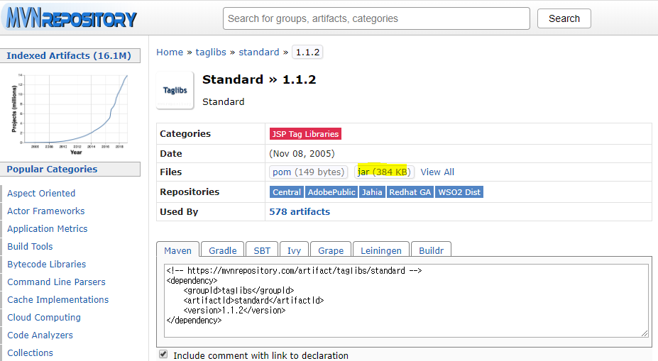

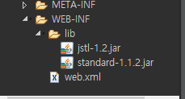

```java


```

# jsp _0120

> JSP 는 `WEB-INF` 파일이 반드시 있어야 한다.
>
> -- lib 
>
> -- classes -- bundle -- testBundle.properties , testBundle_ko.properties
>
> -- tld(라이브러리-JSTL,standard)
>
> --web.xml (web.xml 생성 - 우클릭 java EE Tools)

* JSP 내부 객체
  * vrequest 로컬 쿠키(클라이언트) , 세션(서버)
  * response
  * out
  * pageContext
  * sessio
  *  application
  * config
  * page
  * exception

# JSTL& EL

## EL

> EL은 JSP의 출력 문법을 대체하는 표현 언어입니다.
>
> EL 표기법에서 파라미터의 값은 **param 키워드**를 통해 가져올 수 있습니다.
>
> 또한 JSP 값 표기법에서 파라미터는 문자열이지만, EL에서 **숫자는 숫자로, 문자열은 문자열로 인식합니다.**

- <%= i %> 

- - JSP에서의 값 표기법이며, i는 **변수**

- ${ i }

- - EL에서의 값 표기법이며, i는 **이름**

내장 객체

|    pageScope     | page Scope에 접근하기 위한 객체        |
| :--------------: | -------------------------------------- |
|   reqeustScope   | request Scope에 접근하기 위한 객체     |
|   sessionScope   | session Scope에 접근하기 위한 객체     |
| applicationScope | application Scope에 접근하기 위한 객체 |
|      param       | 파라미터 값을 가져오기 위한 객체       |
|      header      | 헤더 값을 가져오기 위한 객체           |
|      cookie      | 쿠키 값을 가져오기 위한 객체           |
|    initParam     | JSP 초기 파라미터를 가져오기 위한 객체 |
|   pageContext    | pageContext 객체에 접근하기 위한 객체  |


```java
<!-- \문자 ===> 해당 문자 표현, \\,\" -->
	<h3>\${5+7} = ${5+7}</h3>  // ==> EL방식
	<h3>\${5+7} = <%=5+7 %></h3>  // ==> java code 여서 갱신하려면 서버를 재 시작해야함.
    <br>
	<h3>\${5-7} = ${5-7}</h3>
	<h3>\${5*7} = ${5*7}</h3>
	<h3>\${5/7} = ${5/7}</h3>
	<h3>\${5div7} = ${5 div 7}</h3>
	<h3>\${5%7} = ${5%7}</h3>
	<h3>\${5 mod 7} = ${5 mod 7}</h3>
	<hr>
	<h3>\${5!=7} = ${5!=7}</h3>
	<h3>\${5>7} = ${5>7}</h3>
	<h3>\${5<7} = ${5<7}</h3>
	<h3>\${5<=7} = ${5<=7}</h3>
	<hr>
	<h3>\${5+3==8?8:10} = ${5+3==8?8:10}</h3>
	<hr>
	<table border="1" width="100%">
		<tr>
			<td>\${header['host']}</td>  
			<td>${header['host']}</td>
		</tr>
		<tr>
			<td>\${header['user-agent']}</td>  //보고싶은 부위만 출력
			<td>${header['user-agent']}</td>
		</tr>
		<tr>
			<td>\${headerValues}</td>   //전체 출력
			<td>${headerValues}</td>
		</tr>
	</table>
    
  

```


> F12 - 화면에 커서 두고F5- ex01_el.jsp 파일 클릭 =>headers 볼수 있다.

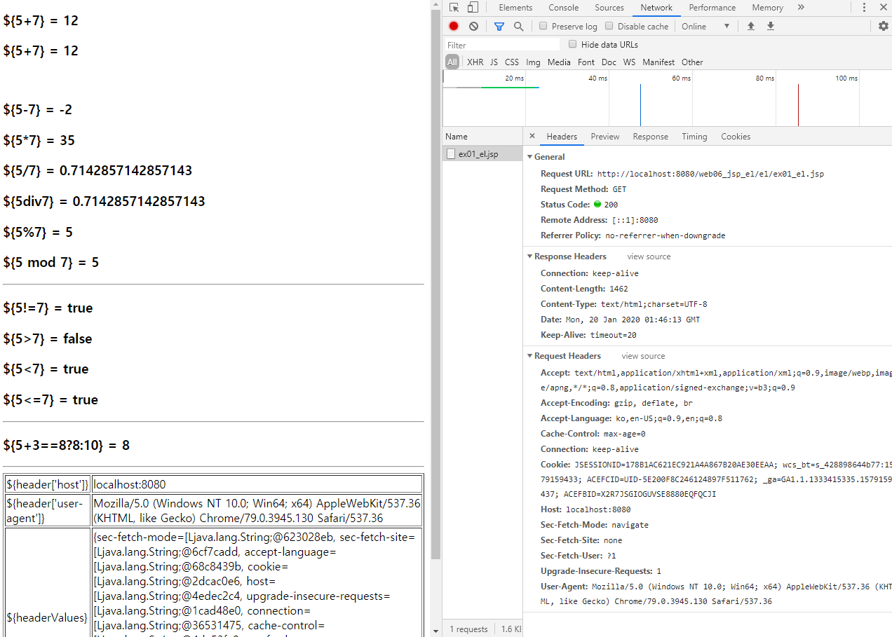


 ### El로 받아오기

```jade
<%@ page language="java" contentType="text/html; charset=UTF-8"
    pageEncoding="UTF-8"%>
    
<%session.setAttribute("msg", "Session Test") %>   //("a","b") c '값'을 a에 대입한다.
<!DOCTYPE html>
<html><head>
<meta charset="UTF-8">
<title>ex02_el.jsp EL TEST</title>
</head>
<body>
	<form action="ex02_result.jsp" method = "post">
	<table border = "1" align="center">
		<tr>
			<td>검색:</td>
			<td><input type="text" name="search" placeholder="검색어를 쓰세요"></td>
		</tr>
		<tr>
			<td>이름:</td>
			<td><input type="text" name="name" placeholder="Name쓰세요"></td>
		</tr>
		<tr>
			<td>나이:</td>
			<td><input type="number" name="age" placeholder="Age를쓰세요"></td>
		</tr>
		<tr>
			<td colspan="2" align="center"><input type="submit" value="전송"></td>
		</tr>
	</table>
	</form>
	
</body>
</html>
```

```java
<%@ page language="java" contentType="text/html; charset=UTF-8"
    pageEncoding="UTF-8"%>
    
<%@taglib prefix="c" uri="http://java.sun.com/jsp/jstl/core"%>
<%@taglib prefix="fmt" uri="http://java.sun.com/jsp/jstl/fmt"%>


<!DOCTYPE html>
<html><head>
<meta charset="UTF-8">
<title>ex02_result.jsp 결과 받아줄 페이지</title>
</head>
<body>
	<fmt:requestEncoding value="UTF-8"/>   // ==> 해당 코드 적용이 안되면"request.setCharacterEncoding("UTF-8");""  로 대체 해야한다.

	<%
		request.setCharacterEncoding("UTF-8");  
		String name = request.getParameter("name");
		String search = request.getParameter("search");
		int age = Integer.parseInt(request.getParameter("age"));
		out.println(age);
	%>
	<br>
	<%=name %>님 검색어는 <%=search %> 쓰셧군요
	
	
	<h3>${ param.name }</h3><h3>${ param['name'] }</h3>
	<h3>${ param.search }</h3><h3>${ param['search'] }</h3>
	<h3>${ param.age }</h3><h3>${ param['age'] }</h3>
	
	<h2>${ sessionScope.msg }</h2>   // <%session.setAttribute("msg", "Session Test") %> 호출
	
</body>
</html>
```


## JSTL

>JSTL(**JavaServer Pages Standard Tag Library** )은 태그를 통해 JSP 코드를 관리하는 라이브러리로
>
>라이브러리이기 때문에 JSTL을 사용하려면, 라이브러리를 다운로드 해서 추가해야 한다.
>
>그리고 JSP 페이지에서 아래의 세 줄을 맨 위에 작성해야 해야 JSTL 문법을 사용할 수 있다.
>
>```
><%@ taglib uri="http://java.sun.com/jsp/jstl/core" prefix="c"%>
><%@ taglib uri="http://java.sun.com/jsp/jstl/fmt" prefix="fmt"%>
><%@ taglib uri="http://java.sun.com/jsp/jstl/functions" prefix="fn"%>
>```


# DBCP & Pool & JNDI (커넥션 풀)

* 톰켓 서버에서 라이브러리 같다 쓴다.

[Tomcat Connercion Pool](http://commons.apache.org/)

> 1.DBCP , POOL 두가지 필요
>
> 2.tomcat-dbcp.jar

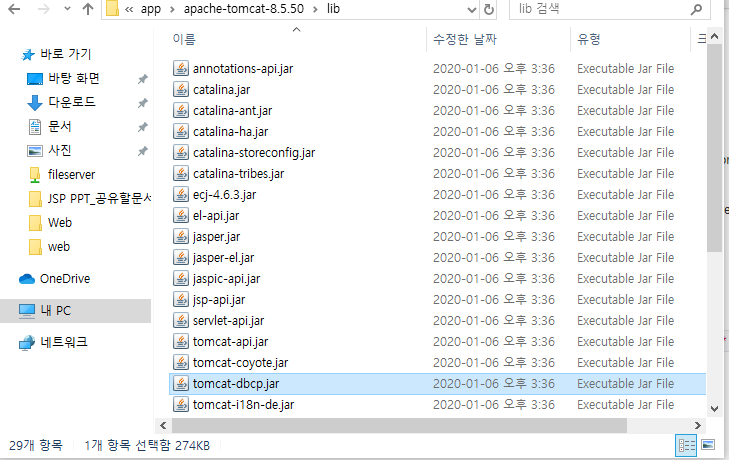


* 라이브러리를 쓰기위해 이름을(3가지) 맞춰줘야한다.

[TomcatLibrary](http://tomcat.apache.org/tomcat-8.5-doc/jndi-resources-howto.html#web.xml_configuration)

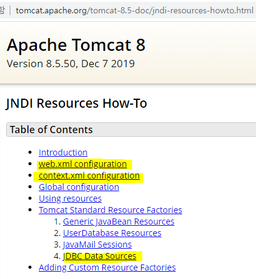

> web.xml 
>
> context.xml
>
> java code

### Web.xml 설정

```java
<?xml version="1.0" encoding="UTF-8"?>
<web-app xmlns:xsi="http://www.w3.org/2001/XMLSchema-instance" xmlns="http://xmlns.jcp.org/xml/ns/javaee" xsi:schemaLocation="http://xmlns.jcp.org/xml/ns/javaee http://xmlns.jcp.org/xml/ns/javaee/web-app_3_1.xsd" version="3.1">
  <display-name>web06_jsp_el</display-name>
  
  
    <!-- jdbc:dbcpTestDB  DBCP setting -->
  <resource-ref>
  		<description>jdbc:dbcpTestDB  DBCP setting</description>
  		<res-ref-name>jdbc:dbcpTestDB</res-ref-name>
  		<res-type>javax.sql.DataSource</res-type>
  		<res-auth>Container</res-auth>
  </resource-ref>
  
  
  
 	<!-- jdbc:dbcpTestDB DBCP setting -->
  
  <!-- <resource-ref>
 	 <description>
    	jdbc:dbcpTestDB DBCP setting
  	</description>
 	 <res-ref-name>
  	  jdbc:dbcpTestDB
  	</res-ref-name>
 	 <res-type>
  	  javax.sql.DataSource
  	</res-type>
 	 <res-auth>
 	   Container
 	 </res-auth>
</resource-ref> -->
  
  <welcome-file-list>
    <welcome-file>index.html</welcome-file>
    <welcome-file>index.htm</welcome-file>
    <welcome-file>index.jsp</welcome-file>
    <welcome-file>default.html</welcome-file>
    <welcome-file>default.htm</welcome-file>
    <welcome-file>default.jsp</welcome-file>
  </welcome-file-list>
</web-app>
```

### context.xml

xml 파일 생성

```java
<?xml version="1.0" encoding="UTF-8"?>

<Context reloadable="true">
	 <WatchedResource>WEB-INF/web.xml</WatchedResource>
	 
	 <Resource   name="jdbc:dbcpTestDB"
	 				   auth="Container"
	 				   type="javax.sql.DataSource"
	 				   username="doublekim"
	 				   password="oracle"
	 				   driverClassName="oracle.jdbc.OracleDriver"
	 				   url="jdbc:oracle:thin:@localhost:1521:xe"
	 				   
	 				   maxActive="20"
	 				   maxIdle="10"
	 				   maxWait="-1"	 			 			
	 
	 		/>

</Context>
```

### java code

```java
<%@ page language="java" contentType="text/html; charset=UTF-8"
    pageEncoding="UTF-8"%>
    
<%@ page import="javax.sql.DataSource , javax.naming.*  , java.sql.* "  %>

<!DOCTYPE html>
<html><head><meta charset="UTF-8">
<title>dbcpConnection.jsp</title>
</head>
<body>
<%
	try{
		Context ctx = new InitialContext();
		Context envCtx = (Context) ctx.lookup("java:comp/env");
		DataSource ds = (DataSource) envCtx.lookup("jdbc:dbcpTestDB");

		Connection conn = ds.getConnection();
		
		out.println("DBCP Connection success.....<br><br>");
		
	} catch(Exception e) {
		e.printStackTrace();
	}
	
%>
</body>
</html>
```


# MVC

> Model 2 방식
>
> C - Controller와 Data파일은 java로 작성
>
> M - 
>
> V - 
>
> **MVC는 controller 에서 컴파일 싱행 해야한다. **

## MVC TEST Code

* Controller (src 폴더 - servlet file)

```java
package com.multi.controler;

import java.io.IOException;

import javax.servlet.RequestDispatcher;
import javax.servlet.ServletException;
import javax.servlet.annotation.WebServlet;
import javax.servlet.http.HttpServlet;
import javax.servlet.http.HttpServletRequest;
import javax.servlet.http.HttpServletResponse;

/**
 * Servlet implementation class MessageController
 */
@WebServlet("/MessageController")
public class MessageController extends HttpServlet {   //HttpServlet 를 상속해야 doGet, doPost 을 사용 할 수 있다.
	private static final long serialVersionUID = 1L;
	
	
	//응답 객체 , 요청객체는 반드시 하나씩 가지고 있어야 한다.(사용 여부와 관계 없이)
	//1. 전동방식 결정
	protected void doGet(HttpServletRequest request, HttpServletResponse response) throws ServletException, IOException {
		process(request, response);
	}

	protected void doPost(HttpServletRequest request, HttpServletResponse response) throws ServletException, IOException {
		process(request, response);
	
	}

	//2. 사용자 요청 처리 메세지(doGet/ doPost
	protected void process(HttpServletRequest request, HttpServletResponse response) throws ServletException, IOException {
		String msg = request.getParameter("message");
		Object result = null;
		
		if(msg == null || msg.equals("test")) {
			result = "메세지가 없거나, test로 넘어왔다.";
		}else if(msg.equals("name")) {
			result = "이름은 Kim 입니다.";
		}else {
			result = "찾는 type이 없습니다.";
		}
		//3. 데이터 저장 - request.setAttribute("변수", 값or변수(데이터)); -값을 변수에 담아 전달하는 메소드
		request.setAttribute("result", result);  
		//4. 해당 뷰 페이지로 이동
		RequestDispatcher dispatcher = request.getRequestDispatcher("/view/msgView.jsp");
		dispatcher.forward(request, response); //응답객체와 요청객체는 반드시 포함 되어야한다.
	}
}

```

* View (webcontent 폴더 - jsp file)

```java
<%@ page language="java" contentType="text/html; charset=UTF-8"
    pageEncoding="UTF-8"%>
    
<%@taglib prefix="c" uri="http://java.sun.com/jsp/jstl/core" %>
<!DOCTYPE html>
<html><head>
<meta charset="UTF-8">
<title>msgView.jsp 간단한 컨트롤러 뷰 페이지</title>
</head>
<body>
	전달된 결과:
	<c:out value="${ result }"></c:out>
</body>
</html>
```

* index page (Controller 에서 실행 대신 해당 페이지에서 컴파일 가능하게 하기위해)

```java
<!DOCTYPE html>
<html>
<head>
<meta charset="UTF-8">
<meta name="viewport" content="width=device-width, initial-scale=1.0" />
<meta http-equiv="X-UA-Compatible" content="ie=edge" />
<title>index.html</title>
</head>
<!-- <body onload="window.location.href='MessageController?message=name'">  MessageController는 controller 에 @WebServlet("/MessageController") 이름이다 -->
<body onload="window.location.href='MessageController'">    

</body>
</html>
```


# Spring

[Spring Download](https://spring.io/tools)

> Spring Framework 라이브러리 추가 방법 3가지
>
> * 응용 p/g, 사용가능한 프레임 워크
> * 웹 p/g 사용가능한 프레임 워크
> * 모바일에서 사용 가능한 프레임 워크
>
> 타 framework들과 호환성이 좋음.

> Framework 
>
> DI(Dependency Injection) - loC
>
> AOP(Aspect Oriented Programming)-  **관점 지향 프로그래밍**
>
> POJO
>
> bean
>
> 개발자가 만든 코드를 Spring에 넣어 사용한다.

* Framework -복잡한 문제를 해결하거나 서술하는 데 사용되는 기본 개념 구조이다. 간단히 **뼈대**, **골조**(骨組), **프레임워크**(framework)라고도 한다
* DI -표준을 정의 할 수 있고, 정의된 표준을 바탕으로 같은 설계를 하게 헤줌
  * 재사용성, 테스트 용이, 코드 단순화, 객체간의 의존관계를 없애거나 줄일 수 있다.
* AOP -어떤 로직을 기준으로 핵심적인 관점, 부가적인 관점으로 나누어서 보고 그 관점을 기준으로 각각 모듈화하겠다는 것
* 
  * Aspect - 흩어진 것을 모듈화한것((주로 부가기능을 모듈화 한다)
  * Target - Aspect 를 적용하는 곳(class, method...)
  * Advice - 실질적 부가기능을 담은 구현체
  * JointPoint - Advice 가 적용될 위치
  * JointCut - JointPoint ㅡ이 상세한 스펙을 정의, Advice가 실행될 지점을 정할 수 있음.
* POJO
  * 특정 규약에 종속되지 않는다. (Java 언어와 꼭 필요한 API 외에 종속되지 않는다.)
  * 특정환경에 종속되지 않는다.
  * 객체 지향
  * 코드의 간겨함(비즈니스 로직과 특정 환경/low 레벨 종속적인 코드를 분리하므로 단순하다.)
  * 자동화 테스트에 유리
  * 객체지향적 설계의 자유로운 사용
* bean
  * 자주 사용하는 객체를 singleton 으로 만들어 놓고 어디서든 불러쓸수 있도록 한 것.


* .m2 => Maven -프로젝트 관리 도구

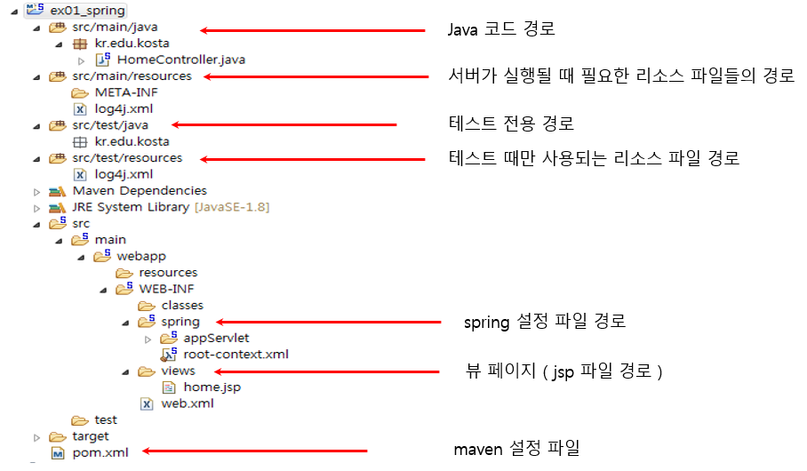


* 스프링 MVC의 생명주기

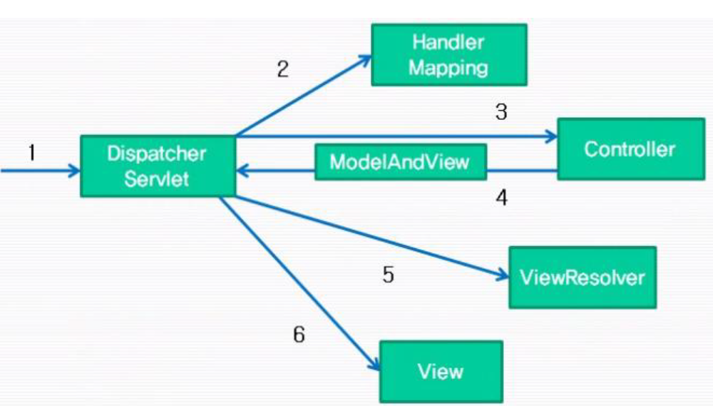

* web.xml =>1.Dispacher Servlet

```java
<servlet>
		<servlet-name>appServlet</servlet-name>
		<servlet-class>org.springframework.web.servlet.DispatcherServlet</servlet-class> //설정파일 관문
		<init-param>
			<param-name>contextConfigLocation</param-name>
			<param-value>/WEB-INF/spring/appServlet/servlet-context.xml</param-value> //xml file위치(경로)
		</init-param>
		<load-on-startup>1</load-on-startup>
	</servlet>
```


## Spring 적용 방법

> 로컬 저정소 위치 -C:\Users\student\.m2

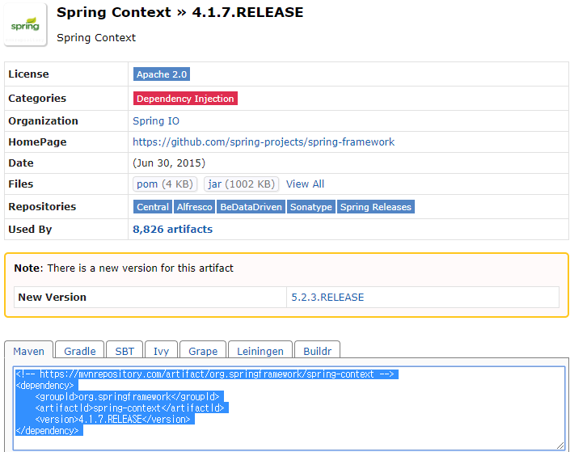

### 1.  library 이용한 방법

> Project 에 두고 우클릭 - configure -create Module - info.java 

- jar 파일 다운받아 각각 폴더에 적용하는 방법

### 2. pom.xml 방법

* 사진에 아래 코드를 복사하여 적용하는 방법

  ```java
  <pom.XML>
      
  <project xmlns="http://maven.apache.org/POM/4.0.0"
  	xmlns:xsi="http://www.w3.org/2001/XMLSchema-instance"
  	xsi:schemaLocation="http://maven.apache.org/POM/4.0.0 https://maven.apache.org/xsd/maven-4.0.0.xsd">
  	<modelVersion>4.0.0</modelVersion>
  	<groupId>ex02_di</groupId>
  	<artifactId>ex02_di</artifactId>
  	<version>0.0.1-SNAPSHOT</version>
  	<build>
  
  		<sourceDirectory>src</sourceDirectory>
  		<plugins>
  			<plugin>
  				<artifactId>maven-compiler-plugin</artifactId>
  				<version>3.8.0</version>
  				<configuration>
  					<source>1.8</source>
  					<target>1.8</target>
  				</configuration>
  			</plugin>
  		</plugins>
  	</build>
  	
          <!--dependencies 안에 넣어줘야함 -->
  	<dependencies>
  		<!-- https://mvnrepository.com/artifact/org.springframework/spring-context -->
  		<dependency>
  			<groupId>org.springframework</groupId>
  			<artifactId>spring-context</artifactId>
  			<version>4.1.7.RELEASE</version>
  		</dependency>
  
  	</dependencies>
  
  </project>
  ```

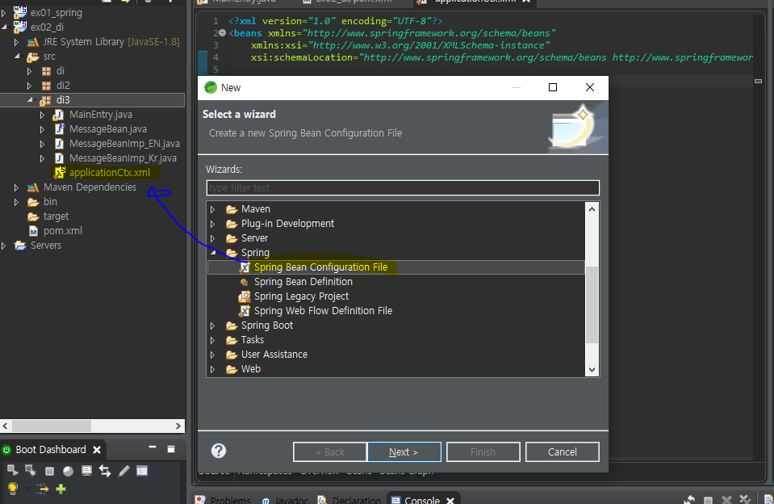


### Spring Core

[spring core 다운로드](https://mvnrepository.com/artifact/org.springframework/spring-context)

> 4.1.7 or 4.1.9 를 주로 사용

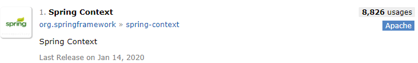

## DI

> 1. 생성자 (Constructor)함수
>
> 2.  Setter Method - 가장 많이 사용(권장)

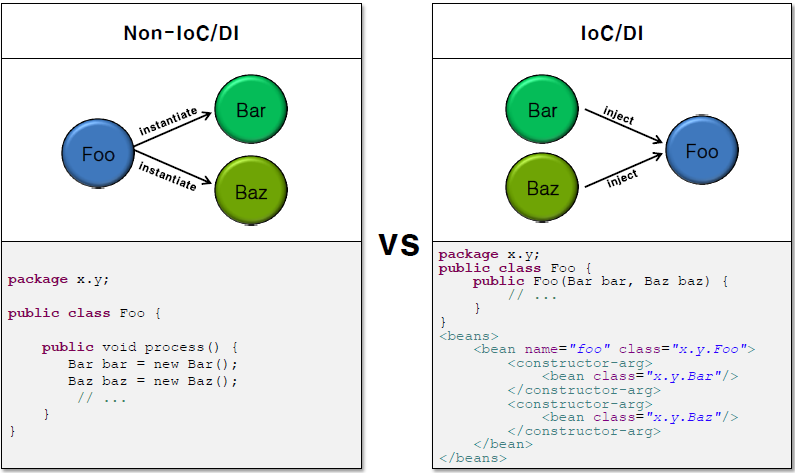

* IoC Container


### 1. 생성자 (Constructor)함수

```java


```


### 2. Setter Method

* Setter Injection은 argument가 없는 기본 생성자를 사용하여 객체를 생성한 후, setter 메소드를 사용하여 의존성을 주입하는 방식으로, <property/> element를 사용한다.
* Class에 attribute(또는 setter 메소드 명)과 <property/> element의 ‘name’ attribute를 사용하여 매핑한다.


## AOP


# 참고 사이트

[Spring 영상](https://wizcenter.tistory.com/tag/spring)

[web 블로그](https://victorydntmd.tistory.com/156?category=719481)

[w3schools](https://www.w3schools.com/)

[https://www.w3.org/](https://www.w3.org/)

[HTML5/CSS 특강](https://www.youtube.com/playlist?list=PLMfOC9Ny9UB_w3Ru8HI0g00bxz21LA0gL)

### 학습 사이트

[생활코딩](https://opentutorials.org/course/1)

[JAVA강좌 Youtube](https://www.youtube.com/playlist?list=PLieE0qnqO2kTyzAlsvxzoulHVISvO8zA9)

[Web개발 학습](https://developer.mozilla.org/ko/docs/Learn)

[프로그램 학습](https://www.javatpoint.com/android-tutorial)

[무료 Test website](https://codesandbox.io/s/)

[jQuery library](https://jquery.com/)

참고 도석

[코드로 배우는 스프링 웹 프로젝트](http://book.interpark.com/product/BookDisplay.do?_method=detail&sc.prdNo=291334836&gclid=EAIaIQobChMInczJ3v6T5wIVRaqWCh0x2Q2gEAQYASABEgJGSfD_BwE)

[hg](https://github.com/TunaHG)