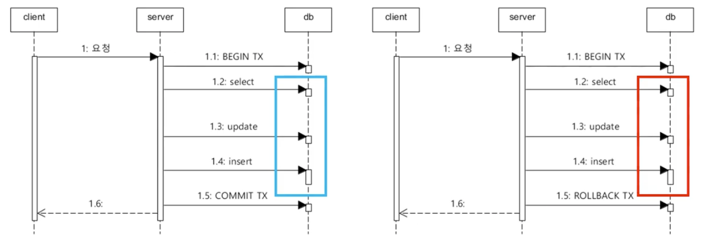
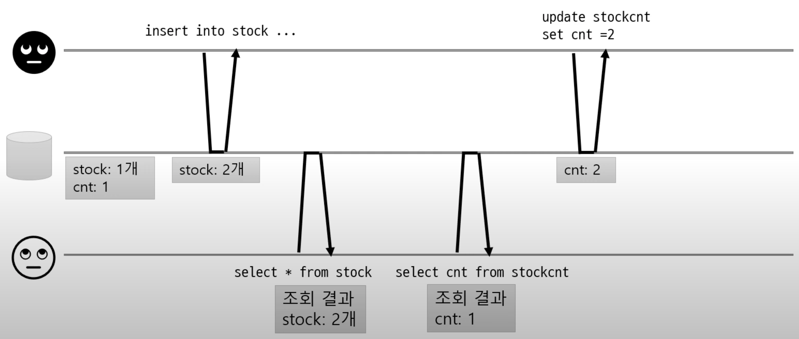
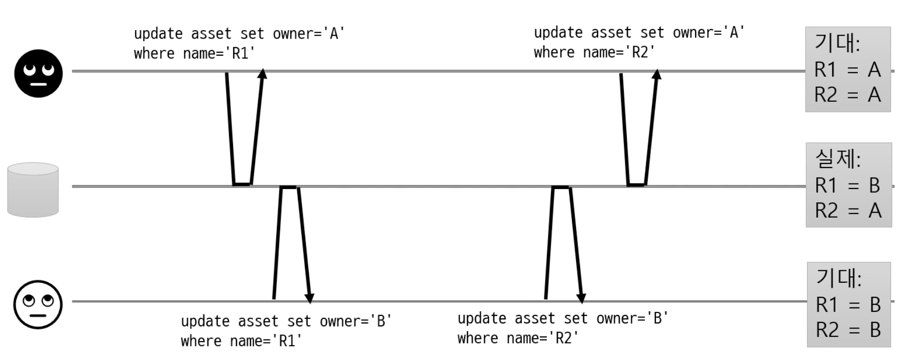
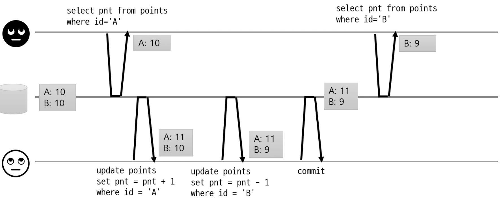
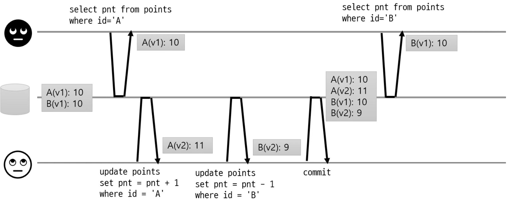
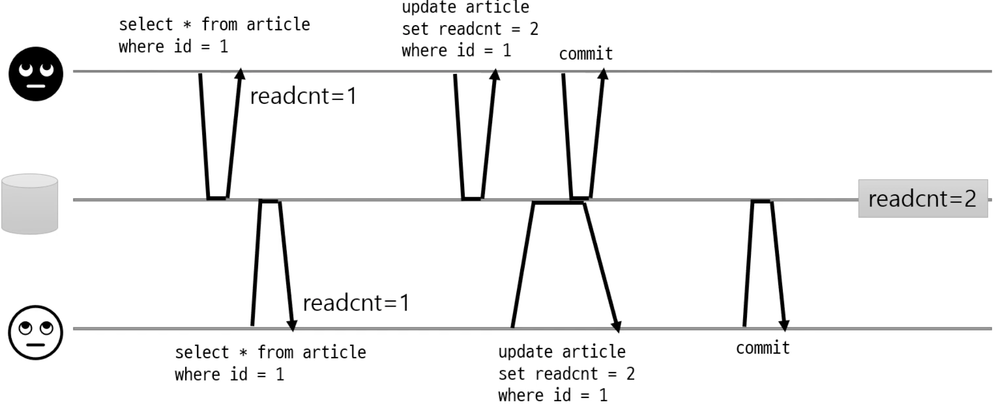
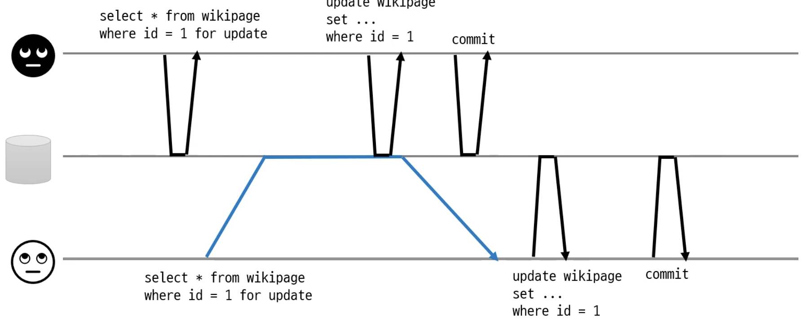
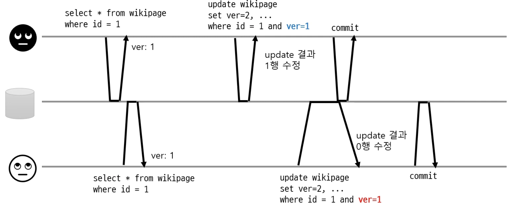
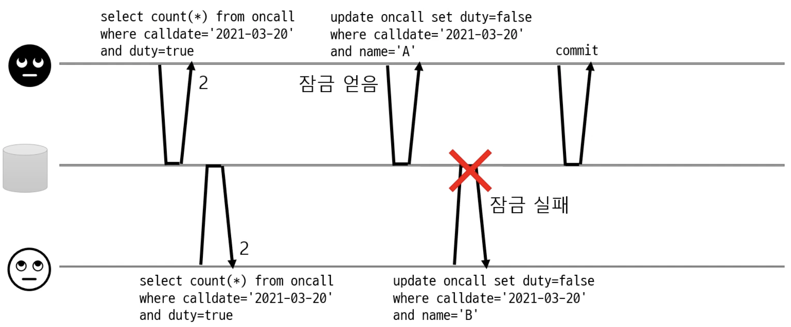

# 트랜잭션

* 여러 읽기/쓰기를 논리적으로 하나로 묶음
  * 트랜잭션 시작 - 여러 쿼리 실행 - 커밋 또는 롤백
  * 모두 반영(커밋) 또는 모두 반영하지 않거나(롤백)

 

* 트랜재션의 범위는 커넥션 기준으로 한다
  * 여러 메소드를 호출할때 여러 메소드를

## 트랜잭션 특징

* 원자성(Atomicity)
  * 트랜잭션이 데이터베이스에 모두 반영되던가, 아니면 전혀 반영되지 않아야 한다
* 일관성(Consistency)
  * 트랜잭션의 작업 처리 결과가 항상 일관성이 있어야 한다.
  * 트랜잭션이 진행되는 동안에 데이터베이스가 변견 되더라도 업데이트 된 데이터베이스로 트랜잭션이 진행되는 것이 아니라, 처음에 진행하기 위해 참조한 데이터베이스로 진행된다 (= 사용자는 일관성 있는 데이터를 볼 수 있다)
* 독립성(Isolation)
  * 어떤 하나의 트랜잭션이라도, 다른 트랜잭션의연산에 끼어들 수 없다.
* 지속성(Durabilty)
  * 트랜잭션이 성공적으로 완료되었을 경우, 결과는 영구적으로 반영되어야 한다.

## 트랜잭션 전파

여러 메서드 호출이 한 트랜잭션에 묶이도록 하기 위해 필요

* 스프링 프레임워크의 트랜잭션 처리
  * `@Transactional` 을 이용해 메서드 간에 커넥션 객체를 전달하지 않아도 한 트랜잭션으로 묶어서 실행

```java
@Transactioal
public void createMember(){
  if(checkMember){
    insertMember(userInfo);
  }
  ...
}

public boolean checkMember(String userId){
  UserInfo signUserInfo = userRepository.findByUserId(userSignUpRequest.getUserId());
  if(signUserInfo == null){
		return false;    
  }else{
    return true;
  }
}

public void insertMember(UserInfo userInfo){
  userRepository.save(userInfo);
}
```


## 같은 데이터에 동시 접근

> 동시성 문제와 격리 수준을 이해하면 문제 발생을 줄일 수 있음
>
> 잠금 시간은 최소화 (잠금 시간이 길어지면 성능 저하)
>
> 동시성 문제를 다룰 때는 사용하는 DB의 기본 격리 레벨확인, DB의 격리 레벨 동작 방식확인(DB마다 동작 방식이 다를수 있다.)

* 경쟁 상태(Race Condition)

  * 여러 클라이언트가 같은 데이터에 접근할 때 문제 발생

  * 트랜잭션 격리(Isolation)

    * 트랜잭션을 서로 격리해서 다른 트랜잭션이 영향을 주지 못하게 함

  * 가장 쉬운 방법은 트랜잭션을 순서대로 실행

    * 동시 접근 문제 아예 없음
    * 하지만 한 번에 한 개 트랜잭션만 처리하므로 성능 저하 

  * 다양한 경리 수준 지원

    * Read Uncommitted

    * Read Committed

      * 커밋된 데이터만 읽기
        * 커밋된 값과 트랜잭션 진행 중인 값을 따로 보관
      * 커밋된 데이터만 덭어쓰기
        * 행 단위 잠금 사용 (같은 데이터를 수정한 트랜잭션이 끝날 때까지 대기)

    *  Repeatable Read

      * 트랜잭션 동안 같은 데이터를 일게 함(읽는 시점에 특정 버전에 해당하는 데이터만 읽음)

       

    * Serializable

      * 인덱스 잠금이나 조건 기반 잠금 사용

       

* 동시성 관련 문제들

  * 커밋되지 않은 데이터 읽을때

    * Dirty read

     

  * 커밋되지 않은 데이터 덮어쓰 기

    * Dirty write

     

  * 읽는 동안 데이터 변경

    * Read skew

     

  * 변경 유실

    * Loas Update (같은 데이터를 쓸 때 발생)

     

    * 변경 유실 처리 방법

      * 원자적 연산 사용

        * DB가 지원하는 원자젹 연산(동시 수정 요청에 대ㅐ DB가 순차 처리)

      * 명시적인 잠금

        * 조회할 때 수정할 행을 미리 잠금

         

      * CAS(Compare And Set)

        * 수정할 때 값이 같은지 비교

         


# Reference

[최범규님 - 프로그래밍 초식 : DB 트랜잭션 조금 이해하기 01 격리](https://www.youtube.com/watch?v=urpF7jwVNWs)

[최범규님 - 프로그래밍 초식 : DB 트랜잭션 조금 이해하기 02 격리](https://www.youtube.com/watch?v=poyjLx-LOEU)