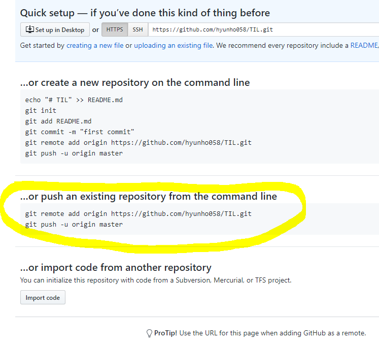

> # Git 기초
>
> ## 0.준비 사항
>
> * [git bash](https://gitforwindows.org/) 다운로드 `CLI(Command Line Interface)를 제공한다.
> * Mac은 system bash 그냥 사용(dounlod없이)
> * source tree, github desktop등을 통해 GUI 환경에서도 활용 가능.

## 1. 로컬 저장소 활용하기

### 1. 저장소 초기화

```bash
$ git init
Initialized empty Git repository in C:/Users/student/Desktop/TIL/.git/
(master) $
```

* 저장소(repssitory)를 초기화 하게 되면,  .git 폴더가 해당 디렉토리에 생성된다.
* bash창에서는 (master) 라고 표기된다.
  * 현재 브랜치가 master라는 것을 의미함.

### 2. add -staging area

> git 으로 관리되는 파일들은 Working directory(작업환겅), Staging Are, commit단계를
>
> 거쳐이력에 저자오딘다.

```bash
$ git add a.txt #파일명
$ git add imges/ #폴더명
$ git add . #현재 디렉토리의 모든 파일
```

* add 전 상태

```bash
student@M16026 MINGW64 ~/Desktop/TIL (master)
$ git status
On branch master

No commits yet

Untracked files:
  (use "git add <file>..." to include in what will be committed)
        git.md
        image/
        markdown.md

nothing added to commit but untracked files present (use "git add" to track)

```

* add 후 상태

```bash
student@M16026 MINGW64 ~/Desktop/TIL (master)
$ git add .

student@M16026 MINGW64 ~/Desktop/TIL (master)
$ git status
On branch master

No commits yet

Changes to be committed:
  (use "git rm --cached <file>..." to unstage)
        new file:   git.md
        new file:   "image/\353\213\244\354\232\264\353\241\234\353\223\234.png"
        new file:   markdown.md
```

###  3.commit

> 커밋은 코드의 이력을 남기는 과정이다.

```bash
$ git commit -m {커밋 메시지}
student@M16026 MINGW64 ~/Desktop/TIL (master)
$ git commit -m '마크다운 및 git 기초 정리'
[master (root-commit) 7cfb20a] 마크다운 및 git 기초 정리
 3 files changed, 135 insertions(+)
 create mode 100644 git.md
 create mode 100644 "image/\353\213\244\354\232\264\353\241\234\353\223\234.png"
 create mode 100644 markdown.md
```

* 커밋 메시지는 항상 해당 이력에 대한 정보를 담을 수 있도록 작성하는 것이 좋다.
* 일관적인 커밋 메시지를 작성하는 습관을 들이자.
* 이력 확인을 위해서는 아래의 명령어를 활용한다

```bash
$ git log
student@M16026 MINGW64 ~/Desktop/TIL (master)
$ git log
commit 7cfb20ad550736952b9a7a3a5f4e97ae239fb938 (HEAD -> master)
Author: hyunho058 <hyunho058@naver.com>
Date:   Mon Dec 16 14:26:08 2019 +0900

    마크다운 및 git 기초 정리
```

> 항상 status명령어를 통해 git의 상태를 확인하자!! commit 이후에는 log 명령어를 통해 이력들을 확인하자!!!


## github 업로드

```bash
student@M16026 MINGW64 ~/Desktop/TIL (master)
$ git remote add origin https://github.com/hyunho058/TIL.git

student@M16026 MINGW64 ~/Desktop/TIL (master)
$ git push -u origin master
Enumerating objects: 6, done.
Counting objects: 100% (6/6), done.
Delta compression using up to 8 threads
Compressing objects: 100% (5/5), done.
Writing objects: 100% (6/6), 13.99 KiB | 7.00 MiB/s, done.
Total 6 (delta 0), reused 0 (delta 0)
To https://github.com/hyunho058/TIL.git
 * [new branch]      master -> master
Branch 'master' set up to track remote branch 'master' from 'origin'.

```



해당 부분 복사

## 원격 저장소 활용하기

> 원격 저장소(remote repository)를 제공하는 서비스는 다양하게 존재한다.
>
> github을 기준으로 설명한다.

### 0. 준비하기

Github에서 저장소(repository)생성

### 1. 원격 저장소 설정

```bash
$ git remote add origin {github url}
```

* {github url} 부분에는 원격 저장소 url을 작성한다.
* 원격저장소(remote)로 {github url}을 origin이라는 이름으로 추가(add)하는 명령어이다.
* 원격 저장소 목록을 보기 위해서는 아래의 명령어를 활용한다.

```bash
$ git remote -v
student@M16026 MINGW64 ~/Desktop/TIL (master)
$ git remote -v
origin  https://github.com/hyunho058/TIL.git (fetch)
origin  https://github.com/hyunho058/TIL.git (push)
```

### 2. push

```bash
$ git push origin master
```

* 설정된 원격 저장소(origin)으로 push!

폴더의 내용을 수정 및 삭제, 생성 등을 하게 된다면, add, commit 명령어를 통해서 이력을 저장하고 push 명령어를 통해 업로드 한다.