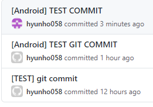

# GIT잔디

> * commit  후 잔디가 안심어 지는 현상이 발생됨.

 

* user.email 가 다른 계정으로 되어 있었다.
  * git config --list 를 입력하면 확인할 수 있다.

```
user.email=rchyunho058@gmail.com
user.name=hyunho058
```


* git config --global user.email "[user email]"
  * 해당 명령어로 이메일 정보를 수정할 수 있다.
  * git configl user.email "[user email]"
    * --global 을 빼고 사용해주면 프로젝트마다 각각의 다른 정보를 사용할 수 있음

```
$ git config --global user.email "hyunho058@naver.com"
```

* 변경후

```
user.email=hyunho058@naver.com
user.name=hyunho058
```

 


## Reference

[https://hoony-gunputer.tistory.com/232](https://hoony-gunputer.tistory.com/232)

