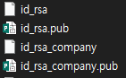
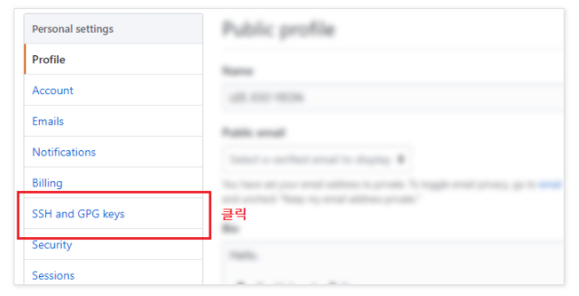
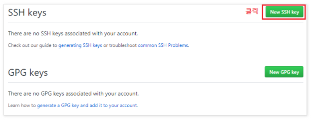
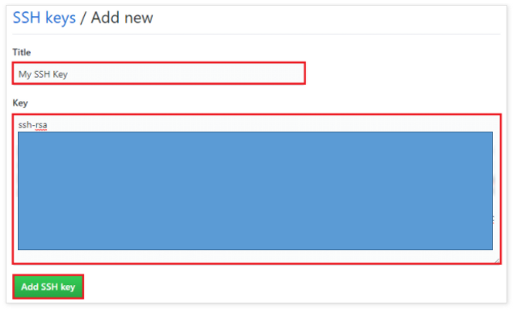

# SSh-key

> 1. ssh key 생성
> 2. ssh config 파일 설정
> 3. git config 파일 설정


1. SSH Key 생성

   * ssh-keygen

   ```
   $ ssh-keygen -t rsa -C "email@email.com"
   ```

   * 사용자 키생성 명령어를 입력한다
     * "email@email.com" 대신 **Git 계정에 사용한 이메일 주소를 입력**

   ```
   Generating public/private rsa key pair.
   Enter file in which to save the key (/c/user/.ssh/id_rsa):
   ```

   * id_rsa_me 자리에 원하는 key 이름을 작성한다.
     * 작성하지 않으면 id_rsa가 디폴트로 적용 된다.

   ```
   Enter file in which to save the key (/c/user/.ssh/id_rsa):id_rsa_me
   ```

   * 사용자의 키 암호(Passphrase)를 입력한다
     * 두 번 입력하여 확인 과정을 거친다

   ```
   Enter passphrase (empty for no passphrase): 
   Enter same passphrase again:
   ```

   * 아래와 같이 나타나면 키 생성이 완료 된거다.
     * 완료가 되면 등록할 다른 계정을 ssh-keygen부터 다시 반복해준다.

   ```
   Your identification has been saved in /home/user/.ssh/id_rsa.
   Your public key has been saved in /home/user/.ssh/id_rsa.pub.
   The key fingerprint is:
   SHA256:qYWyFlIUh/DxwRyzRj961ymIFyhgKchwpAyl0YJcIIm my-email@example.com
   The key's randomart image is:
   +---[RSA 4096]----+
   | Eo+X+.          |
   |+O.B.O           |
   |+.  @ =          |
   |o. B *   o .     |
   |. . B = S o      |
   |   . = + .       |
   |    o =          |
   |   .         =   |
   |                 |
   +----[SHA256]-----+
   ```

   * /.ssh/ 경로에 생성된 파일을 볼수 있다.

    

   * ssh key들을 추가하고 저장해 줘야한다

   ```
   $ ssh-add ~/.ssh/id_rsa // 추가
   
   $ ssh-add ~/.ssh/id_rsa_company // 추가
   
   $ ssh-add -l // 저장
   ```

   

2. ssh config 파일 설정

   * /.ssh/config 파일을 만들어준다.
     * 아래 내용을 작성해 준다
     * Host - 접속 주소
     * identityFile - ssh key의 경로라고 보면 된다.

   ```
   vim config
   ```

   ```
   # me
   Host me-github.com
   HostName github.com
   User git
   IdentityFile ~/.ssh/id_rsa
   
   # company
   Host company-github.com
   HostName github.com
   User git
   IdentityFile ~/.ssh/id_rsa_company
   ```

   

3. git config 파일 설정

   * git 저장소가 세팅된 /.git 경로에서 config 파일 확인
     * url = git@github.com:ID/TIL.git 에서 ID는 자신의 Git 계정 id이다

   ```
   [core]
   	repositoryformatversion = 0
   	filemode = false
   	bare = false
   	logallrefupdates = true
   	symlinks = false
   	ignorecase = true
   [remote "origin"]
   	url = git@github.com:me/TIL.git
   ```

   * 회사 계정 config 파일

   ```
   [remote "origin"]
   	url = git@github.com:COMPANY/Repository-Name.git
   ```

   * 만약 아직 git 저장소 초기화가 안되었다면 원하는 경로에 **git init** 명령어를 사용한다
     * git init을 하면 .git 파일이 생성되고 해당 Directory에 config파일을 확인할 수 있다.
   * remote 정보를 갱신
     *  
     * git@github.com:user/repository.git - git 주소는 위 그림처럼 복사해서 붙여 넣는다

   ```
   $ git remote add origin git@github.com:user/repository.git
   ```

   

   * GitHub에 공개 키 등록
     * SSH and GPG keys 메뉴를 클릭
     * New SSH Key 버튼 클릭하여 SSH키를 등록
       * Title - 키 이름
       * Key - id_rsa.pub파일 내용 복사해서 작성해준다

   

   




## Error 처리

* 오류 처리

  * fatal: remote origin already exists. 오류가 발생하였다.

  ```
  $ git remote add origin origin git@github.com:user/repository.git
  fatal: remote origin already exists.
  
  //오류 처리//
  $ git remote rm origin
  
  $ git remote add origin git@github.com:user/repository.git
  
  $ git remote -v
  origin  origin git@github.com:user/repository.git (fetch)
  origin  origin git@github.com:user/repository.git (push)
  ```

  * Repository not found
    * ssh-add가 되지 않아 발생하였다

  ```
  $ git clone origin git@github.com:user/repository.git
  Cloning into 'repository'...
  Enter passphrase for key '/Users/.ssh/id_rsa':
  ERROR: Repository not found.
  fatal: Could not read from remote repository.
  
  Please make sure you have the correct access rights
  and the repository exists.
  ```

  * Could not open a connection to your authentication agent.
    * 어떤 'ssh-agent'를 사용해야 할지 모르기 때문에 오류 발생 

  ```
  $ ssh-add ~/.ssh/id_rsa_company
  Could not open a connection to your authentication agent.
  
  //오류 처리//
  $ eval $(ssh-agent)
  Agent pid 1913
  
  $ ssh-add ~/.ssh/id_rsa_company
  Enter passphrase for /Users/.ssh/id_rsa_company:
  Identity added: /Users/.ssh/id_rsa_company (email@email.com)
  ```

  * 정상 적인 clone

  ```
  $ git clone git@github.com:user/repository.git
  Cloning into 'android-finaltor'...
  remote: Enumerating objects: 1928, done.
  remote: Counting objects: 100% (1928/1928), done.
  remote: Compressing objects: 100% (1247/1247), done.
  Recremote: Total 1928 (delta 891), reused 1552 (delta 518), pack-reused 0
  Receiving objects: 100% (1928/1928), 6.48 MiB | 3.92 MiB/s, done.
  Resolving deltas: 100% (891/891), done.
  ```


## Reference

[https://mygumi.tistory.com/96](https://mygumi.tistory.com/96)

[https://m.blog.naver.com/PostView.nhn?blogId=angelkim88&logNo=221565694228&proxyReferer=https:%2F%2Fwww.google.com%2F](https://m.blog.naver.com/PostView.nhn?blogId=angelkim88&logNo=221565694228&proxyReferer=https:%2F%2Fwww.google.com%2F)

[https://jootc.com/p/201905122827](https://jootc.com/p/201905122827)

[https://ohgyun.com/483](https://ohgyun.com/483)