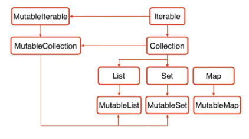
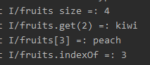
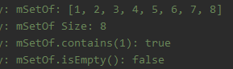
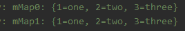

# Collections_Kotlin

> * 코틀린의 Collection은 기본적으로 Mutable(변할 수 없는)과 Immutable(불변의)을 별개로 지원한다
> * Mutable
>   * 추가, 삭제 가능
> * Immutable
>   * 수정 X


* Kotlin Collection



* Java Collection


## List

* Immutable (수정할 수 없는 객체, 불변의) => GET만 가능
  * ListOf<타입>(item)

```kotlin
val fruits= listOf<String>("apple", "banana", "kiwi", "peach")
// val fruits= listOf("apple", "banana", "kiwi", "peach") -> 타입 생략 가능

Log.i("fruits size = "+fruits.size)
Log.i("fruits.get(2) = "+fruits.get(2))
Log.i("fruits[3] = "+fruits[3])
Log.i("fruits.indexOf("peach") = "+fruits.indexOf("peach"))
```

​	


* Mutable (수정가능한 객체, 변할 수 있는)
  * mutableListOf => 추가 및 삭제 가능

```kotlin
val mMutableListOF = mutableListOf<String>("apple", "banana", "kiwi", "peach")

mMutableListOF.remove("apple")
mMutableListOF.add("grape")
Timber.i("mMutableListOF: %s", mMutableListOF)
mMutableListOF.addAll(listOf("melon", "cherry"))
Timber.i("mMutableListOF: %s", mMutableListOF)
mMutableListOF.removeAt(3)
Timber.i("mMutableListOF: %s", mMutableListOF)
```

 


## Set

> * Set은 동일한 아이템이 없는 Collection이다
> * 아이템들의 순서는 특별히 지정해져 있지 않다
> * null객체를 갖고 있을 수 있다
> * 동일한 객체는 추가될 수 없기 때문에 null도 1개만 갖고 있을 수 있다
> * Immutable과 Mutable을 지원한다


*  Immutable
  * setOf<타입>(items)

```kotlin
val mSetOf = setOf<Int>(1,2,3,4,5,6,7,8)

Timber.i("mSetOf: %s",mSetOf)
Timber.i("mSetOf Size: %s", mSetOf.size)
Timber.i("mSetOf.contains(1): %s",mSetOf.contains(1));
Timber.i("mSetOf.isEmpty(): %s", mSetOf.isEmpty())
```

 


* Mutable
  * mutableSetOf<타입>(아이템) => 추가, 삭제 가능

```kotlin
val mMutableSetOf = mutableSetOf<Int>(1,2,3,4,5,6,7,8)

Timber.i("mMutableSetOf: %s", mMutableSetOf)
mMutableSetOf.add(100)
mMutableSetOf.remove(1)
Timber.i("mMutableSetOf: %s", mMutableSetOf)
```

 


##  Map

> * key와 value를 짝지어 저장하는 Collection이다
> * key는 유일하기 떄문에 동일한 이름의 key는 허용되지 않는다.
> * Immutable과 Mutable을 지원


* Immutable
  * mapOf<key, value>(item)
    * item은 Pair객체로 ㅠㅛ현하며, Pair에 key와 value를 넣을 수 있다
    * Pair(A,B) = > A toB로 간단하게 표현 가능 (to는 infix이다)

```kotlin
val mMap0 = mapOf<String, String>( "1" to "one", "2" to "two", "3" to "three")
val mMap1 = mapOf(Pair("1", "one"), Pair("2", "two"), Pair("3", "three"))

Timber.i("mMap0: %s", mMap0)
Timber.i("mMap1: %s", mMap1)
```

 

```kotlin
Timber.i("mMap0.get(\"1\"): %s", mMap0.get("1"))
Timber.i("mMap0[\"1\"]: %s", mMap0["1"])
Timber.i("mMap0[\"1\"]: %s", mMap0.values)
Timber.i("mMap0 keys: %s", mMap0.keys)
Timber.i("mMap0 values: %s", mMap0.values)
```

 

* Mutable
  * mutableMapOf<key, value>(item)
    * put() - 객체 추가

```kotlin
val mMutableMap = mutableMapOf<String, String>(
    "1" to "one", "2" to "two", "3" to "three")

Timber.i("mMutableMap: %s", mMutableMap)
mMutableMap.put("4", "four")
mMutableMap["5"] = "five"
Timber.i("mMutableMap: %s", mMutableMap)

mMutableMap.remove("1")
Timber.i("mMutableMap: %s", mMutableMap)

mMutableMap.clear()
Timber.i("mMutableMap: %s", mMutableMap)
```

 


## Reference

[https://codechacha.com/ko/collections-in-kotlin/](https://codechacha.com/ko/collections-in-kotlin/)