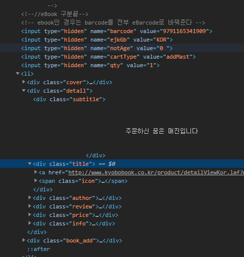

# 교보문고_Crawling

* Code

```python
from urllib.request import urlopen
from bs4 import BeautifulSoup as bs
from urllib.parse import quote_plus
import requests

# 교보문고 URL
# http://www.kyobobook.co.kr/bestSellerNew/bestseller.laf?mallGb=KOR&linkClass=A&range=1&kind=0&orderClick=DAa

bookTypeList = ['A','B','C','D','E']

baseUrl = "http://www.kyobobook.co.kr/bestSellerNew/bestseller.laf?mallGb=KOR&linkClass="


for b in bookTypeList:
    bookType = b
    url = baseUrl + quote_plus(bookType)
    html = urlopen(url) # 교보문고 베스트셀러
    bsObject = bs(html, "html.parser")

    # 집계기준 날짜
    week_standard = bsObject.find('h4', {'class':'title_best_basic'}).find('small').text
    # //////////////////////////////////////////////////////////////////////////////////#

    bestseller_contents = bsObject.find('ul', {'class':'list_type01'})
    bestseller_list = bestseller_contents.findAll('div', {'class':'detail'})
    print(len(bestseller_list))
    input_list = bestseller_contents.findAll('input', {'name':'barcode'})
    print(len(input_list))

    title_list = [b.find('div', {'class': 'title'}).find('strong') for b in bestseller_list] # 제목
    subtitle_list = [b.find('div', {'class': 'subtitle'}).text.strip() for b in bestseller_list] # 책 설명
    author_list = [b.find('div', {'class': 'author'}).text for b in bestseller_list] #저자

    print("\n"+week_standard+"\n\n")
    for i in range(len(title_list)):
        print("Title: "+title_list[i].text)
        print("Description: "+subtitle_list[i])
        print("Author: "+author_list[i])
        print(input_list[i])
```

* 교보문고

 

