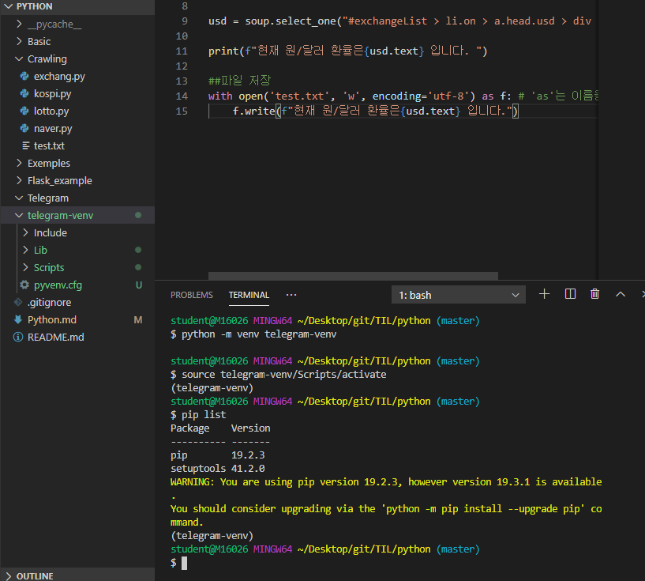
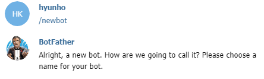
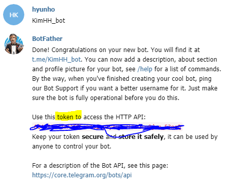
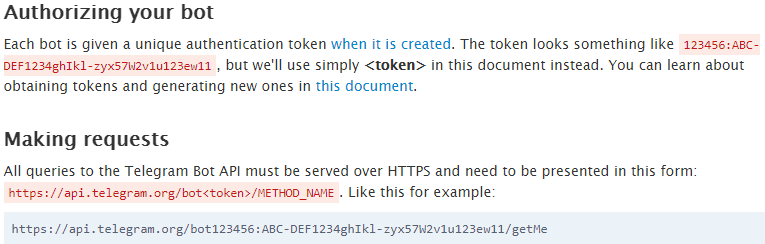

# Python

[python 라이브러리](https://docs.python.org/ko/3/library/index.html)

1. 자장
2. 조건
3. 반복

# Web

* 요청
  1. 사용자 ->API Server
* 응답(XML, Json)
  1. API Server -> 사용자

외장모듈(PIP) = Reg,Bs4

* python  pip requests 다운로드

  [pip install requests](https://pypi.org/project/requests/)

* python pip bs4 다운로드

  [pip install bs4](https://pypi.org/project/bs4/)

  [Flask](https://pypi.org/project/Flask/)
  
  # Telegram chetbot
  
  * 가상환경 만들기

```bash
$ python -m venv telegram-venv

$sourc telegram-venv/Scripts/activate
(telegram-vev)
```




```bash
student@M16026 MINGW64 ~/Desktop/git/TIL/python (master)
$ pip list
Package           Version   
----------------- ----------
astroid           2.3.3     
beautifulsoup4    4.8.1     
bs4               0.0.1     
certifi           2019.11.28
chardet           3.0.4     
Click             7.0       
colorama          0.4.3     
Flask             1.1.1     
get               2019.4.13 
idna              2.8       
isort             4.3.21    
itsdangerous      1.1.0     
Jinja2            2.10.3    
lazy-object-proxy 1.4.3     
MarkupSafe        1.1.1
mccabe            0.6.1
pip               19.2.3    
post              2019.4.13
public            2019.4.13
pylint            2.4.4
query-string      2019.4.13
setuptools        41.2.0
six               1.13.0
soupsieve         1.9.5
urllib3           1.25.7
Werkzeug          0.16.0
wrapt             1.11.2
WARNING: You are using pip version 19.2.3, however version 19.3.1 is available.
You should consider upgrading via the 'python -m pip install --upgrade pip' co.mmand.                                                                        mmand.

student@M16026 MINGW64 ~/Desktop/git/TIL/python (master)
$ python -m venv telegram-venv

student@M16026 MINGW64 ~/Desktop/git/TIL/python (master)
$ source telegram-venv/Scripts/activate
(telegram-venv)
student@M16026 MINGW64 ~/Desktop/git/TIL/python (master)
$ pip list
Package    Version
---------- -------
pip        19.2.3
setuptools 41.2.0
WARNING: You are using pip version 19.2.3, however version 19.3.1 is available.
You should consider upgrading via the 'python -m pip install --upgrade pip' command.
(telegram-venv)
student@M16026 MINGW64 ~/Desktop/git/TIL/python (master)
$
```

```bash
student@M16026 MINGW64 ~/Desktop/git/TIL/python (master)
$ pip freeze

astroid==2.3.3
beautifulsoup4==4.8.1
bs4==0.0.1
certifi==2019.11.28
chardet==3.0.4
Click==7.0
colorama==0.4.3
Flask==1.1.1
get==2019.4.13
idna==2.8
isort==4.3.21
itsdangerous==1.1.0
Jinja2==2.10.3
lazy-object-proxy==1.4.3
MarkupSafe==1.1.1
mccabe==0.6.1
post==2019.4.13
public==2019.4.13
pylint==2.4.4
query-string==2019.4.13
request==2019.4.13
requests==2.22.0
six==1.13.0
soupsieve==1.9.5
urllib3==1.25.7
Werkzeug==0.16.0
wrapt==1.11.2

```

복사해서 TLI 폴더에 requirements.txt를 만들고 해당 내용 적용

```bash
$ pip install -r requirements.txt
```

만든 가상환경 을 나가고 싶으면 -venv 폴더 삭제 하면 가상환경 정보 사라짐

* Telegram 쳇봇 요청







토큰 값

https://api.telegram.org/bot<token>/METHOD_NAME

https://api.telegram.org/bot864971232:AAGQLck432-plycu3vlF692rg0jon_F3nqQ/getMe

token 과 id value 는 hiden되어야 하기 때문에 .env 파일을 만들어서 관리한다. 그리고  .env 파일을 .gitignore에 등록 하여 connit되지 않게 한다.


* [ngrok](https://ngrok.com/download) telegram에서 local에 접속을 도와주는 프로그램

```bash
C:\Users\student>ngrok http 5000
```


```
-token code-
864971232:AAGQLck432-plycu3vlF692rg0jon_F3nqQ

https://api.telegram.org/bot<token>/METHOD_NAME
-URL-
https://api.telegram.org/bot864971232:AAGQLck432-plycu3vlF692rg0jon_F3nqQ/getMe

-chat ID-
826839579

-ngrok- #주소는 휘발성이기 때문에다시하려면 할당을 다시받아야함#
https://58c1ae6c.ngrok.io == localgost.5000
/setWebhook?url=<ngrok forw.https>


-(url/token//ngrok//token)-
https://api.telegram.org/bot864971232:AAGQLck432-plycu3vlF692rg0jon_F3nqQ//setWebhook?url=https://58c1ae6c.ngrok.io/864971232:AAGQLck432-plycu3vlF692rg0jon_F3nqQ
이 페이지를 실행시켜야 webHook 이 실행됨

```

https://github.com/edutak/TIL

[파이썬 코딩도장]{https://dojang.io/course/view.php?id=7}

https://www.pythonanywhere.com/user/matgangjung058/

id - matgangjung058