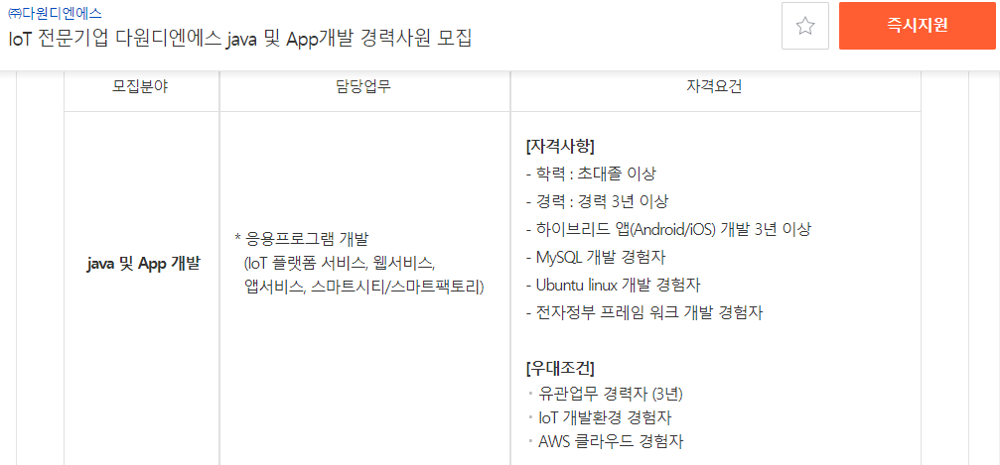
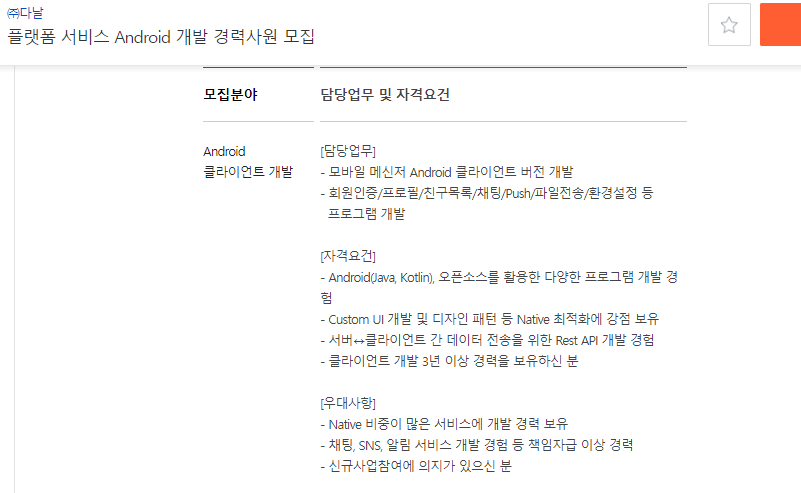
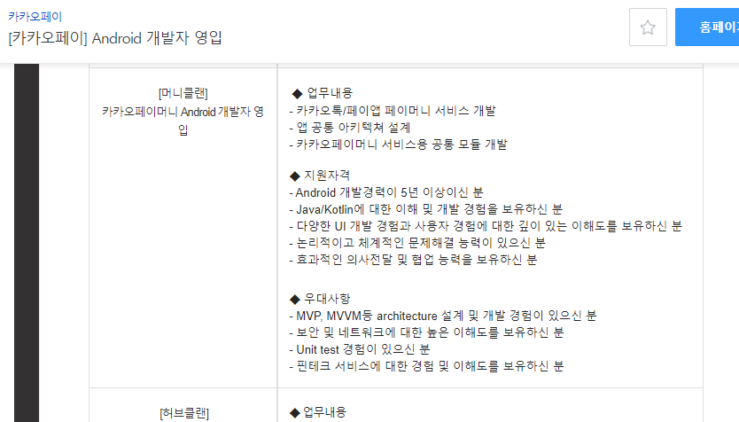
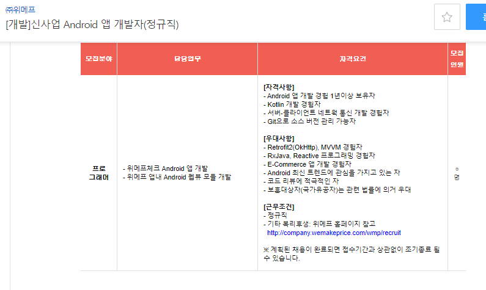
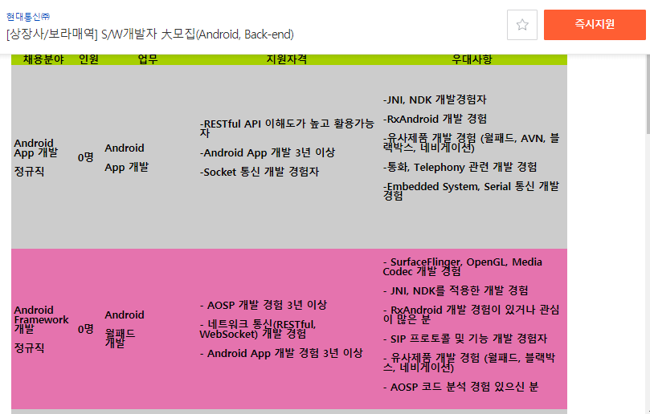
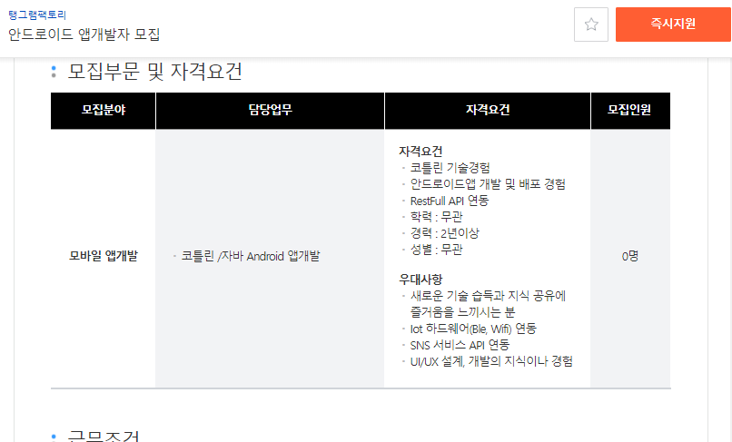
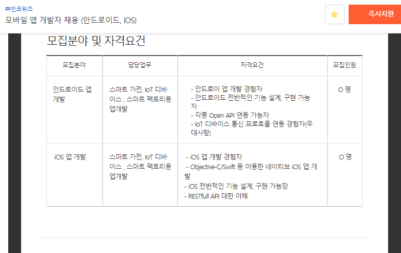
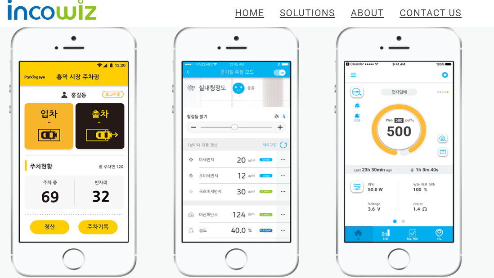
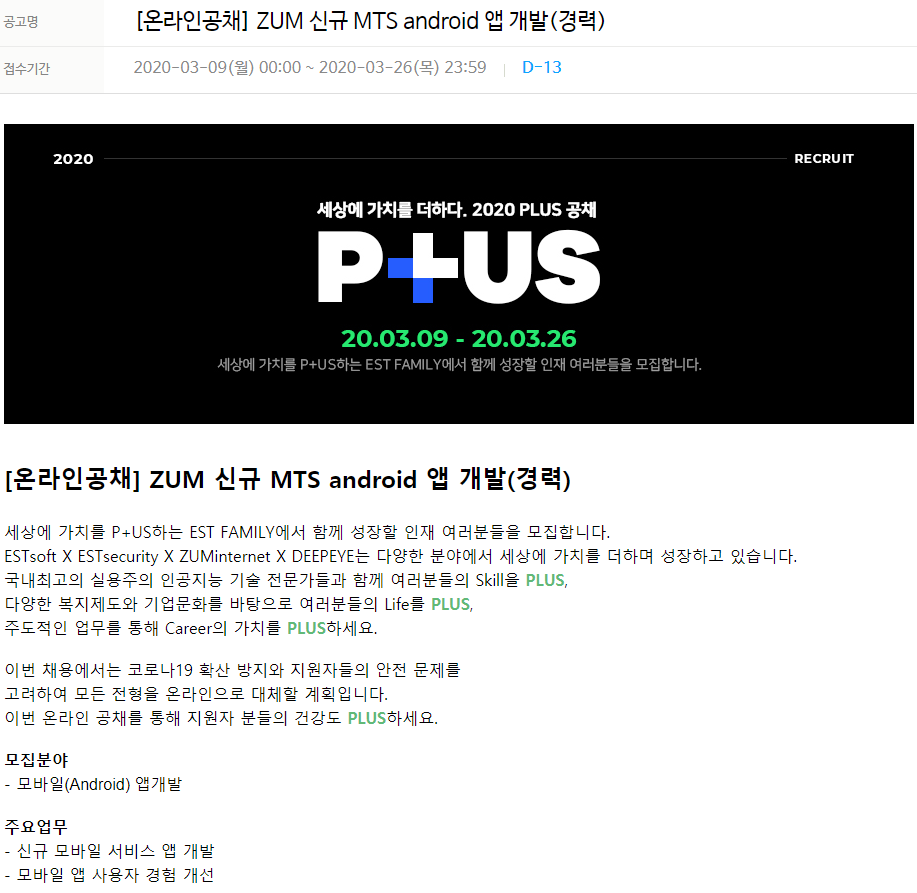

# 기업 자료

### 쿠팡

[관련 자료](https://blog.naver.com/coupang1104/221630199758)

### [인콘](http://www.jobkorea.co.kr/Recruit/Co_Read/C/win4net)

### 다원디엔에스

### 현대통신

### 에이티앤에스

### 카카오엔터프라이즈

### 다날

### 카카오페이

### 위메프

### 현대통신

### 탱그램팩토리

### 인코위즈

### ZUM

### X2soft

~~~
배우는건 - MC

직무 관련 - 능력은 주말 Study를 통해
~~~

###  [웹케시](http://www.saramin.co.kr/zf_user/jobs/relay/view?isMypage=no&rec_idx=38005994&recommend_ids=eJxtkckVwzAIRKvJnUVs5xSi%2FruI9GwQ9svxM2KAETsgx6ApIR%2F7csM5dsEiVBFWQV9YugfJ0Z00%2FA9ez7c%2FQPRxN6adM4K2%2FsTsB1GyKYovLH9EwOafWP42Bk8b%2BsI6B9Tp6IXlP1ZCzT%2Fx3Ccq%2Fb4bSwez3p%2FYdPKHfmHup66r4ew3lBqSIHLfntZn3bjDCuHKdg0239noD2EAcqc%3D&view_type=list&gz=1&t_ref_content=ing_recruit&t_ref=company_info_view#seq=0)

